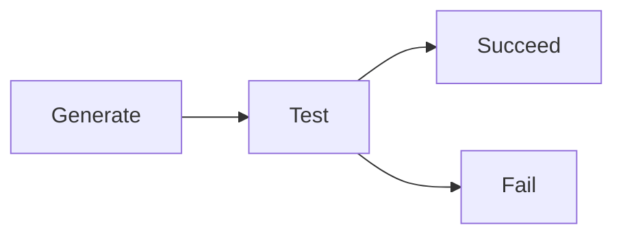

### 课程信息

MIT OPEN COURSE WARE  
6.034, Fall 2010, **Artificial Intelligence,** *Patrick H. Winston*  
[Youtube](https://www.youtube.com/watch?v=TjZBTDzGeGg&list=PLUl4u3cNGP63gFHB6xb-kVBiQHYe_4hSi) / [Bilibili](https://www.bilibili.com/video/av75097245)

本节内容：生成测试，状态图和状态空间

<!--

### 写作目的

虽然写第一讲之前我就已经把整个课程看完了，但是怕马上转眼就忘了（其实已经记不太清了），所以一是稍微总结一下加深记忆，另外梳理一下以后方便回头看。在这里主要写一下每一讲的关键点，详细内容还要看原视频。然后可能会有很多疏漏错误，请一切以 Winston 原文为准 2333
-->

<!-- more -->

### 第一讲 概论

#### Definition of Artificial Intelligence

Algorithms enabled by  
Constraint exposed by  
Representations that support  
Models targeted at  
Thinking Perception Action

#### Generate and Test

生成器：不冗余（重复），且能提供足够的信息以判断

#### 状态图和推理 (Reasoning)

状态空间法（例：农夫过河问题）

#### 语言 (Language)

1. 讲故事和理解故事
2. 整理感官系统和指挥感官系统



**Rumpelstilskin Principle**  
Once you have a name for something, you get power over it.

**Occam's Razor**  
Simple ideas are often the most powerful.


