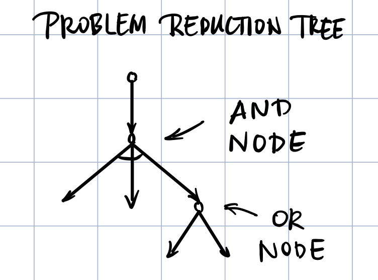
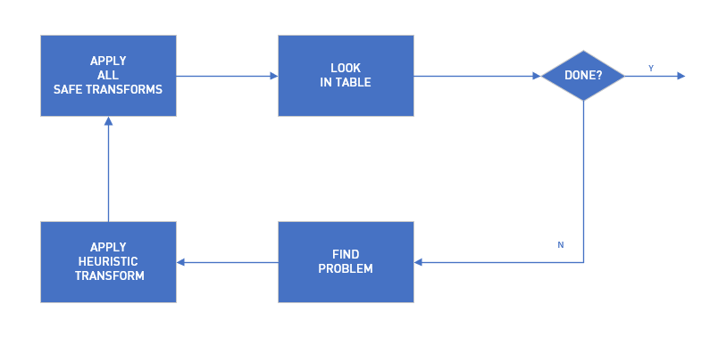
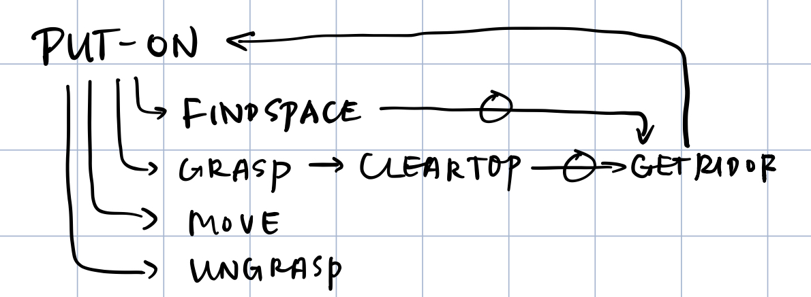
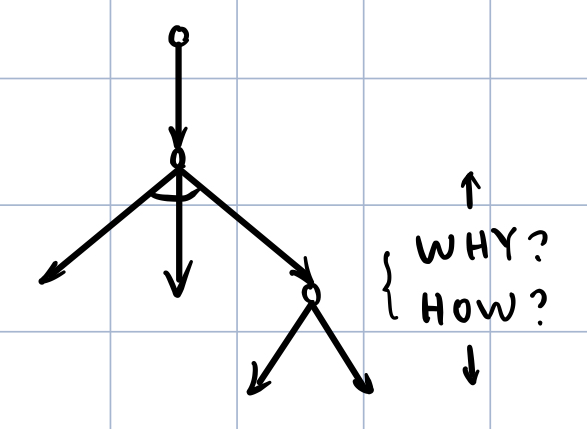
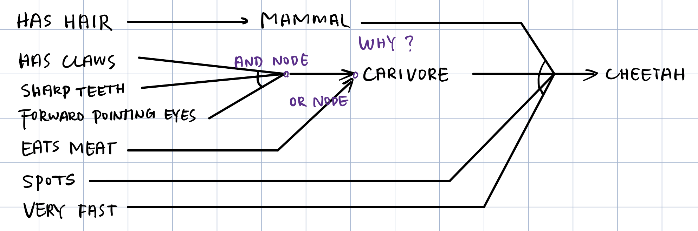
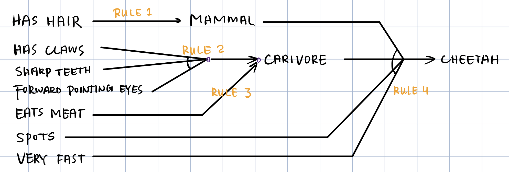
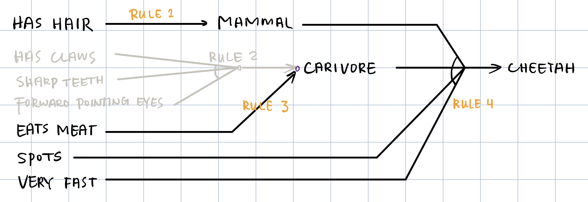

### 课程信息

MIT OPEN COURSE WARE  
6.034, Fall 2010, **Artificial Intelligence,** *Patrick H. Winston*  
[Youtube](https://www.youtube.com/watch?v=TjZBTDzGeGg&list=PLUl4u3cNGP63gFHB6xb-kVBiQHYe_4hSi) / [Bilibili](https://www.bilibili.com/video/av75097245)

 

本节内容：目标树，产生式系统

<!-- more -->

 

#### 第二讲 目标树与问题求解

#### Problem Reduction

**Goal Tree** (also called **and/or tree**, **problem reduction tree**)

PROCEDURE:

Safe transformations, Heuristic transformations

 

#### CATECHISM

- WHAT KIND
- HOW REPRESENTED
- HOW USED
- HOW MUCH
- WHAT EXACTLY

 

#### Modeling Problem Solving

- Generate and Test
- Problem Reduction

 

### 第三讲 目标树和基于规则的专家系统（产生式）

#### 移放方块问题

**Goal tree can answer certain kinds of questions about its own behavior.**

 

#### Simon's Ant

The complexity of the behavior is a consequence of the complexity of the environment, not the complexity of the program.

**C(behavior) = max{C(program), C(environment)}**

 

#### RULE-BASED SYSTEM

*BUILDING A GOAL TREE*

- **FORWARD-CHAINING RULE-BASED “EXPERT” SYSTEM**

  work forward from facts

  

- **BACKWARD-CHAINING RULE-BASED “EXPERT” SYSTEM**

  work backward from a hypothesis

  

**Deduction(演绎) System:** working with facts to produce new facts

 

#### 建立规则库

1. 将专家做法转化为 IF-THEN 条件语句
2. 考虑个例（而 1 中只得到了总体的规则）
3. 考虑看起来相同但实际处理不同的东西
4. 运行系统，看它在什么情况下会出错

 



Knowledge **about knowledge** is power.



 
