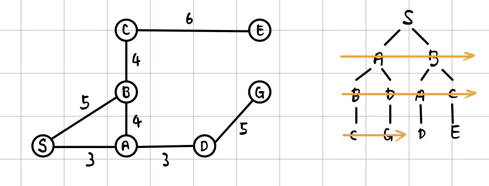
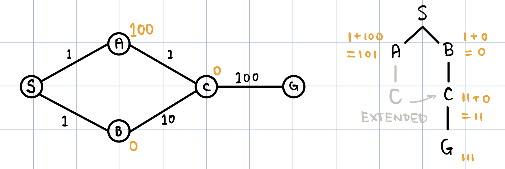

### 课程信息

MIT OPEN COURSE WARE  
6.034, Fall 2010, **Artificial Intelligence,** *Patrick H. Winston*  
[Youtube](https://www.youtube.com/watch?v=TjZBTDzGeGg&list=PLUl4u3cNGP63gFHB6xb-kVBiQHYe_4hSi) / [Bilibili](https://www.bilibili.com/video/av75097245)

 

本节内容：深度优先，广度优先，爬山算法，束搜索，代价一致，A\*

<!-- more -->

 

### 第四讲 深度优先、广度优先、爬山算法、 集束搜索

#### British Museum Search

find every possible path（注意不能绕圈）

 

#### Depth First Search

*backup / backtracking*

 

#### Breadth First Search

 

#### Hill Climbing

深度优先的改良：每次拓展离目标最近的节点

**在连续空间中使用爬山算法可能存在的问题：**

1. 卡在局部极大值
2. 遇到电线杆问题
3. 落在山脊上（高维空间尤甚）

 

#### Beam Search

广度优先的改良：每层只保留离目标最近的 ω 个节点

 

#### Best First Search

总是拓展整个树中离目标最近的节点

 

|       SEARCH       | BACKTRACKING | USE ENQUED LIST | INFORMED |
| :----------------: | :----------: | :-------------: | :------: |
| **British Museum** |      ×       |        ×        |    ×     |
|  **Depth First**   |      √       |        √        |    ×     |
| **Breadth First**  |      ×       |        √        |    ×     |
| **Hill Climbing**  |      √       |        √        |    √     |
|  **Beam Search**   |      ×       |        √        |    √     |

 

### 第五讲 代价一致、A\*

#### Uniform Cost Search (Branch & Bound)

每次拓展已经走过的代价最小的路径

***Use Extended List:***

***Admissible Heuristic:***

*accumulated distance + airline distance*

admissible: 确保小于实际距离（注：在这里直线距离给出了两点路程的下界）

在考虑**地图**时，可容许启发式总是最优搜索的稳妥方式，但非欧时：

因此需要强化可容许启发式的限制条件：

- **可容许 admissible**
  $ H\left( x,G\right) \leq D\left( x,G\right) $

- **一致性 consistent**
  $ \left| H\left( x,G\right) -H\left( y,G\right) \right| \leq D\left( x,y\right) $
   

#### A\*

use both **EXTENDED LIST** and **ADMISSIBLE HEURISTIC**

 



Search is not about maps; **Search is about choice.**



 
