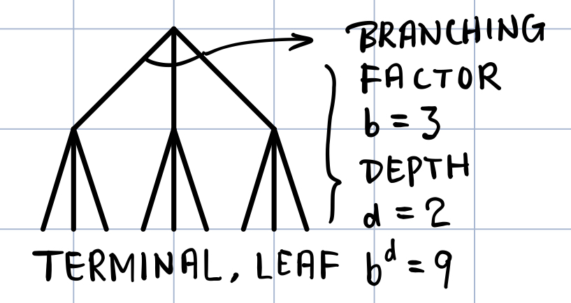
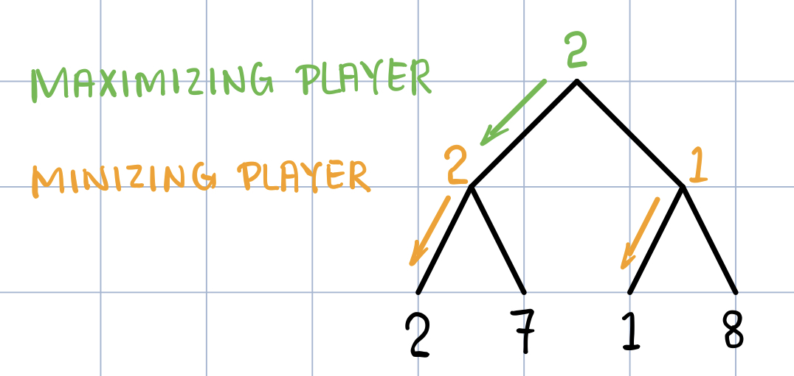
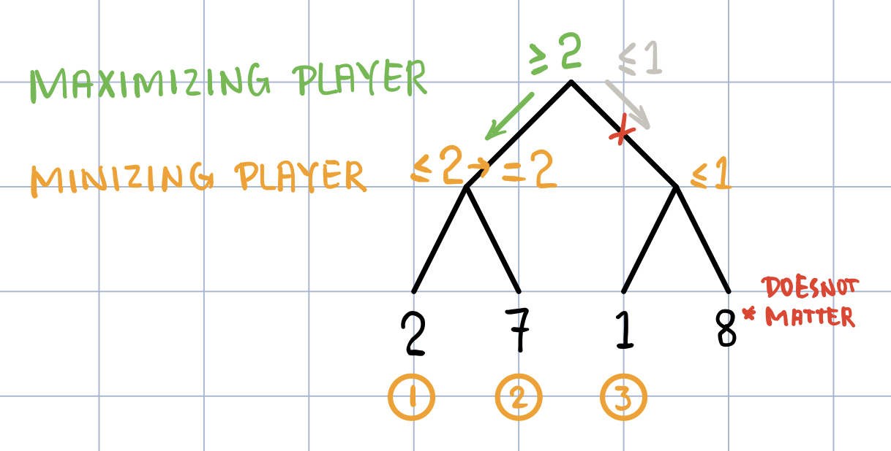
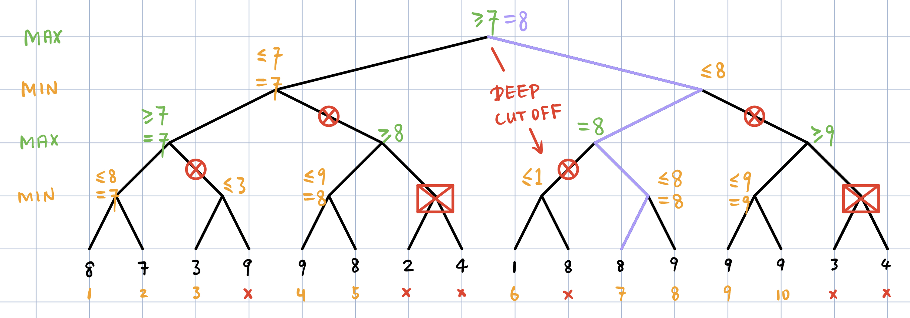

### 课程信息

MIT OPEN COURSE WARE  
6.034, Fall 2010, **Artificial Intelligence,** *Patrick H. Winston*  
[Youtube](https://www.youtube.com/watch?v=TjZBTDzGeGg&list=PLUl4u3cNGP63gFHB6xb-kVBiQHYe_4hSi) / [Bilibili](https://www.bilibili.com/video/av75097245)

 

本节内容：极小极大，α-β 剪枝

<!-- more -->

 

### 第六讲 博弈、极小极大、α-β 剪枝

#### 下棋程序

1.  ~~Analysis Strategy Tactics~~

2.  IF-THEN Rules

3.  Look Ahead & Evaluate

    static value $ S=g\left( f_{1},f_{2},\ldots ,f_{n}\right) =c_{1}f_{1}+c_{1}f_{2}+\ldots +c_{n}f_{n} $

4.  British Museum

    

5.  LOOK AHEAD AS FAR AS POSSIBLE

    - Game Tree

      

    - Pruning

      **注意：α-β 剪枝是对 minimax 的优化（而不是近似），因此会给出同样的解**

    - *Deep Cutoff*

      

      **S ≈ 2bd/2** —— 同样算力加多了一倍深度 / 同样深度所需算力开根号

    - ***Progressive Deepening***

           为避免运行超时得不到结果而只能走随机的一步，可以在上（每）一层先给出一个走法，一层一层做极小极大。这样只需要完成当前层的 1/d 算力，却能给出比较靠谱的结果。从下面的式子看出，对每一层的代价求和，总代价与只算倒数第二层相差不大。

      $ S'=1+b+b^{2}+\ldots +b^{n-1}=\dfrac {b^{n}-1}{b-1}\approx b^{n-1} $ 
      *P.S. 计算的中间值将用于对树重新排序以求得最大化的剪枝*

 

#### Minimax + Alpha-Beta + Progressive Deepening

- **DEAD HORSE PRINCIPLE**
  一旦确定比最优差，就把整枝剪掉
- **MARSHALL ARTS PRINCIPLE**
  在每一层给出结果，避免下一层算不完
- **ANYTIME ALGORITHMS**
  一旦需要，随时都能给出一个（当时的最佳）答案

 

#### Deep Blue

- MINIMAX
- Alpha-Beta
- Progressive Deepening
- Parallel Computing
- Opening Book
- End Game
- **Uneven Tree Development**
