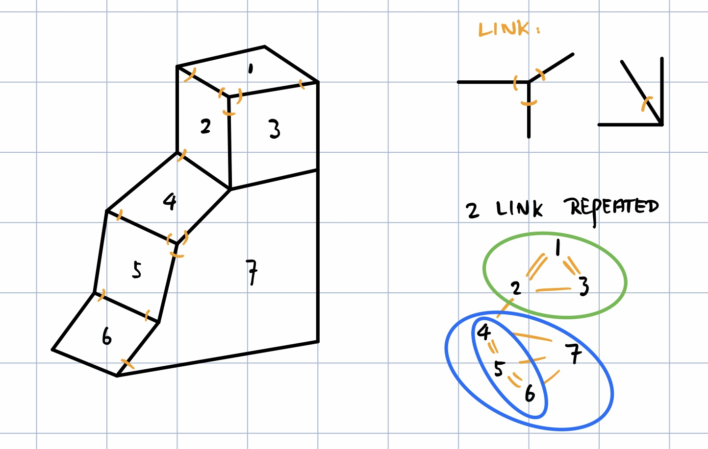
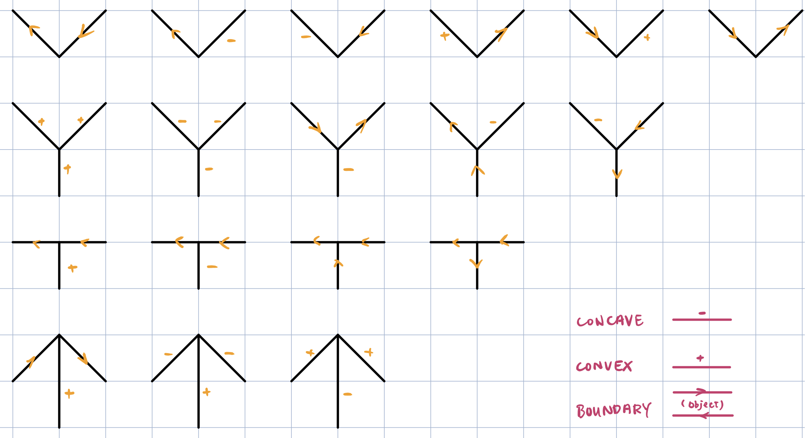
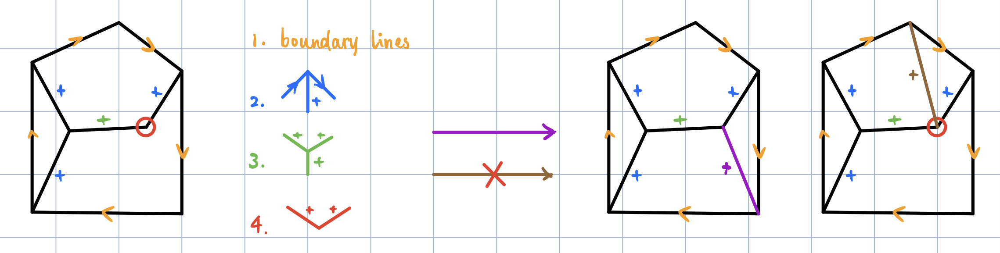
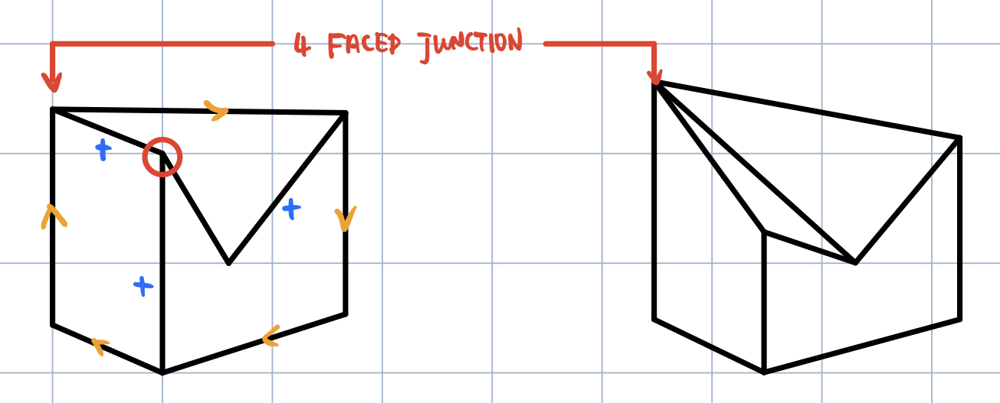
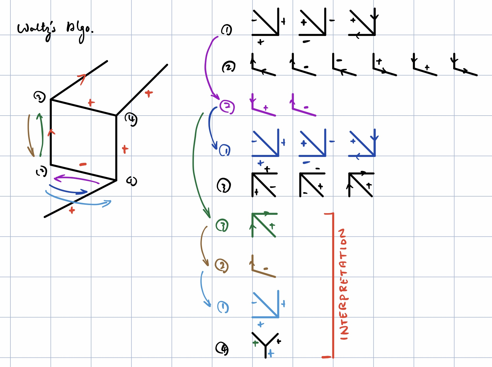
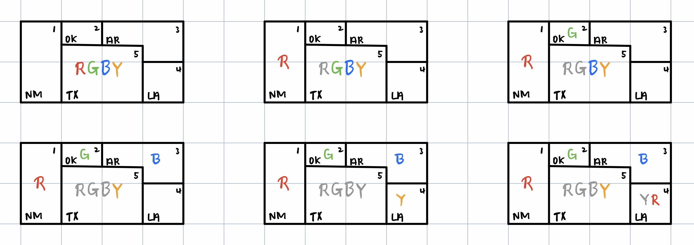
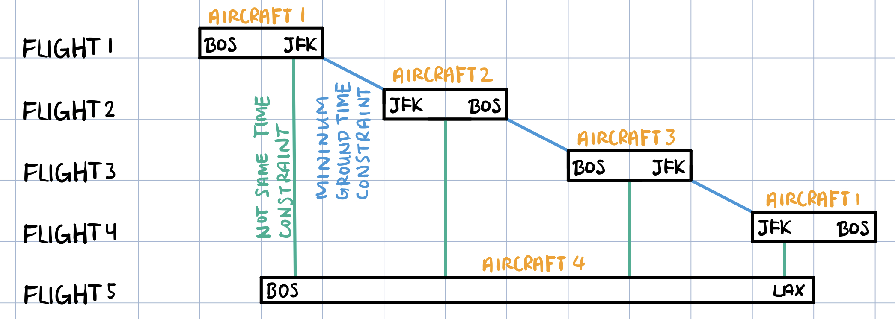
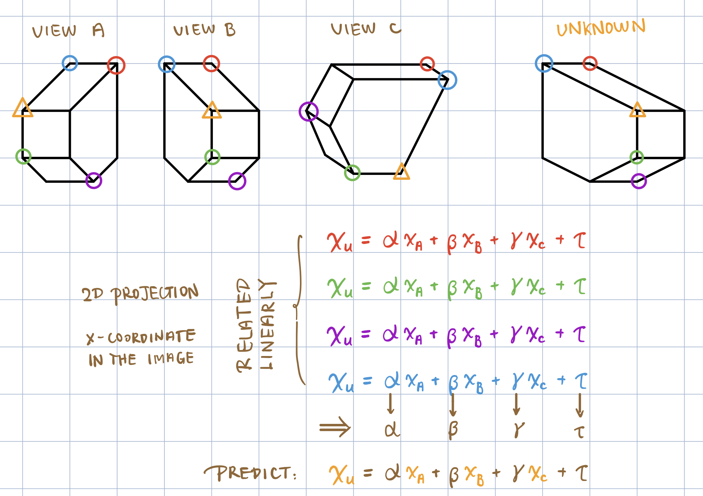
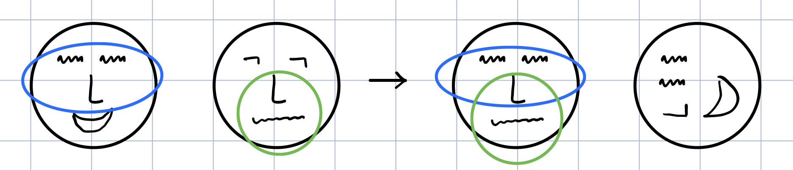
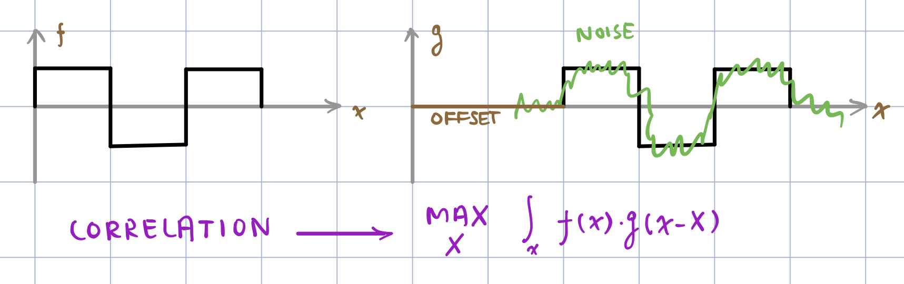

### 课程信息

MIT OPEN COURSE WARE  
6.034, Fall 2010, **Artificial Intelligence,** *Patrick H. Winston*  
[Youtube](https://www.youtube.com/watch?v=TjZBTDzGeGg&list=PLUl4u3cNGP63gFHB6xb-kVBiQHYe_4hSi) / [Bilibili](https://www.bilibili.com/video/av75097245)

<br>

本节内容：约束（线条图、地图着色、物体识别）

<!--
<br>

> 期末考试加拖延症，没想到直接拖更到 2020 年了 OTZ 强迫更新一波，本来准备是趁热打铁现在直接变成二刷了 2333
-->

<!-- more -->

<br>

### 第七讲 解释线条图

#### Guzman 的工作

**ABDUCTION:** THREE FACED VERTEXES --> ARROW / FORK



<br>

#### Huffman 的工作

**Characteristics:**

- general position
- trihedral, 3 faces
- 4 kinds of lines (concave, convex, boundary)
- (cracks & shadows left out)



检验能否构建一个物体*（必要非充分条件）*：



（不能处理四面交汇的问题：）



<br>

#### Waltz 的工作

**Waltz's Label**

- CRACKS
- SHADOWS
- NON-TRIHEDRAL VERTEXES
- LIGHT

**Waltz's Algorithm**



<br>

### 第八讲 搜索、域缩减

- ~~深度优先~~
- ~~条件约束~~
- 局部约束（Martial Arts Principal）



#### Domain Reduction Algorithm

VARIABLE **V**: something that can have assignment
VALUE **x**: something that can be an assignment
DOMAIN **D**: bag of values
CONSTRAINT **C**: limit on variable values

```
FOR EACH DFS ASSIGNMENT
  FOR EACH VARIABLE Vi CONSIDERED
    FOR EACH Xi IN Di
      FOR EACH CONSTRAINT C(Xi, Xj) WHERE Xj ∈ Dj
        IF NOT ∃ Xj SUCH THAT C(Xi, Xj) SATISFIED
          REMOVE Xi FROM Di
        IF Di EMPTY
          BACKUP
```

***<br>CONSIDERED***

- ~~NOTHING~~
- ASSIGNMENT
- NEIGHBORS
- **PROPAGATE CHECKING THROUGH V WITH D REDUCED TO ONE VALUE**
- PROPAGATE CHECKING THROUGH V WITH REDUCED D
- ~~EVERYTHING~~

**\+ 按约束多到少的顺序做深度优先搜索**

**\+ 可以使用两边夹逼的方法快速确定一个狭小的范围**

<br>

类似的问题还有：



<br>

### 第九讲 视觉对象识别

#### Marr 的工作

1. Camera Input
2. Primal Sketch
3. 2.5D Sketch
4. Generalized Cylinders
5. Recognition

<br>

#### Ullman's ALIGNMENT THEORY



<br>

#### Ullman's INTERMEDIATE FEATURES THEORY

**Goldilocks Principle:** not too big, not too small



**SIGNAL, CORRELATION**



$$
\max _{X,Y}\int _{x,y}f\left(x-X\right)\cdot g\left(x-X,y-Y\right)
$$
