### 课程信息

MIT OPEN COURSE WARE  
6.034, Fall 2010, **Artificial Intelligence,** *Patrick H. Winston*  
[Youtube](https://www.youtube.com/watch?v=TjZBTDzGeGg&list=PLUl4u3cNGP63gFHB6xb-kVBiQHYe_4hSi) / [Bilibili](https://www.bilibili.com/video/av75097245)

<br>

本节内容：最近邻、识别树

<!-- more -->

<br>

### 第十讲 最近邻

#### 学习的分类

1. BASED ON **REGULARITY** <sup>*BULLDOZER*</sup>
   - Nearest Neighbors <sup>*pattern recognition*</sup>
   - Neural Nets <sup>*mimic biology*</sup>
   - Boosting <sup>*theory*</sup>
2. BASED ON **CONSTRAINS** <sup>*HUMANLIKE*</sup>
   - One Shot
   - Explanation Based Learning

<br>

#### NEAREST NEIGHBOR BASED LEARNING

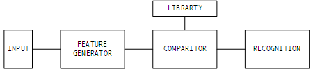

##### 插座分类的例子

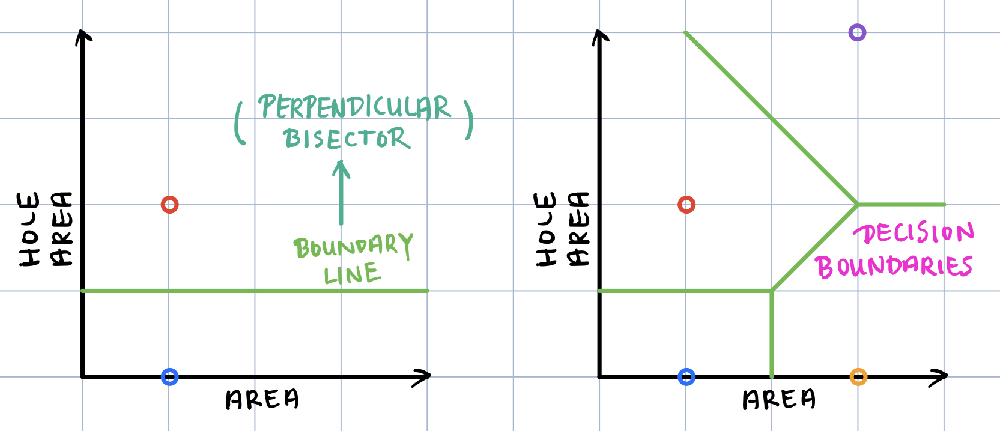

##### 文章分类的例子

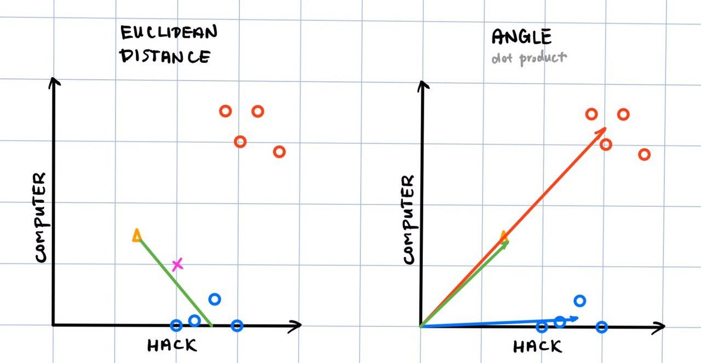

##### 机械臂运动的例子

Find the closest match in the 'childhood' table:

| θ<sub>1</sub> | θ<sub>2</sub> | θ<sub>1</sub>' | θ<sub>2</sub>' | θ<sub>1</sub>'' | θ<sub>2</sub>'' | τ<sub>1</sub> | τ<sub>2</sub> |
| :-----------: | :-----------: | :------------: | :------------: | :-------------: | :-------------: | :-----------: | :-----------: |
|      ...      |      ...      |      ...       |      ...       |       ...       |       ...       |      ...      |      ...      |
|      ...      |      ...      |      ...       |      ...       |       ...       |       ...       |      ...      |      ...      |

##### 存在的一些问题

- **SPREAD** <sup>***non-uniformity***</sup> --> NORMALIZE

- **WHAT MATTERS**

- **INDEPENDENCE**
  confusion of correlation with cause

<br>

### 第十一讲 识别树

#### IDENTIFICATION TREES

##### 吸血鬼的例子

- NON NUMERIC
- SOME DON'T MATTER
- SOME MATTER ONLY SOME OF TIME
- COST

| Vampire | Shadow | Garlic | Complexion | Accent |
| :-----: | :----: | :----: | :--------: | :----: |
| **No**  |   ?    |  Yes   |    Pale    |  None  |
| **No**  |  Yes   |  Yes   |   Ruddy    |  None  |
| **Yes** |   ?    |   No   |   Ruddy    |  None  |
| **Yes** |   No   |   No   |  Average   | Heavy  |
| **Yes** |   ?    |   No   |  Average   |  Odd   |
| **No**  |  Yes   |   No   |    Pale    | Heavy  |
| **No**  |  Yes   |   No   |  Average   | Heavy  |
| **No**  |   ?    |  Yes   |   Ruddy    |  Odd   |

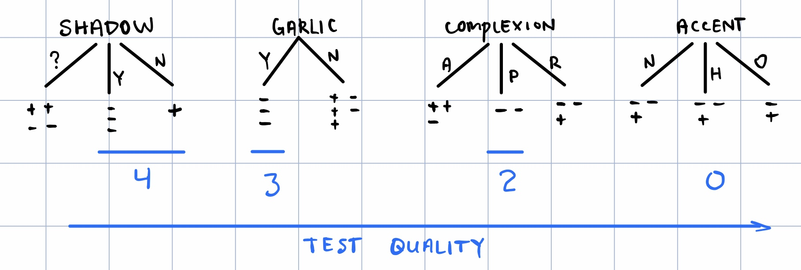

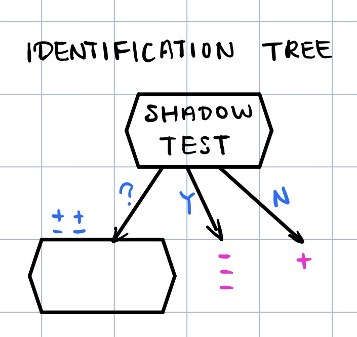

|   Vampire   | Shadow  | Garlic  | Complexion  |  Accent   |
| :---------: | :-----: | :-----: | :---------: | :-------: |
|   **No**    |    ?    |   Yes   |    Pale     |   None    |
| ~~**No**~~  | ~~Yes~~ | ~~Yes~~ |  ~~Ruddy~~  | ~~None~~  |
|   **Yes**   |    ?    |   No    |    Ruddy    |   None    |
| ~~**Yes**~~ | ~~No~~  | ~~No~~  | ~~Average~~ | ~~Heavy~~ |
|   **Yes**   |    ?    |   No    |   Average   |    Odd    |
| ~~**No**~~  | ~~Yes~~ | ~~No~~  |  ~~Pale~~   | ~~Heavy~~ |
| ~~**No**~~  | ~~Yes~~ | ~~No~~  | ~~Average~~ | ~~Heavy~~ |
|   **No**    |    ?    |   Yes   |    Ruddy    |    Odd    |

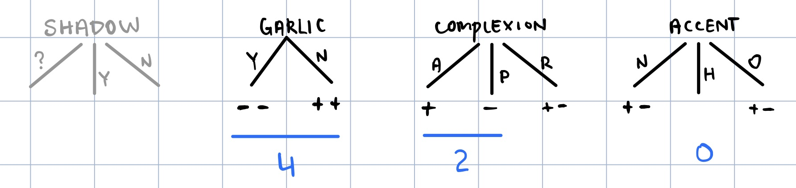

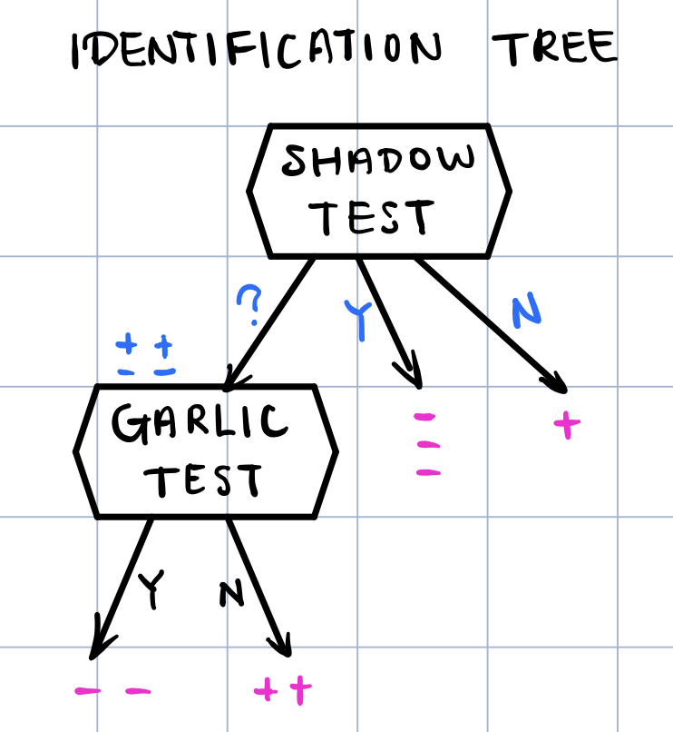

<br>

##### LARGE DATASET

###### <span style="font-size:110%;">Measuring DISORDER of tests</span>

$$
D\left(set\right) =-\dfrac {P}{T}\log _{2}\dfrac {P}{T}-\dfrac {N}{T}\log _{2}\dfrac {N}{T}
$$

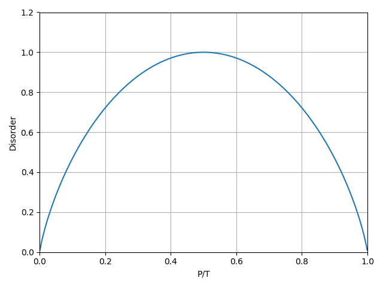

###### <span style="font-size:110%;">Measuring the OVERALL QUALITY</span>

$$
Q\left(test\right) =\sum _{^{sets\ produced}}D\left(set\right)\times\mathrm{\dfrac {Number\ of\ Samples\ in\ Set}{Number\ of\ Samples\ Handeled\ by\ Test}}
$$

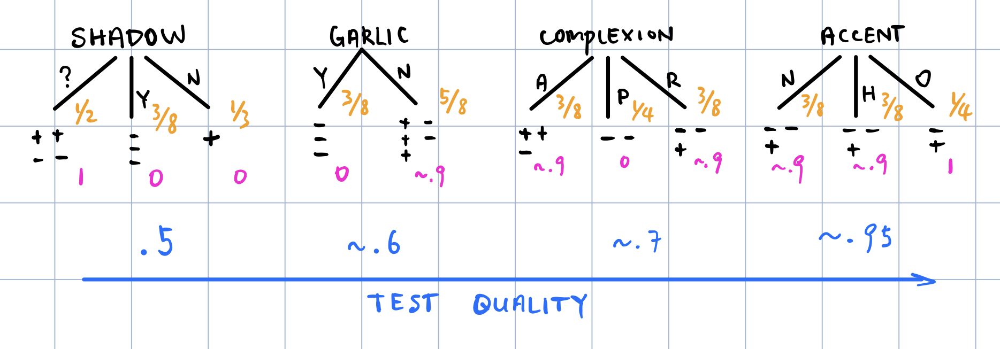

###### <span style="font-size:110%;">NUMERICAL data</span>

NUMERICAL --> ***threshold*** --> *binary test*

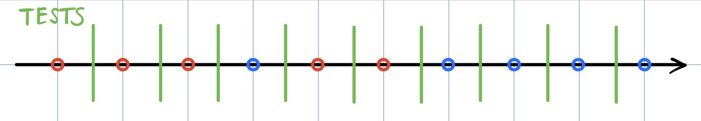

NUMBER OF TESTS = NUMBER OF SAMPLES - 1

<br>

#### NN 与 ID Tree 的比较

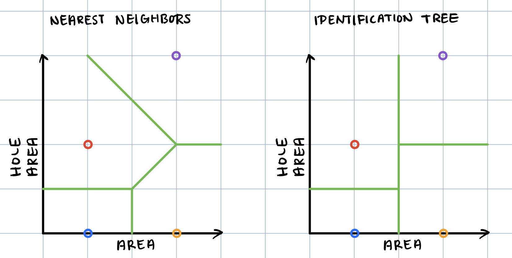

<br>

#### Convert tree into a set of rules

Go down each branch to the leaf.


```
IF SHADOW = ? & GARLIC = Y THEN -
IF SHADOW = ? & GARLIC = N THEN +
IF SHADOW = Y THEN -
IF SHADOW = N THEN +
```

然后对规则优化.，例如：

```
IF SHADOW = ?   <-- no need to take both tests
   GARLIC = Y
THEN -

IF GARLIC = Y THEN -
```

<br>



**The Precedent Principle**
If something is similar in some respects, it is likely to be similar in other respects.

**Occam's Razor**
The simplest explanation is often the best explanation.



<br>
