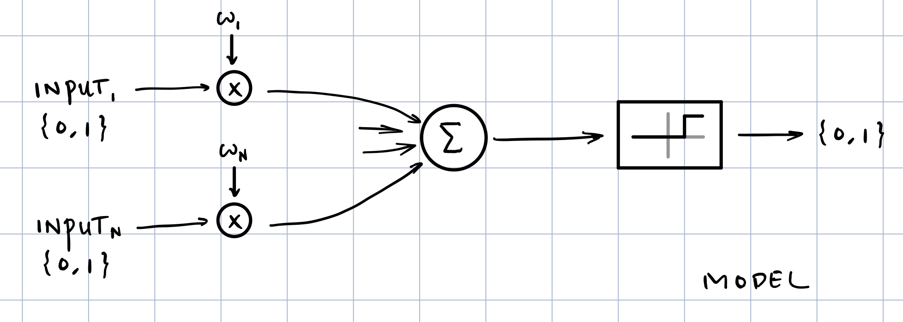

### 课程信息

MIT OPEN COURSE WARE  
6.034, Fall 2010, **Artificial Intelligence,** *Patrick H. Winston*  
[Youtube](https://www.youtube.com/watch?v=TjZBTDzGeGg&list=PLUl4u3cNGP63gFHB6xb-kVBiQHYe_4hSi) / [Bilibili](https://www.bilibili.com/video/av75097245)

 

本节内容：神经网络

<!-- more -->

 

### 第十二讲 神经网络、反向传播算法

#### NEURAL NETS

##### NAIVE NEURO-BIOLOGY

1. Synaptic Weights
2. Cumulative Effect
3. All or None
4. ...

##### NEURON MODEL

***fix1:*** *RENDER TRIGGER AS WEIGHT*

***fix2:*** *USE SIGMOID FUNCTION*

##### NEURAL NETS MODEL

- **output vector** $ \overline {z}=f\left( \overline {x},\overline {\omega }\right)  $

- **desired output** $ \overline {d}=g\left( \overline {x}\right)  $

- **performance function** $ P\left( \overline {d},\overline {z}\right) =- \dfrac {1}{2}\left\| \overline {d}-\overline {z}\right\| ^{2}$ ← trigger T? → ***fix1***
  *MAXIMIZE* ← gradient ascent ← ***smooth, continuous?*** → STEP FUNCTION → ***fix2***

  $ \beta _{sigmoid} =\dfrac {1}{1 + e ^{- \alpha }} $, $ \Delta \omega =\tau _{rate} \left( \dfrac {\partial P}{\partial \omega_{1}}i+\dfrac {\partial P}{\partial \omega_{2}}j\right) $

 

#### 举个栗子

$ \dfrac {\partial p}{\partial \omega _{2}}=\dfrac {\partial p}{\partial z}\dfrac {\partial z}{\partial \omega _{2}}=\dfrac {\partial p}{\partial z}\dfrac {\partial z}{\partial p_{2}}\dfrac {\partial p_{2}}{\partial \omega_{2}}=\left( d-z\right) \cdot \dfrac {\partial z}{\partial p_{2}}\cdot y $

$ \dfrac {\partial p}{\partial \omega _{1}}=\dfrac {\partial p}{\partial z}\dfrac {\partial z}{\partial p_{2}}\dfrac {\partial p_{2}}{\partial y}\dfrac {\partial y}{\partial p_{1}}\dfrac {\partial p_{1}}{\partial \omega_{1}}=\left( d-z\right) \cdot \dfrac {\partial z}{\partial p_{2}} \cdot\omega_{2}\cdot \dfrac {\partial y}{\partial p_{1}} \cdot x $

$ \dfrac {d\beta }{d\alpha }=\dfrac {d}{d\alpha }\left( \dfrac {1}{1+e^{-\alpha }}\right) =\dfrac {e^{-\alpha }}{\left( 1+e^{-\alpha }\right) ^{2}} =\dfrac {1}{\left( 1+e^{-\alpha }\right) }\cdot\left( 1-\dfrac {1}{1+e^{-\alpha }}\right) =\beta\left( 1-\beta\right) $

$ \dfrac {\partial p}{\partial \omega _{2}}=\left( d-z \right) \cdot \dfrac {\partial z}{\partial p_{2}} \cdot y= \left( d-z \right) \cdot z \left( 1-z \right) \cdot y $

$ \dfrac {\partial p}{\partial \omega _{1}}=\left( d-z\right) \cdot \dfrac {\partial z}{\partial p_{2}} \cdot\omega_{2}\cdot \dfrac {\partial y}{\partial p_{1}} \cdot x=\left( d-z\right) \cdot z\left( 1-z\right) \cdot\omega_{2}\cdot y\left( 1-y\right) \cdot x $

 

##### BACK-PROPAGATION ALGORITHM

先计算最近的 ω，下一个 ω 只依赖于当前计算的值和前一个 ω
也就是说，在一长串节点中，各点的计算量是相同的（总量是线性的）

##### PROBLEMS

- Encoding
- Overfitting *(steps)*
- Overshooting *(rate constant)*
