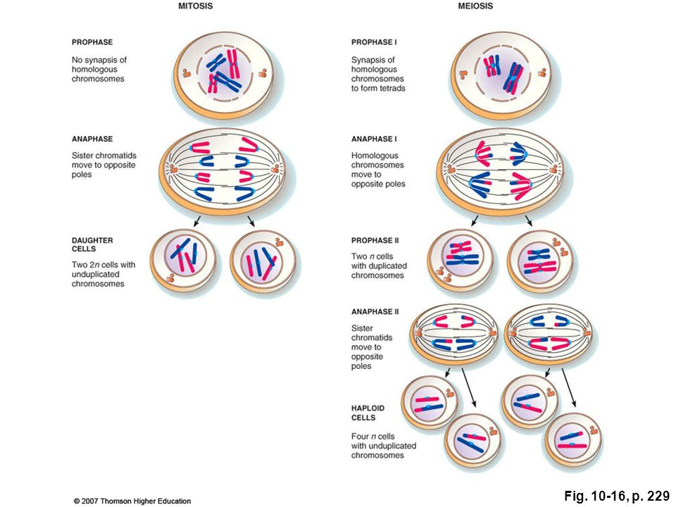
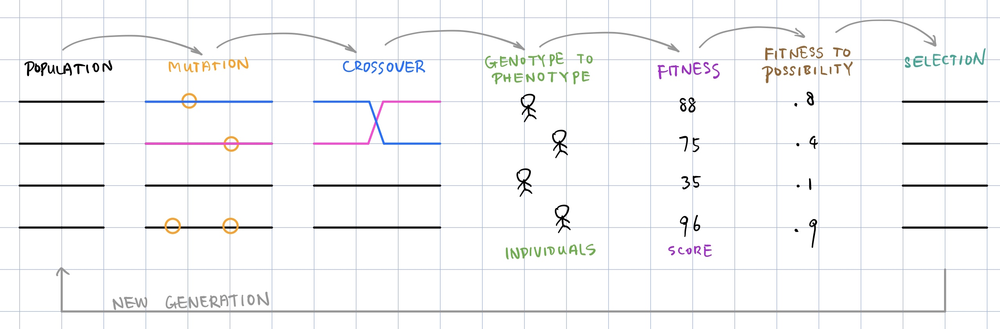
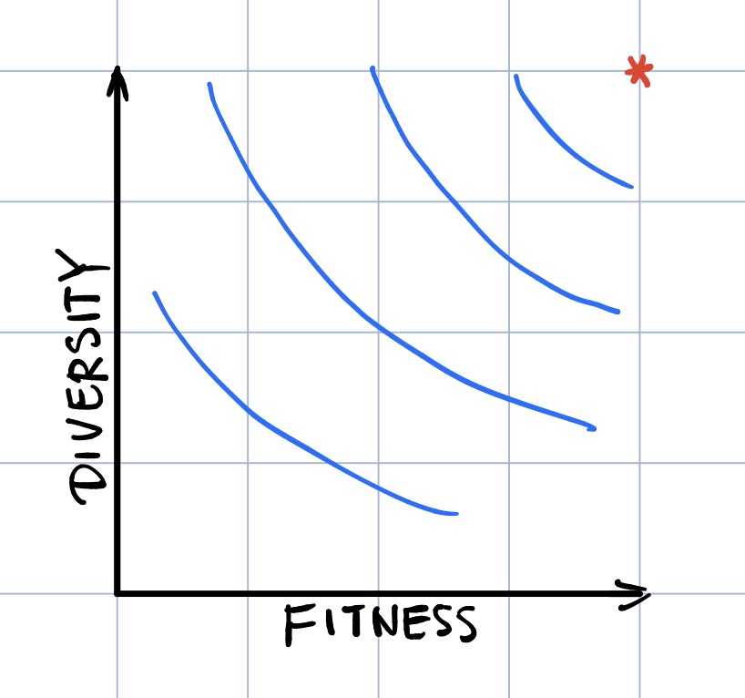
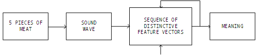
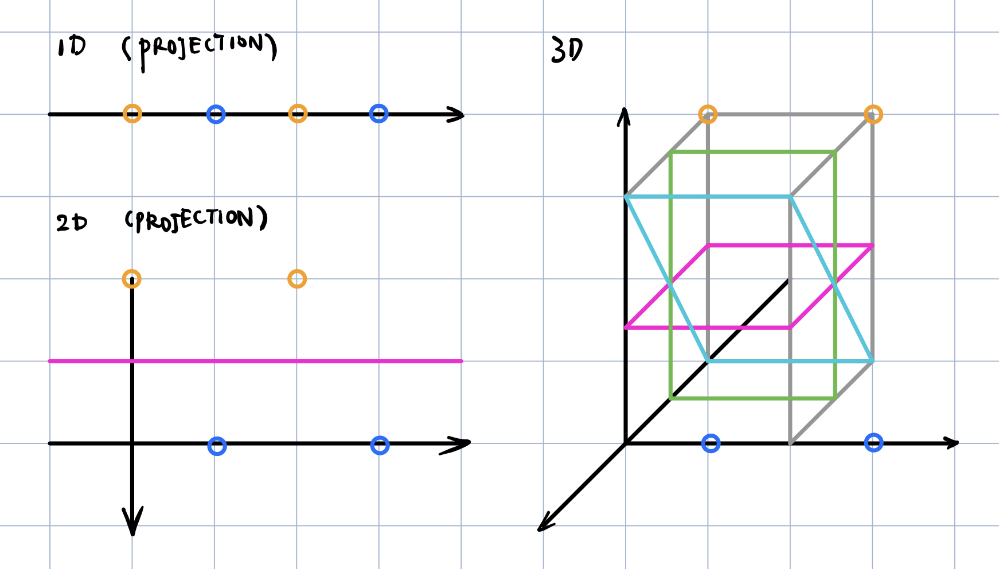

### 课程信息

MIT OPEN COURSE WARE  
6.034, Fall 2010, **Artificial Intelligence,** *Patrick H. Winston*  
[Youtube](https://www.youtube.com/watch?v=TjZBTDzGeGg&list=PLUl4u3cNGP63gFHB6xb-kVBiQHYe_4hSi) / [Bilibili](https://www.bilibili.com/video/av75097245)

 

本节内容：遗传算法、模拟退火、稀疏空间

<!-- more -->

 

### 第十三讲 遗传算法

#### GENETIC ALGORITHMS

##### NAIVE EVOLUTION

 

##### MIMICKING

- **存活概率的计算机制**

  1. $ P_{i}=\dfrac {f_{i}}{\sum _{j}f_{j}} $
  2. **RANK SPACE**
     P1 = Pc
     P2 = (1 - Pc) Pc
     P3 = (1 - Pc)2 Pc
     ...
     Pn-1 = (1 - Pc)n-2 Pc
     Pn = (1 - Pc)n-1
  3. MEASURE **DIVERSITY**
     

- **模拟退火算法（Simulated Annealing）**

 ASK WHERE THE CREDIT ***LIES***

**Rich with Solutions**

 

### 第十四讲 稀疏空间、音韵学

BASIC METHODS → NAIVE MIMICRY → FOCUS ON PROBLEM → FOCUS ON THEORY FIOS (for its own sake)

#### Phonology

##### Propagators

|     (4/14)     |  K  |  A  |  T  |   S   |
| :------------: | :-: | :-: | :-: | :---: |
|  **SYLLABIC**  |  –  |  +  |  +  |   –   |
|   **VOICED**   |  –  |  +  |  –  |   –   |
| **CONTINUANT** |  –  |  +  |  –  |   +   |
|  **STRIDENT**  |  –  |  –  |  –  | **+** |

1. **COLLECT + & – EXAMPLES**
2. **PICK + SEED**
3. **GENERALIZE (+ → x, – → x) **
   **UNTIL COVER –**

|     (4/14)     |  K  |  A  |   T   |   S   |
| :------------: | :-: | :-: | :---: | :---: |
|  **SYLLABIC**  |  x  |  x  |   x   |   –   |
|   **VOICED**   |  x  |  x  | **–** |   –   |
| **CONTINUANT** |  x  |  x  |   x   |   +   |
|  **STRIDENT**  |  x  |  x  | **–** | **+** |

|     (4/14)     |  D  |  O  |   G   |   Z   |
| :------------: | :-: | :-: | :---: | :---: |
|  **SYLLABIC**  |  x  |  x  |   x   |   –   |
|   **VOICED**   |  x  |  x  | **+** |   +   |
| **CONTINUANT** |  x  |  x  |   x   |   +   |
|  **STRIDENT**  |  x  |  x  |   x   | **–** |

btw fyi 如果要借机学英语的话，strident **+** 对应的是 **-es**，如 peach -> peaches

 

#### SPARSE SPACE

在稀疏空间中很容易找到一个超平面分开两组例子

 

#### Marr's Catechism

1. **PROBLEM**
2. **REPRESENTATION**
   - EXPLICIT
   - EXPOSE CONSTRAINT
   - LOCALNESS CRITERIA
3. **APPROACH / METHOD**
4. **MECHANISM / ALGORITHM**
5. **EXPERIMENT**
