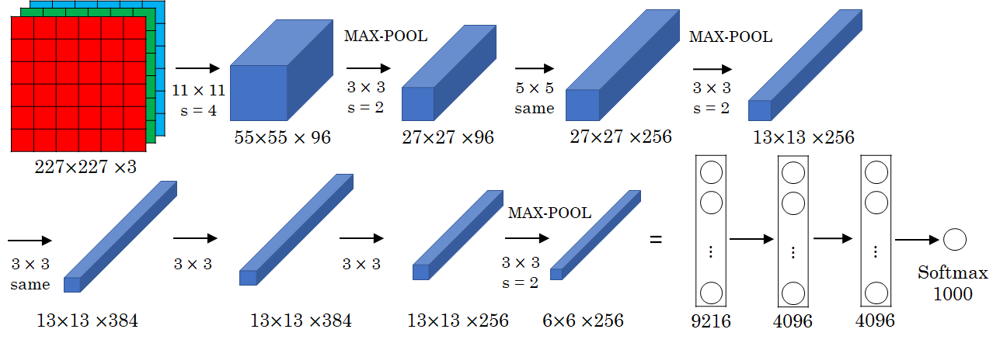
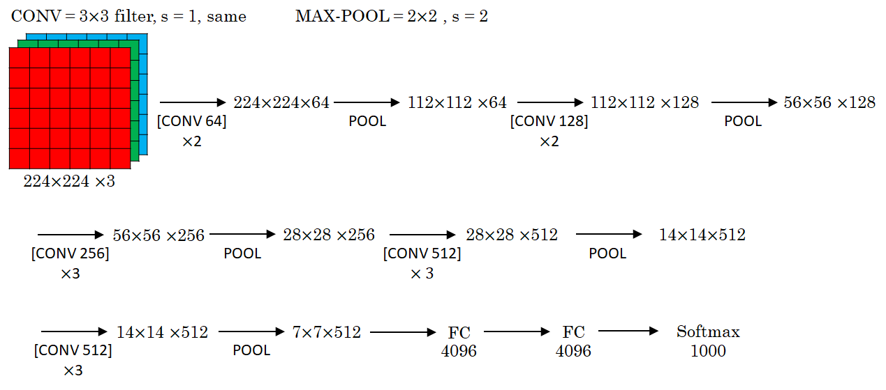
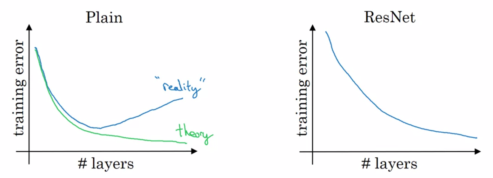
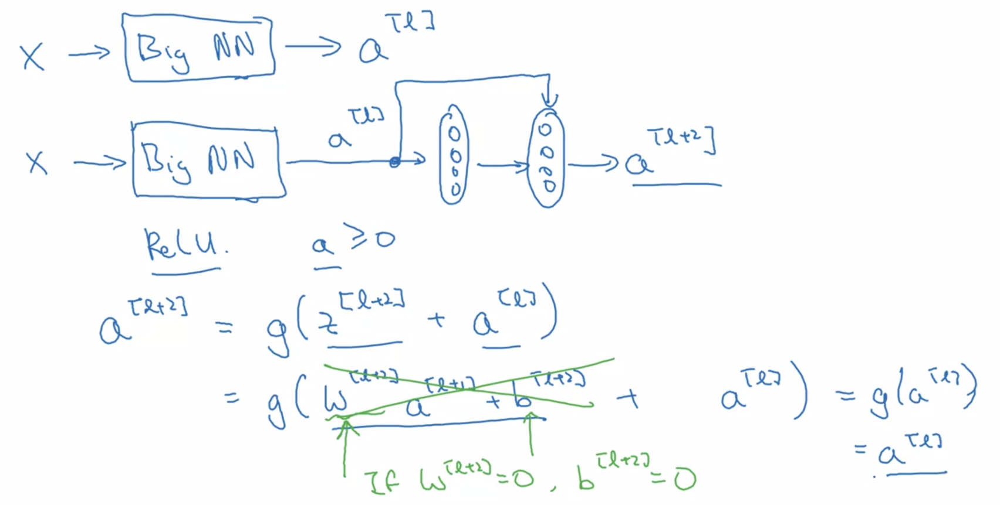
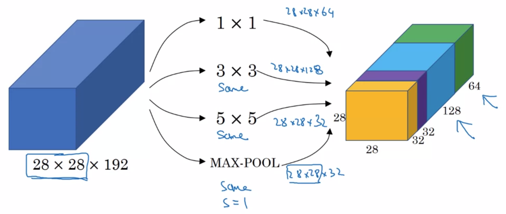
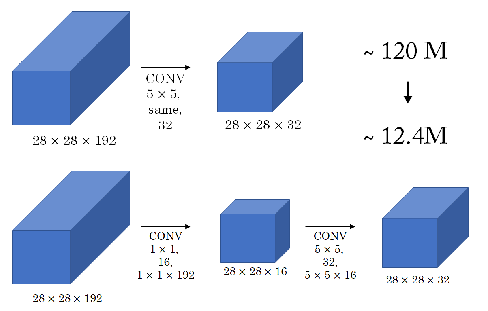
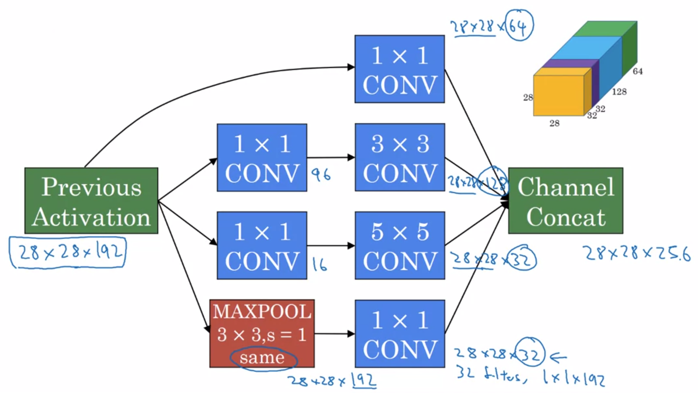
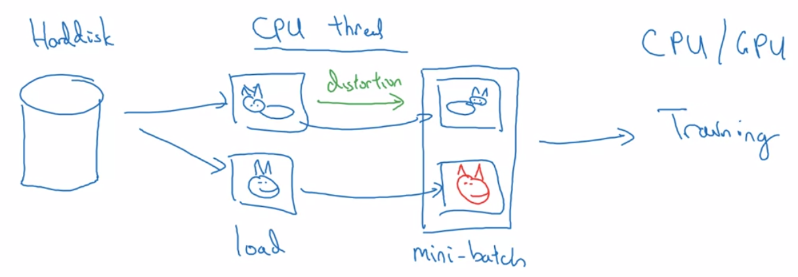

Deep Learning Specialization, Course D
**Convolutional Neural Networks** by deeplearning.ai, ***Andrew Ng,*** [Coursera](https://www.coursera.org/learn/neural-networks-deep-learning/home/info)

***Week 2:*** *Deep Convolutional Models: case studies*

1. Understand multiple foundational papers of convolutional neural networks
2. Analyze the dimensionality reduction of a volume in a very deep network
3. Understand and Implement a Residual network
4. Build a deep neural network using Keras
5. Implement a skip-connection in your network
6. Clone a repository from GitHub and use transfer learning

<!-- more -->

### Case Studies

#### Classic Networks

##### LeNet - 5

##### AlexNet

##### VGG - 16

#### Residual Networks

##### Residual Block

$\begin{aligned} z^{\left[l+1\right]} &= W^{\left[l+1\right]}a^{\left[l\right]} + b^{\left[l+1\right]} \\ a^{\left[l+1\right]} &= g\left( z^{\left[l+1\right]} \right) \\ z^{\left[l+2\right]} &= W^{\left[l+2\right]}a^{\left[l+1\right]} + b^{\left[l+2\right]} \\ a^{\left[l+2\right]} &= g\left( z^{\left[l+2\right]} \right) \end{aligned}$

$\begin{aligned} \xrightarrow[\rm main\ path]{ \Large{ a^{\left[l\right]} } { {\xrightarrow{ \  {\rm short\ cut} \ / \ {\rm skip\ connection} \ } } \atop {\large {\rightarrow{\rm Linear} \rightarrow {\rm ReLU} \rightarrow a^{\left[l+1\right]} \rightarrow {\rm Linear} \rightarrow}} } {\rm ReLU} \rightarrow a^{\left[l+2\right]}} \\ a^{\left[l+2\right]} = g\left( z^{\left[l+2\right]} + \underline{ a^{\left[l\right]} _{}} \right) ^{\strut} \end{aligned}$

##### Residual Networks

#### Why ResNets Work

*identity function is easy for residual block to learn*

#### Networks in Networks and 1×1 Convolutions

#### Inception Network Motivation

##### Computation Cost

***bottleneck layer***

#### Inception Network

##### googLeNet

#### Practical Advices for Using ConvNets

#### Using Open-Source Implementation

GitHub → Transfer Learning

#### Transfer Learning

- download **code** and **weight** as initialization
- train **new** softmax layer, **freeze** (all) other layers
- **pre-compute** activation for all the examples in training sets and **save** them to disk

#### Data Augmentation

- **Mirroring**
- **Random Cropping**
- Rotation
- Shearing
- Local Warping
- **Color Shifting**
  - PCA color argumentation

#### State of Computer Vision

- labeled data
- hand-engineering features / network architecture / other components

$\begin{aligned} {Little\ Data \atop {\small\textsf{more hand-engineering} \atop hack}} \xrightarrow[\qquad \uparrow\ {\rm Object\ Detection} \qquad  \qquad \uparrow\ {\rm Speech\ Recognition} \qquad]{\qquad \downarrow\ {\rm Image\ Recognition}} {Lots\ of\ Data \atop {\small\textsf{less hand-engineering} \atop simpler\ algo}}  \end{aligned}$

**on benchmarks**

- ***assembling:*** train several networks independently and average their *outputs*
- ***multi-crop:*** run classifier on multiple versions of *test* images and average results

**use open source code**

- use architecture of networks published in the literature
- use open source implementations if possible
- use pretrained models and fine-tune on your dataset

### Programming Assignments

#### Keras Tutorial

#### Residual Networks

<a href='https://github.com/muhac/coursera-deep-learning-solutions' target="_blank">Solutions Manual</a>
