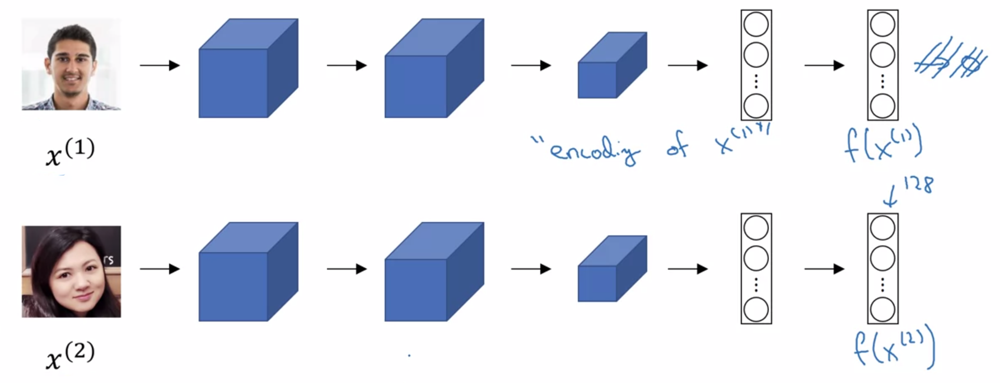
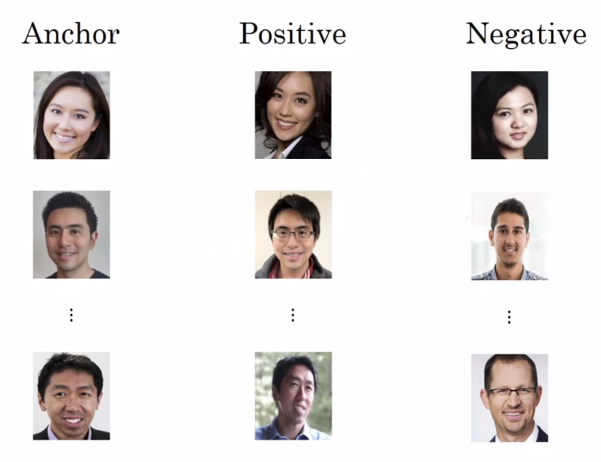
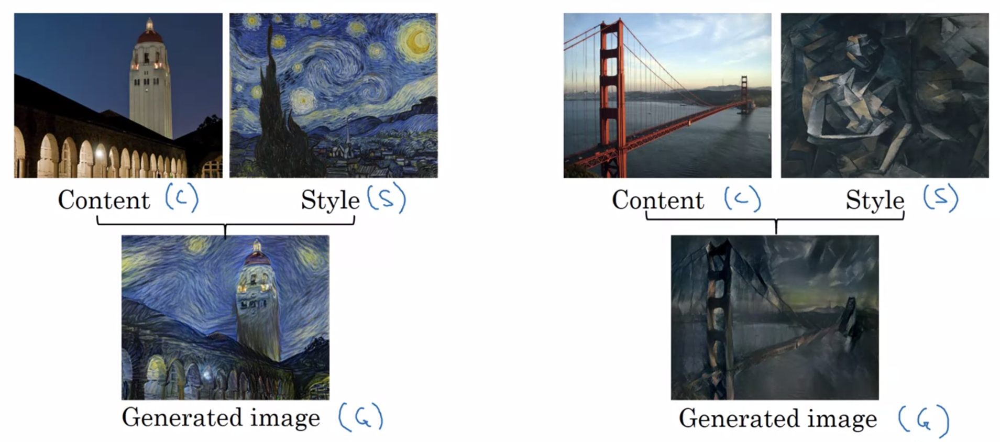
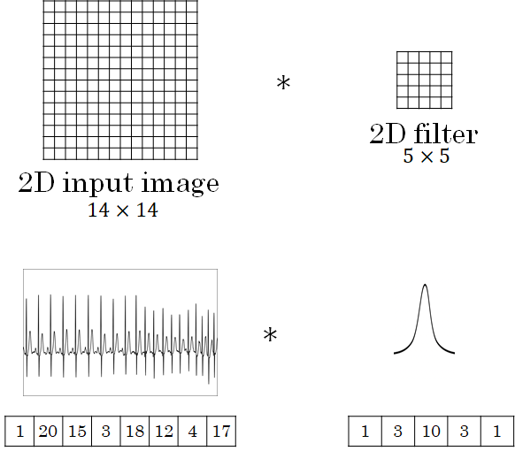
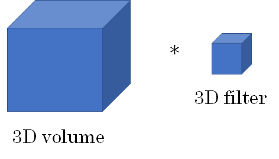
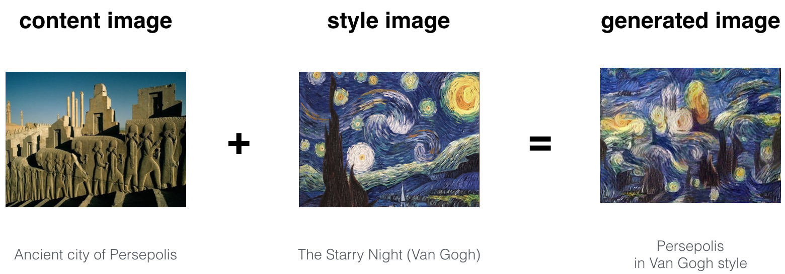

Deep Learning Specialization, Course D
**Convolutional Neural Networks** by deeplearning.ai, ***Andrew Ng,*** [Coursera](https://www.coursera.org/learn/neural-networks-deep-learning/home/info)

***Week 4:*** *Special Applications: Face Recognition & Neural Style Transfer*

1. Discover how CNNs can be applied to multiple fields, including art generation and face recognition. Implement your own algorithm to generate art and recognize faces!

<!-- more -->

### Face Recognition

#### What is Face Recognition?

**Verification** *( 1 - 1 )*

- input image, name / ID
- output whether the input image is that of the claimed person

**Recognition** *( 1 - k )*

- a database of K persons
- get an input image
- output ID if the image is any of the K persons (or 'not recognized')

#### One Shot Learning

learning from one example to recognize the person again

**Learning a *similarity* function**

#### Siamese Network

$d\left( x^{\left( 1\right) },x^{\left( 2\right) }\right) =\left\| f\left( x^{\left( 1\right) }\right) -f\left( x^{\left( 2\right) }\right) \right\| ^{2}$

- Parameters of NN define an encoding $f\left( x^{\left( i\right) }\right)$
- Learn parameters so that
  - if $x^{\left( i\right) } , x^{\left( j\right)}$ are the same person, $\left\| f\left( x^{\left( i\right) }\right) -f\left( x^{\left( j\right) }\right) \right\| ^{2}$ is small
  - if $x^{\left( i\right) } , x^{\left( j\right)}$ are different persons, $\left\| f\left( x^{\left( i\right) }\right) -f\left( x^{\left( j\right) }\right) \right\| ^{2}$ is large

#### Triplet Loss

***anchor, positive, negative***

$\begin{aligned} d\left(A,P\right) &\leq d\left(A,N\right) \\ \left\| f\left( A \right) -f\left( P \right) \right\| ^{2} &\leq \left\| f\left( A \right) -f\left( N \right) \right\| ^{2} \\ \Rightarrow \ \left\| f\left( A \right) -f\left( P \right) \right\| ^{2} &\,- \left\| f\left( A \right) -f\left( N \right) \right\| ^{2} +\alpha \leq 0\end{aligned}$

$L\left(A,P,N\right) = \max\left( \left\| f\left( A \right) -f\left( P \right) \right\| ^{2} - \left\| f\left( A \right) -f\left( N \right) \right\| ^{2} +\alpha, \ 0 \right)$

$J=\sum_{i=1}^{m} L\left(A^{\left( i\right) },P^{\left( i\right) },N^{\left( i\right) }\right)$

##### choosing the triplets A, P, N

choose triplets *hard* to train on

#### Face Verification and Binary Classification

$\begin{aligned} \widehat {y} &=\sigma \left( \sum ^{n}_{k=1}w_{k}\left| f\left( x^{\left( i\right) }\right) _{k}-f\left( x^{\left( j\right) }\right) _{k}\right| +b\right) \\ \widehat {y} &=\sigma \left( \sum ^{n}_{k=1}w_{k} \dfrac{\left( f\left( x^{\left( i\right) }\right) _{k}-f\left( x^{\left( j\right) }\right) _{k}\right)^2}{f\left( x^{\left( i\right) }\right) _{k}+f\left( x^{\left( j\right) }\right) _{k}} +b\right) \qquad \chi ^2\ {\rm similarity} \end{aligned}$

*precompute database*

### Neural Style Transfer

#### What is Neural Style Transfer?

#### What are Deep ConvNets Learning?

#### Cost Function

$J\left(G\right) = \alpha\cdot J_{\rm content} \left(C,G\right) + \beta\cdot J_{\rm style} \left(S,G\right)$

1. initialize G randomly
2. use gradient descent to minimize J(G)

#### Content Cost Function

- use hidden layer l to compute content cost
- use a pretrained ConvNet
- let a\[l](C) and a\[l](G) be the activation of layer l on the images
- if a\[l](C) and a\[l](G) are similar, both images have similar content

$J_{\rm content} \left(C,G\right) = \dfrac{1}{2} \cdot \left\| a^{\left[l\right]\left(C\right)}  - a^{\left[l\right]\left(G\right)} \right\| ^2$

#### Style Cost Function

- use hidden layer l to compute style cost
- define style as correlation between activations across channels

$\textsf{Let } a_{i,j,k}^{\left[l\right]} = \textsf{ activation at } \overbrace{ \left( i,j,k \right) }^{\rm H,W,C}.\ G^{\left[l\right]} \textsf{ is } n_c^{\left[l\right]} \times n_c^{\left[l\right]}.$

$\begin{aligned} G_{kk'}^{\left[l\right]\left(S\right)} &= \sum_{i=1}^{n_H^{\left[l\right]}} \sum_{j=1}^{n_W^{\left[l\right]}} a_{i,j,k}^{\left[l\right]\left(S\right)} a_{i,j,k'}^{\left[l\right]\left(S\right)} \\ G_{kk'}^{\left[l\right]\left(G\right)} &= \sum_{i=1}^{n_H^{\left[l\right]}} \sum_{j=1}^{n_W^{\left[l\right]}} a_{i,j,k}^{\left[l\right]\left(G\right)} a_{i,j,k'}^{\left[l\right]\left(G\right)} \qquad \textsf{Gram Matrix}^{\strut} \end{aligned}$

$\begin{aligned} J_{\rm style}^{\left[l\right]} \left(S,G\right) &= \dfrac{1}{\left(2 n_H^{\left[l\right]} n_W^{\left[l\right]} n_C^{\left[l\right]} \right)^2} \cdot \left\| G^{\left[l\right]\left(S\right)}  - G^{\left[l\right]\left(G\right)} \right\| ^2_F \\ &= \dfrac{1}{\left(2 n_H^{\left[l\right]} n_W^{\left[l\right]} n_C^{\left[l\right]} \right)^2} \cdot \sum_{k} \sum_{k'} \left( G^{\left[l\right]\left(S\right)}_{kk'}  - G^{\left[l\right]\left(G\right)}_{kk'} \right)^2 \\ \\ J_{\rm style} \left(S,G\right) &= \sum_l \lambda ^{\left[l\right]} J_{\rm style}^{\left[l\right]} \left(S,G\right) \end{aligned}$

$J\left(G\right) = \alpha\cdot J_{\rm content} \left(C,G\right) + \beta\cdot J_{\rm style} \left(S,G\right)$

#### 1D and 3D Generalizations

##### 2D to 1D

##### 2D to 3D

### Programming Assignments

#### Art generation with Neural Style Transfer

#### Face Recognition

<a href='https://github.com/muhac/coursera-deep-learning-solutions' target="_blank">Solutions Manual</a>
