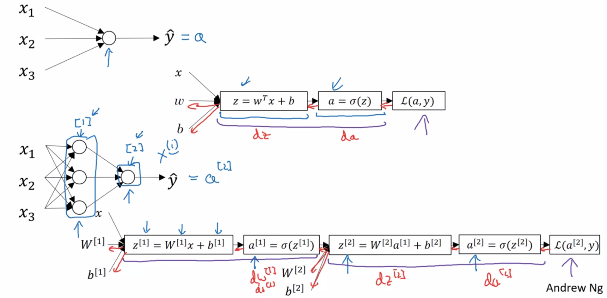
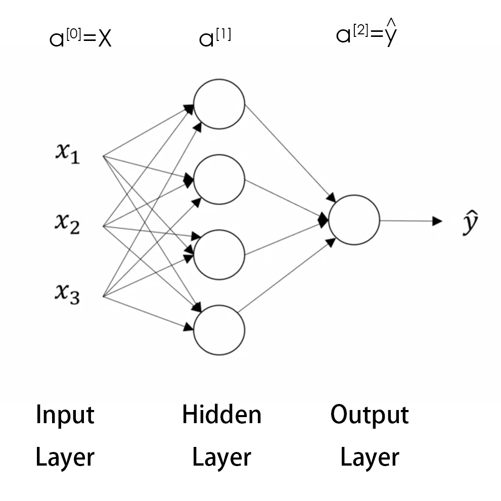
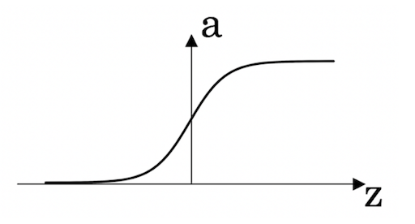
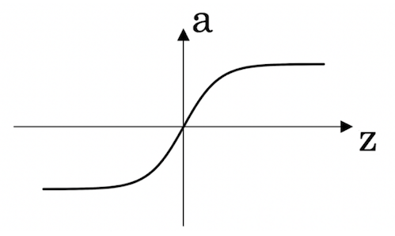
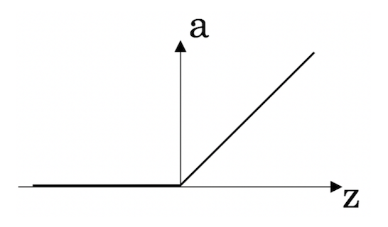
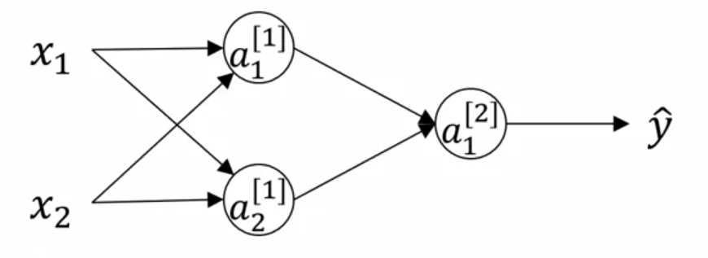
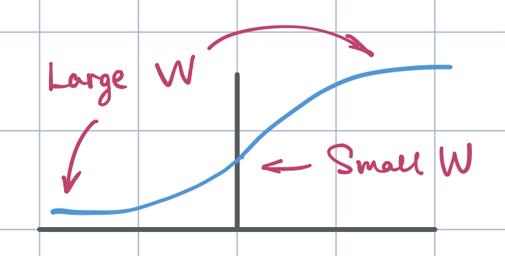

Deep Learning Specialization, Course A
**Neural Networks and Deep Learning** by deeplearning.ai, ***Andrew Ng,*** [Coursera](https://www.coursera.org/learn/neural-networks-deep-learning/home/info)

***Week 3:*** *Shallow Neural Networks*

1. Understand hidden units and hidden layers
2. Be able to apply a variety of activation functions in a neural network.
3. Build your first forward and backward propagation with a hidden layer
4. Apply random initialization to your neural network
5. Become fluent with Deep Learning notations and Neural Network Representations
6. Build and train a neural network with one hidden layer.

<!-- more -->

### Shallow Neural Network

#### Neural Networks Overview

- ***n(i):*** training samples
- ***n[i]:*** layers

#### Neural Network Representation

**2 Layer Neural Network**

$a^{\left[0\right]} = x = \left[ \begin{matrix} x_1 \\ x_2 \\ x_3 \end{matrix} \right] \qquad \underbrace{ a^{\left[1\right]} = \left[ \begin{matrix} a^{\left[1\right]}_1 \\ \vdots  \\ a^{\left[2\right]}_4 \end{matrix} \right] }_{w^{\left[1\right]}\in\mathbb{R}^{4 \times3}\\b^{\left[1\right]}\in\mathbb{R}^{4\times1}} \qquad \underbrace{ a^{\left[2\right]} = \hat{y}}_{w^{\left[2\right]}\in\mathbb{R}^{1\times4}\\b^{\left[2\right]}\in\mathbb{R}^{1\times1}}$

#### Computing a Neural Network's Output

$\begin{cases} z^{\left[1\right]}_1 = {w^{\left[1\right]}_1 }^{\mathsf{T}} x + b^{\left[1\right]}_1 \qquad & a^{\left[1\right]}_1 = \sigma \left(z^{\left[1\right]}_1 \right) \\ z^{\left[1\right]}_2 = {w^{\left[1\right]}_2 }^{\mathsf{T}} x + b^{\left[1\right]}_2 \qquad & a^{\left[1\right]}_2 = \sigma \left(z^{\left[1\right]}_2 \right) \\ z^{\left[1\right]}_3 = {w^{\left[1\right]}_3 }^{\mathsf{T}} x + b^{\left[1\right]}_3 \qquad & a^{\left[1\right]}_3 = \sigma \left(z^{\left[1\right]}_3 \right) \\ z^{\left[1\right]}_4 = {w^{\left[1\right]}_4 }^{\mathsf{T}} x + b^{\left[1\right]}_4 \qquad & a^{\left[1\right]}_4 = \sigma \left(z^{\left[1\right]}_4 \right) \end{cases}$

##### vectorized

$z^{\left[1\right]} = {\overbrace{\left[ \begin{matrix}  \rule{15pt}{0.4pt} \ {w^{\left[1\right]}_1}^{\mathsf{T}} \ \rule{15pt}{0.4pt} \\ \rule{15pt}{0.4pt} \ {w^{\left[1\right]}_2}^{\mathsf{T}} \ \rule{15pt}{0.4pt}  \\ \rule{15pt}{0.4pt} \ {w^{\left[1\right]}_3}^{\mathsf{T}} \ \rule{15pt}{0.4pt} \\ \rule{15pt}{0.4pt} \ {w^{\left[1\right]}_4}^{\mathsf{T}} \ \rule{15pt}{0.4pt} \end{matrix} \right]}^{W^{\left[1\right]}}}_{4\times3} \left[ \begin{matrix} x_1 \\ x_2  \\ x_3 \end{matrix} \right] + {\overbrace{ \left[ \begin{matrix} b^{\left[1\right]}_1 \\ b^{\left[1\right]}_2 \\ b^{\left[1\right]}_3 \\ b^{\left[1\right]}_4 \end{matrix} \right]}^{b^{\left[1\right]}}}_{4\times1} = \left[ \begin{matrix} {w^{\left[1\right]}_1 }^{\mathsf{T}} x + b^{\left[1\right]}_1 \\ {w^{\left[1\right]}_2 }^{\mathsf{T}} x + b^{\left[1\right]}_2 \\ {w^{\left[1\right]}_3 }^{\mathsf{T}} x + b^{\left[1\right]}_3 \\ {w^{\left[1\right]}_4 }^{\mathsf{T}} x + b^{\left[1\right]}_4 \end{matrix} \right] = \left[ \begin{matrix} z^{\left[1\right]}_1 \\ z^{\left[1\right]}_2 \\ z^{\left[1\right]}_3 \\ z^{\left[1\right]}_4 \end{matrix} \right]$

$a^{\left[1\right]} = \left[ \begin{matrix} a^{\left[1\right]}_1 \\ a^{\left[1\right]}_2 \\ a^{\left[1\right]}_3 \\ a^{\left[1\right]}_4 \end{matrix} \right] = \sigma \left(z^{\left[1\right]} \right)$

$\begin{cases}  z^{\left[1\right]} = W^{\left[1\right]} a^{\left[0\right]}  + b^{\left[1\right]} \qquad & a^{\left[1\right]} = \sigma \left(z^{\left[1\right]} \right) \qquad & {\rm hidden\ layer} \\ z^{\left[2\right]} = W^{\left[2\right]} a^{\left[1\right]}  + b^{\left[2\right]} \qquad \hat{y} =&a^{\left[2\right]} = \sigma \left(z^{\left[2\right]} \right) \qquad & {\rm output\ layer} \end{cases}$

#### Vectorizing across Multiple Examples

For $i=1$ to $m$  
&emsp;&emsp;$z^{\left[1\right]\left(i\right)} = W^{\left[1\right]} x^{\left(i\right)} + b^{\left[1\right]}$  
&emsp;&emsp;$a^{\left[1\right]\left(i\right)} = \sigma \left(z^{\left[1\right]\left(i\right)} \right)$  
&emsp;&emsp;$z^{\left[2\right]\left(i\right)} = W^{\left[2\right]} a^{\left[1\right]\left(i\right)}  + b^{\left[2\right]}$  
&emsp;&emsp;$a^{\left[2\right]\left(i\right)} = \sigma \left(z^{\left[2\right]\left(i\right)} \right)$

##### vectorized

$X = \left[ \begin{matrix} \Big| & \Big| & \Big| & & \Big| \\ x^{\left(1\right)} & x^{\left(2\right)} & x^{\left(3\right)} & \cdots & x^{\left(m\right)} \\ \Big| & \Big| & \Big| & & \Big| \end{matrix} \right]  \qquad X\in\mathbb{R}^{n_x \times m}$

$Z^{\left[1\right]} = \left[ \begin{matrix} \Big| & \Big| & & \Big| \\ z^{\left[1\right]\left(1\right)} & z^{\left[1\right]\left(2\right)} & \cdots & z^{\left[1\right]\left(m\right)} \\ \Big|  & \Big| & & \Big| \end{matrix} \right]  \qquad Z^{\left[1\right]} \in\mathbb{R}^{n_{\rm units} \times m}$

$A^{\left[1\right]} = \left[ \begin{matrix} \Big| & \Big| & & \Big| \\ a^{\left[1\right]\left(1\right)} & a^{\left[1\right]\left(2\right)} & \cdots & a^{\left[1\right]\left(m\right)} \\ \Big|  & \Big| & & \Big| \end{matrix} \right]  \qquad A^{\left[1\right]} \in\mathbb{R}^{n_{\rm units} \times m}$

$\begin{cases}\begin{aligned} & Z^{\left[1\right]} = W^{\left[1\right]} X + b^{\left[1\right]} \\ & A^{\left[1\right]} = g^{\left[1\right]} \left(Z^{\left[1\right]} \right) \\ & Z^{\left[2\right]} = W^{\left[2\right]} A^{\left[1\right]}  + b^{\left[2\right]} \\ & A^{\left[2\right]} = g^{\left[2\right]} \left(Z^{\left[2\right]} \right) \end{aligned}\end{cases}$

#### Activation Functions

- ***sigmoid:*** $a= \sigma \left(z\right) = \dfrac{1}{1+e^{-z}}$

- ***hyperbolic tangent:*** $a = \tanh\left(z\right) = \dfrac{e^z-e^{-z}}{e^z+e^{-z}}$&emsp;&emsp;zero mean
  **hyperbolic tangent** is almost always ***strictly* superior** than **sigmoid** activation function except for the **output layer** of a **binary classification**
- ***rectified linear unit:*** $a= {\rm ReLU} \left(z\right) = \max\left(0,\,z\right)$&emsp;&emsp;derivative >> 0
  **default,** most commonly used

- ***leaky ReLU:*** $a= {\rm LeakyReLU} \left(z\right) = \max\left(\epsilon z,\,z\right), \quad \epsilon \ll 1,\ \sim 0.01 ^{\rm \ learning\ rate}$

#### Why Need Non-Linear Activation Functions

if use linear activation functions (identity activation functions)

$\begin{aligned}a^{\left[1\right]}=z^{\left[1\right]}&=W^{\left[1\right]}x+b^{\left[1\right]}\\a^{\left[2\right]}=z^{\left[2\right]}&=W^{\left[2\right]}a^{\left[1\right]}+b^{\left[2\right]}\\&=W^{\left[2\right]}\left(W^{\left[1\right]}x+b^{\left[1\right]}\right)+b^{\left[2\right]}\\&=\left(W^{\left[2\right]}W^{\left[1\right]}\right)x+\left(W^{\left[2\right]}b^{\left[1\right]}+b^{\left[2\right]}\right)\\&=W^\star x+b^\star\end{aligned}$

$a^{\left[i\right]}$ is ***always linear***

**do *not*** use **linear activation function** except for the **output layer** of a **regression** problem

#### Derivatives of Activation Functions

##### Sigmoid activation functions

$g\left(z\right) = \sigma \left(z\right) = \dfrac{1}{1+e^{-z}}$

$g' \left(z\right) = \dfrac{d}{dz} g\left(z\right) = \dfrac{1}{1+e^{-z}}\left(1-\dfrac{1}{1+e^{-z}}\right) = \underbrace{ g\left(z\right)\left(1-g\left(z\right)\right)} _{=\,a\,\left(1-a\right)}$

##### Hyperbolic tangent activation functions

$g\left(z\right) = \tanh\left(z\right) = \dfrac{e^z-e^{-z}}{e^z+e^{-z}}$

$g' \left(z\right) = \dfrac{d}{dz} g\left(z\right) = 1-\left( \tanh\left(z\right)\right)^2  = \underbrace{ 1-g^2 \left(z\right)} _{=\,1\,-\,a^2}$

##### ReLU activation functions

$g\left(z\right) =  {\rm ReLU} \left(z\right) = \max\left(0,\,z\right)$

$g' \left(z\right) = \dfrac{d}{dz} g\left(z\right) = \begin{cases}0 \qquad {\rm if}\ \ z < 0 \\ 1 \qquad {\rm if}\ \ z \geq 0 \end{cases}$

##### Leaky-ReLU activation functions

$g\left(z\right) = {\rm LeakyReLU} \left(z\right) = \max\left(\epsilon z,\,z\right)$

$g' \left(z\right) = \dfrac{d}{dz} g\left(z\right) = \begin{cases}\epsilon \qquad {\rm if}\ \ z < 0 \\ 1 \qquad {\rm if}\ \ z \geq 0 \end{cases}$

#### Gradient Descent for Neural Networks

- ***Parameters:*** ${W^{\left[1\right]}}_{n^{\left[1\right]} \times n^{\left[0\right]}},\ {b^{\left[1\right]}}_{n^{\left[1\right]} \times 1},\ {W^{\left[2\right]}}_{n^{\left[2\right]} \times n^{\left[1\right]}},\ {b^{\left[2\right]}}_{n^{\left[2\right]} \times 1} \qquad n_x=n^{\left[0\right]},\ n^{\left[1\right]},\ n^{\left[2\right]}=1$
- ***Cost Function:*** $J\left( {W^{\left[1\right]}},\ {b^{\left[1\right]}},\ {W^{\left[2\right]}},\ {b^{\left[2\right]}} \right) = \dfrac{1}{m} \sum_{i=1}^{m} L( \underbrace{\hat{y}^{\left(i\right)}}_{a^{\left[2\right]}},\,y^{\left(i\right)})$

Gradient Decent Repeat:
&emsp;&emsp;compute predictions $\hat{y}^{\left(i\right)}, \ \ i=1, \,\dots,\,m$
&emsp;&emsp;compute derivatives  $dW^{\left[1\right]}=\dfrac{\partial J}{\partial W^{\left[1\right]}},\,db^{\left[1\right]}=\dfrac{\partial J}{\partial b^{\left[1\right]}},\,\dots$
&emsp;&emsp;update $W^{\left[1\right]}:=W^{\left[1\right]}-\alpha dW^{\left[1\right]},\ \ b^{\left[1\right]}:=b^{\left[1\right]}-\alpha db^{\left[1\right]},\,\dots$

##### Formulas

$\begin{array}{lc|cl} \textsf{forward propagation} & \ & \quad & \textsf{back propagation} \\ \\ {\begin{cases}\begin{aligned} Z^{\left[1\right]} &= W^{\left[1\right]} X + b^{\left[1\right]} \\ A^{\left[1\right]} &= g^{\left[1\right]} \left(Z^{\left[1\right]} \right) \\ Z^{\left[2\right]} &= W^{\left[2\right]} A^{\left[1\right]}  + b^{\left[2\right]} \\ A^{\left[2\right]} &= g^{\left[2\right]} \left(Z^{\left[2\right]} \right) \end{aligned}\end{cases}} & & & {\begin{cases}\begin{aligned} dZ^{\left[2\right]} &= A^{\left[2\right]} - Y \\ dW^{\left[2\right]} &= \dfrac{1}{m} dZ^{\left[2\right]} {A^{\left[1\right]}}^{\mathsf{T}} \\ db^{\left[2\right]} &= \dfrac{1}{m} \texttt{np.sum(} dZ^{\left[2\right]} \texttt{, axis=1, keepdims=True)} \\ dZ^{\left[1\right]} &= \overbrace{ {W^{\left[2\right]} }^{\mathsf{T}} dZ^{\left[2\right]}  }^{\left(n^{\left[1\right]},\ m\right)} \odot \overbrace{ {g'} ^{\left[1\right]} \left(Z^{\left[1\right]}\right) }^{\left(n^{\left[1\right]},\ m\right)}\\ dW^{\left[1\right]} &= \dfrac{1}{m} dZ^{\left[1\right]} {X}^{\mathsf{T}} \\ db^{\left[1\right]} &= \dfrac{1}{m} \texttt{np.sum(} dZ^{\left[1\right]} \texttt{, axis=1, keepdims=True)} \end{aligned}\end{cases}} \end{array}$

&emsp;&emsp;***Notice:*** $\odot$ represents **element-wise** product

#### Backpropagation Intuition

$z^{\left[1\right]} \rightarrow a^{\left[1\right]} \rightarrow  z^{\left[2\right]} \rightarrow a^{\left[2\right]} \rightarrow L$

$dz^{\left[2\right]}=a^{\left[2\right]} -y \rightarrow \begin{aligned} dW^{\left[2\right]} & = dz^{\left[2\right]} {a^{\left[1\right]} }^{\mathsf{T}} \\ db^{\left[2\right]} & = dz^{\left[2\right]} \end{aligned} \rightarrow  \overbrace{ dz^{\left[1\right]}  }^{\left(n^{\left[1\right]},\ 1\right)} = \overbrace{ {W^{\left[2\right]} }^{\mathsf{T}} dz^{\left[2\right]}  }^{\left(n^{\left[1\right]},\ 1\right)}   \odot \overbrace{ {g'} ^{\left[1\right]} \left(z^{\left[1\right]}\right) }^{\left(n^{\left[1\right]},\ 1\right)}  \rightarrow \begin{aligned} dW^{\left[2\right]} & = dz^{\left[1\right]} {x}^{\mathsf{T}} \\ db^{\left[1\right]} & = dz^{\left[1\right]} \end{aligned}$

##### vectorized

$dZ^{\left[2\right]}=A^{\left[2\right]} -Y \rightarrow \begin{aligned} dW^{\left[2\right]} & = \dfrac{1}{m} dZ^{\left[2\right]} {A^{\left[1\right]} }^{\mathsf{T}} \\ db^{\left[2\right]} & = \dfrac{1}{m} \texttt{np.sum(}\,  dZ^{\left[2\right]} \,\texttt{...)}\end{aligned}$
&emsp;&emsp;$\rightarrow \overbrace{ dZ^{\left[1\right]} }^{\left(n^{\left[1\right]},\ m\right)}  = \overbrace{ {W^{\left[2\right]} }^{\mathsf{T}} dZ^{\left[2\right]}  }^{\left(n^{\left[1\right]},\ m\right)} \odot \overbrace{ {g'} ^{\left[1\right]} \left(Z^{\left[1\right]}\right) }^{\left(n^{\left[1\right]},\ m\right)}  \rightarrow \begin{aligned} dW^{\left[2\right]} & = dZ^{\left[1\right]} {X}^{\mathsf{T}} \\ db^{\left[1\right]} & = \dfrac{1}{m} \texttt{np.sum(}\, dZ^{\left[1\right]}  \,\texttt{...)} \end{aligned}$

#### Random Initialization

##### Zero initialization

$\begin{aligned}W^{\left[1\right]} &= \left[ \begin{matrix} 0 & 0 \\ 0 & 0 \end{matrix} \right]\\ W^{\left[2\right]} &= \left[ \begin{matrix} 0 & 0 \end{matrix} \right] \end{aligned} \Rightarrow a^{\left[1\right]}_1 = a^{\left[1\right]}_2 \Rightarrow dz^{\left[1\right]}_1 = dz^{\left[1\right]}_2 \Rightarrow W^{\left[1\right]} = \left[ \begin{matrix} a & b \\ a & b \end{matrix} \right]  \Rightarrow \cdots \Rightarrow W^{\left[1\right]} = \left[ \begin{matrix} a' & b' \\ a' & b' \end{matrix} \right]$

&emsp;&emsp;get **all hidden units** computing exactly ***same*** function

##### Random initialization

$\begin{aligned} W^{\left[1\right]} &= \texttt{np.random.rand((2, 2)) }\star\texttt{ 0.01} \\ b^{\left[1\right]} &= \texttt{np.zeros((2, 1))} \\ W^{\left[2\right]} &= \texttt{np.random.rand((1, 2)) }\star\texttt{ 0.01} \\ b^{\left[2\right]} &= \texttt{0} \end{aligned}$

**why `* 0.01` in shallow neural network**

### Programming Assignments

#### Planar Data Classification with a Hidden Layer

<a href='https://github.com/muhac/coursera-deep-learning-solutions' target="_blank">Solutions Manual</a>
