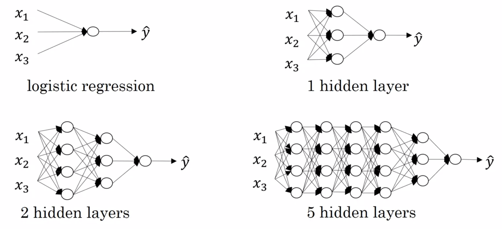
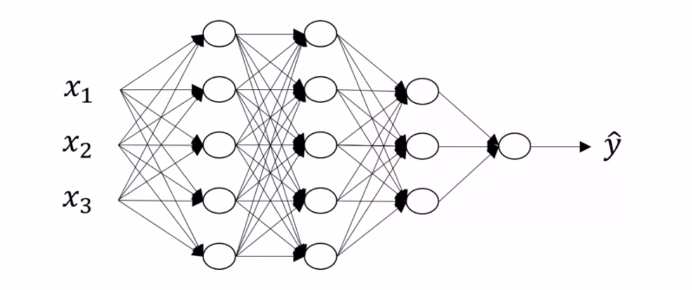
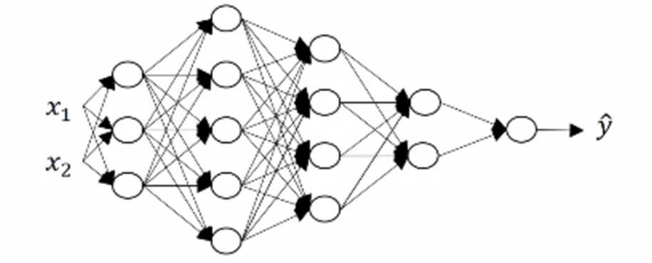
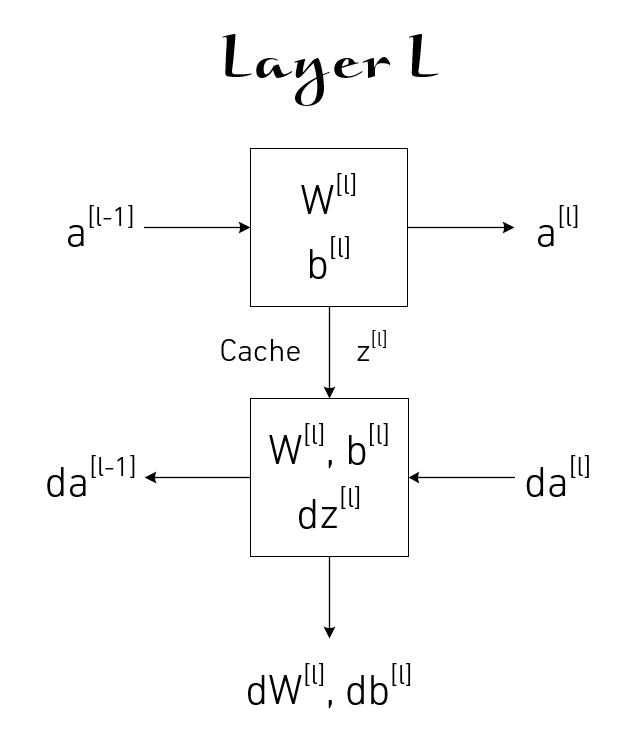

Deep Learning Specialization, Course A
**Neural Networks and Deep Learning** by deeplearning.ai, ***Andrew Ng,*** [Coursera]( https://www.coursera.org/learn/neural-networks-deep-learning/home/info)

***Week 4:*** *Deep Neural Networks*

1. See deep neural networks as successive blocks put one after each other
2. Build and train a deep L-layer Neural Network
3. Analyze matrix and vector dimensions to check neural network implementations.
4. Understand how to use a cache to pass information from forward propagation to back propagation.
5. Understand the role of hyperparameters in deep learning

<!-- more -->

### Deep Neural Network

#### Deep L-Layer neural network

- ***L:*** number of layers
- ***n[l]:*** number of units in layer l
- ***a[l] = g[l](z[l]):*** activations in layer l
- ***W[l]:*** weights for z[l]
- ***b[l]:*** biases for z[l]

$n^{\left[0\right]} = n_x = 3, \ n^{\left[1\right]} = 5, \ n^{\left[2\right]} = 5, \ n^{\left[3\right]} = 3, \ n^{\left[4\right]} = n^{\left[L\right]} = 1 $

#### Forward Propagation in a Deep Network

$\begin{matrix} \begin{aligned} x&=a^{\left[0\right]} \\ z^{\left[1\right]}&=W^{\left[1\right]}a^{\left[0\right]}+b^{\left[1\right]} \\ a^{\left[1\right]}&=g^{\left[1\right]}\left(z^{\left[1\right]}\right) \end{aligned} & \begin{aligned} z^{\left[2\right]}&=W^{\left[2\right]}a^{\left[1\right]}+b^{\left[2\right]} \\ a^{\left[2\right]}&=g^{\left[2\right]}\left(z^{\left[2\right]}\right) \end{aligned} & \begin{aligned} z^{\left[3\right]}&=W^{\left[3\right]}a^{\left[2\right]}+b^{\left[3\right]} \\ a^{\left[3\right]}&=g^{\left[3\right]}\left(z^{\left[3\right]}\right) \end{aligned} & \begin{aligned} z^{\left[4\right]}&=W^{\left[4\right]}a^{\left[3\right]}+b^{\left[4\right]} \\ a^{\left[4\right]}&=g^{\left[4\right]}\left(z^{\left[4\right]}\right) \\ \hat{y}&=a^{\left[4\right]} \end{aligned} \end{matrix}$

$\Rightarrow \begin{cases} \begin{aligned} z^{\left[l\right]}&=W^{\left[l\right]}a^{\left[l-1\right]}+b^{\left[l\right]} \\ a^{\left[l\right]}&=g^{\left[l\right]}\left(z^{\left[l\right]}\right) \end{aligned} \qquad \texttt{for l = 1, 2, ..., L} \end{cases}$

##### vectorized

$\begin{matrix} \begin{aligned} X&=A^{\left[0\right]} \\ Z^{\left[1\right]}&=W^{\left[1\right]}A^{\left[0\right]}+b^{\left[1\right]} \\ A^{\left[1\right]}&=g^{\left[1\right]}\left(Z^{\left[1\right]}\right) \end{aligned} & \begin{aligned} Z^{\left[2\right]}&=W^{\left[2\right]}A^{\left[1\right]}+b^{\left[2\right]} \\ A^{\left[2\right]}&=g^{\left[2\right]}\left(Z^{\left[2\right]}\right) \end{aligned} & \begin{aligned} Z^{\left[3\right]}&=W^{\left[3\right]}A^{\left[2\right]}+b^{\left[3\right]} \\ A^{\left[3\right]}&=g^{\left[3\right]}\left(Z^{\left[3\right]}\right) \end{aligned} & \begin{aligned} Z^{\left[4\right]}&=W^{\left[4\right]}A^{\left[3\right]}+b^{\left[4\right]} \\ A^{\left[4\right]}&=g^{\left[4\right]}\left(Z^{\left[4\right]}\right) \\ \hat{Y}&=A^{\left[4\right]} \end{aligned} \end{matrix}$

$\Rightarrow \begin{cases} \begin{aligned} Z^{\left[l\right]}&=W^{\left[l\right]}A^{\left[l-1\right]}+b^{\left[l\right]} \\ A^{\left[l\right]}&=g^{\left[l\right]}\left(Z^{\left[l\right]}\right) \end{aligned} \qquad \texttt{for l = 1, 2, ..., L} \end{cases}$

#### Getting Your Matrix Dimensions Right

$n_x=n^{\left[0\right]} = 2, \ n^{\left[1\right]} = 3, \ n^{\left[2\right]} = 5, \ n^{\left[3\right]} = 4, \ n^{\left[4\right]} = 2, \ n^{\left[5\right]} = 1 \ $

$\left. \begin{aligned} \overbrace{ z^{\left[1\right]} }^{n^{\left[1\right]} \times 1  \\ =3\times1} = \overbrace{ W^{\left[1\right]} }^{n^{\left[1\right]} \times n^{\left[0\right]} \\ =3\times2} \cdot \overbrace{ x\strut }^{n^{\left[0\right]} \times 1 \\ =2\times1} + \overbrace{ b^{\left[1\right]} }^{n^{\left[1\right]} \times 1  \\ =3\times1} \\ \underbrace{ Z^{\left[1\right]} }_{n^{\left[1\right]} \times m} = \underbrace{ W^{\left[1\right]} }_{n^{\left[1\right]} \times n^{\left[0\right]}} \cdot \underbrace{ X }_{n^{\left[0\right]} \times m} + \underbrace{ b^{\left[1\right]} }_{n^{\left[1\right]} \times 1} \end{aligned} \ \ \right\} \quad\Rightarrow\quad \begin{cases} \begin{aligned} Z^{\left[l\right]}&:\ \left(n^{\left[l\right]} ,\, m\right) \\ A^{\left[l\right]}&:\ \left(n^{\left[l\right]} ,\, m\right) \\ dZ^{\left[l\right]}&:\ \left(n^{\left[l\right]} ,\, m\right) \\ dA^{\left[l\right]}&:\ \left(n^{\left[l\right]} ,\, m\right) \end{aligned} \end{cases} \,,\quad \begin{cases} \begin{aligned} W^{\left[l\right]}&:\ \left(n^{\left[l\right]} ,\, n^{\left[l-1\right]}\right) \\ b^{\left[l\right]}&:\ \left(n^{\left[l\right]} ,\, 1\right) \,{}_\texttt{broadcasting} \\ dW^{\left[l\right]}&:\ \left(n^{\left[l\right]} ,\, n^{\left[l-1\right]}\right) \\ db^{\left[l\right]}&:\ \left(n^{\left[l\right]} ,\, 1\right) \,{}_\texttt{broadcasting} \end{aligned} \end{cases}$

#### Building Blocks of Deep Neural Networks

**one layer**

**one iteration**

#### Forward and Backward Propagation

##### Forward Propagation

- input a[l-1]
- output a[l], cache z[l], (W[l], b[l])

$\begin{array}{lc|cl} {}^\textsf{Forward Propagation} & & & \textsf{vectorized}_\strut \\ {\begin{cases}\begin{aligned} z^\left[l\right] &= W^\left[l\right] a^\left[l-1\right] + b^\left[l\right] \\ a^\left[l\right] &= g^\left[l\right] \left(z^\left[l\right] \right) \end{aligned}\end{cases}} & & & {\begin{cases}\begin{aligned} Z^\left[l\right] &= W^\left[l\right] A^\left[l-1\right] + b^\left[l\right] \\ A^\left[l\right] &= g^\left[l\right] \left(Z^\left[l\right] \right)\end{aligned}\end{cases}} \end{array}$

##### Backward Propagation

- input da[l]
- output da[l-1], dW[l], db[l])

$\begin{array}{lc|cl} {}^\textsf{Backward Propagation} & & & \textsf{vectorized}_\strut \\ {\begin{cases}\begin{aligned} dz^\left[l\right] &= da^\left[l\right] \odot {g^\left[l\right]}' \left(z^\left[l\right] \right) \\ dW^\left[l\right] &= dz^\left[l\right] { a^\left[l-1\right] }^{\mathsf{T}} \\ db^\left[l\right] &= dz^\left[l\right] \\ da^\left[l-1\right] &= { W^\left[l\right] }^{\mathsf{T}} dz^\left[l\right] \end{aligned}\end{cases}} & & & {\begin{cases}\begin{aligned} dZ^\left[l\right] &= dA^\left[l\right] \odot {g^\left[l\right]}' \left(Z^\left[l\right] \right) \\ dW^\left[l\right] &= \dfrac{1}{m} dZ^\left[l\right] { A^\left[l-1\right] }^{\mathsf{T}} \\ db^\left[l\right] &= \dfrac{1}{m} \texttt{np.sum(} dZ^\left[l\right] \texttt{, axis=1, keepdims=True)} \\ dA^\left[l-1\right] &= { W^\left[l\right] }^{\mathsf{T}} dZ^\left[l\right] \end{aligned}\end{cases}} \end{array}$

**initialize**

$\begin{aligned} a^\left[0\right] &= x \qquad & A^\left[0\right] &= X \\ da^\left[L\right] &= - \dfrac{y}{a} + \dfrac{1-y}{1-a} \qquad & dA^\left[L\right] &= \sum_{i=1}^{m} \left(- \dfrac{y ^\left(i\right)}{a ^\left(i\right)} + \dfrac{1-y ^\left(i\right)}{1-a ^\left(i\right)}\right) \end{aligned}$

#### Parameters vs Hyperparameters

- **Parameters**
  - W[1], b[1], W[2], b[2], ...

- **Hyperparameters**
  - learning rate α
  - \# iterations
  - \# hidden layers L
  - \# hidden units n[1], n[2], ...
  - activation function
  - momentum
  -  mini batch size
  - regularization parameters

### Programming Assignments

#### Building your Deep Neural Network: Step by Step

#### Deep Neural Network - Application

<a href='https://github.com/muhac/coursera-deep-learning-solutions' target="_blank">Solutions Manual</a>
