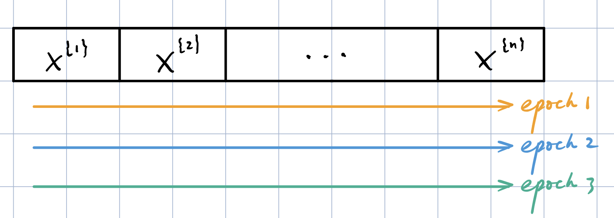
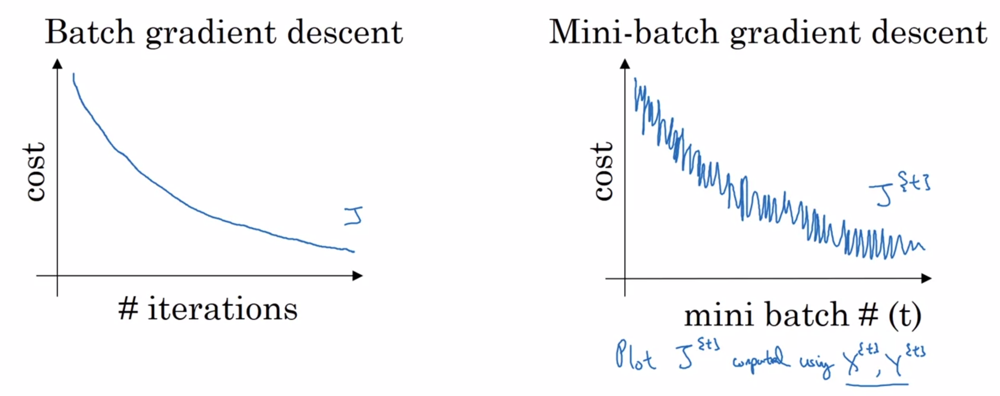
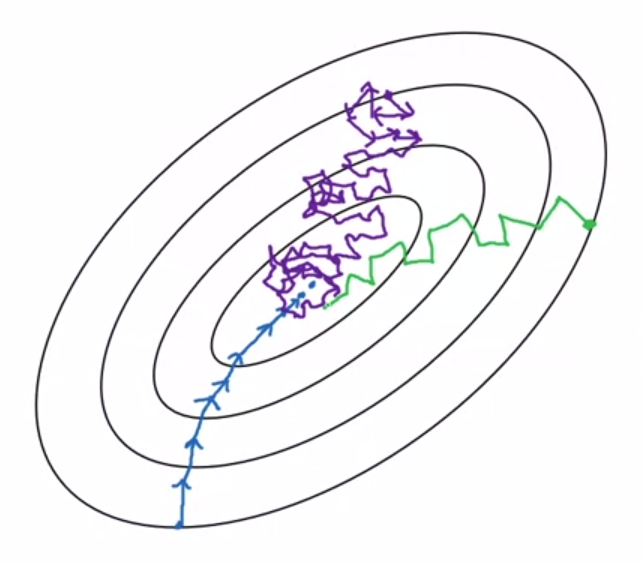
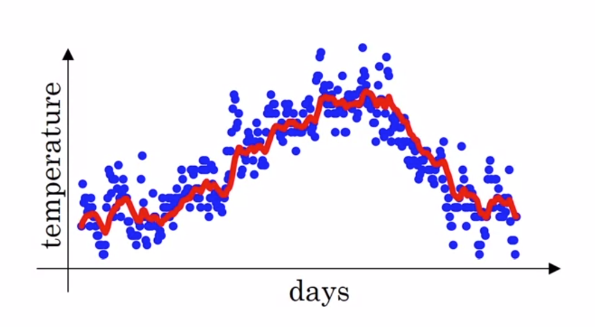
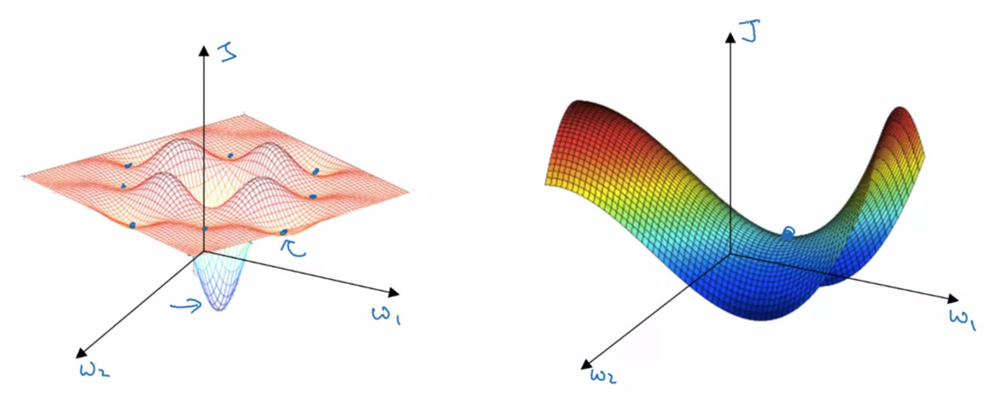

Deep Learning Specialization, Course B
**Improving Deep Neural Networks: Hyperparameter tuning, Regularization and Optimization**
by deeplearning.ai, ***Andrew Ng,*** [Coursera](https://www.coursera.org/learn/neural-networks-deep-learning/home/info)

***Week 2:*** *Optimization Algorithms*

1. Remember different optimization methods such as (Stochastic) Gradient Descent, Momentum, RMSProp and Adam
2. Use random minibatches to accelerate the convergence and improve the optimization
3. Know the benefits of learning rate decay and apply it to your optimization

<!-- more -->

### Optimization Algorithms

#### Mini-Batch Gradient Descent

$X_{n_x \times m} = \left[ \underbrace{ \overbrace{ \begin{matrix} x^{\left(1\right)} & x^{\left(2\right)} & \cdots & x^{\left(1000\right)} \end{matrix} }^{\rm mini-batch} }_{ X^{\left\{1\right\} } } \begin{matrix} | \end{matrix} \underbrace{ \begin{matrix} x^{\left(1001\right)} & \cdots & | & \cdots & | &\cdots & x^{\left(m\right)} \end{matrix} }_{X^{ \left\{2\right\} } \qquad X^{ \left\{3\right\} } \qquad\cdots } \right]$

$Y_{1 \times m} = \left[ \underbrace{ \overbrace{ \begin{matrix} y^{\left(1\right)} & y^{\left(2\right)} & \cdots & y^{\left(1000\right)} \end{matrix} }^{\rm mini-batch} }_{ Y^{\left\{1\right\} } } \begin{matrix} | \end{matrix} \underbrace{ \begin{matrix} y^{\left(1001\right)} & \cdots & | & \cdots & | &\cdots & y^{\left(m\right)} \end{matrix} }_{Y^{ \left\{2\right\} } \qquad Y^{ \left\{3\right\} } \qquad\cdots } \right]$

- ***mini-batch t:*** X<sup>{t}</sup>, Y<sup>{t}</sup>

- ***mini-batch gradient descent***

  for t = 1, 2, ..., 5000:&emsp;&emsp;*(if m = 5,000,000)*

  &emsp;&emsp;forward prop on X<sup>{t}</sup>

  &emsp;&emsp;$\qquad \begin{aligned} Z^{\left[1\right]}&=W^{\left[1\right]}X^{\left\{t\right\}}+b^{\left[1\right]} \\ A^{\left[1\right]}&=g^{\left[1\right]}\left(Z^{\left[1\right]}\right) \\ \cdots \\Z^{\left[l\right]}&=W^{\left[l\right]}A^{\left[l-1\right]}+b^{\left[l\right]} \\ A^{\left[l\right]}&=g^{\left[l\right]}\left(Z^{\left[l\right]}\right) \end{aligned} \qquad \begin{aligned}\\ \\ \\ \\ l = 1, \ 2,\ \dots,\ L \\ \textsf{vectorized}\end{aligned}$

  &emsp;&emsp;compute cost function J

  &emsp;&emsp;$\qquad \begin{aligned} J^{\left\{t\right\}} = \dfrac{1}{1000} \sum_{i=1}^{m} L & \left( \hat{y} ^{\left(i\right)},\, y^{\left(i\right)} \right) + \dfrac{\lambda}{2\cdot1000} \sum_{l=1}^{L} \left|\left| W^{\left[l\right]} \right| \right| ^2_F \end{aligned}$

  &emsp;&emsp;back prop to compute gradients of J<sup>{t}</sup> and update weights

  &emsp;&emsp;$\qquad \begin{aligned} & W^{\left[l\right]} := W^{\left[l\right]} - dW^{\left[l\right]} \\ & b^{\left[l\right]} := b^{\left[l\right]} - db^{\left[l\right]}\end{aligned}$

  $\rightarrow$ ***1 epoch***

  

#### Understanding Mini-Batch Gradient Descent



- *if mini-batch* ***size = m:*** batch gradient decent
  - (X<sup>{1}</sup>, Y<sup>{1}</sup>) = (X, Y) → too long per iteration
- *if mini-batch* ***size = 1:*** stochastic gradient descent
  - (X<sup>{1}</sup>, Y<sup>{1}</sup>) = (X<sup>(1)</sup>, Y<sup>(1)</sup>) → lose speedup from vectorization
- ***in between:*** fastest learning
  - vectorization
  - make progress without entire training set



- ***small training set*** *(2000):* use batch gradient descent
- ***typical mini-batch size:*** 64, 128, 256, 512
- make sure mini-batches fit in memory

#### Exponentially Weighted Averages

$\begin{aligned} V_0 &= 0 \\ V_1 &= 0.9V_0 + 0.1 \theta_1 \\ V_2 &= 0.9V_1 + 0.1 \theta_2 \\ &\vdots \\ V_n &= 0.9V_{n-1} + 0.1 \theta_n \end{aligned}$



$V_t = \beta V_{t-1} + \left( 1-\beta \right) \theta_t$

- ***large β:*** adapt slower
- ***small β:*** more noisy

#### Understanding Exponentially Weighted Averages

$V_{100} = 0.1\ \theta_{100} +0.1\times0.9\ \theta_{99} +0.1\times0.9^2\ \theta_{98} + \cdots +0.1\times0.9^{10}\ \theta_{90} \quad \underbrace{\color {grey} {+ 0.1\times0.9^{11}\ \theta_{89} + \cdots}} _{\rm omit\ when\ \left(1-\varepsilon\right) ^{1/\varepsilon} < \frac{1}{e} , \ \varepsilon = 1-\beta}$

```python
vθ = 0
repeat:
    get next θt
    vθ = β * vθ + (1-β) * θt
```

#### Bias Correction in Exponentially Weighted Averages

$\begin{array}{lc|cl} \begin{aligned} V_0 &= 0 \qquad\Leftarrow \\ V_1 &= 0.98V_0 + 0.02 \theta_1 = 0.02 \theta_1 \\ V_2 &= 0.9V_1 + 0.1 = 0.02 \theta_1= 0.0196 \theta_1 + 0.02 \theta_1 \end{aligned} & & & \begin{aligned} & {\rm use} \ \ V_t / \left( 1-\beta^t\right) \\ \Rightarrow \ \ & V_2 = \dfrac{ 0.0196 \theta_1 + 0.02 \theta_1 }{0.0396} \end{aligned} \end{array}$

#### Gradient Descent with Momentum

on iteration t:

&emsp;&emsp;compute $dW,\ dB$ on current *mini-*batch

&emsp;&emsp;$V_{dW} = \beta_1 V_{dW} + \left( 1-\beta_1 \right) dW \quad {\color{gray} {= \beta_1 V_{dW} + dW}}$

&emsp;&emsp;$V_{db} = \beta_1 V_{db} + \left( 1-\beta_1 \right) db \quad {\color{gray} {= \beta_1 V_{db} + db}}$

&emsp;&emsp;$W:=W-\alpha V_{dW}, \quad b:=b-\alpha V_{db}$


#### Root Mean Square Prop (RMSProp)

on iteration t:

&emsp;&emsp;compute $dW,\ dB$ on current *mini-*batch

&emsp;&emsp;$S_{dW} = \beta_2 S_{dW} + \left(1-\beta_2\right) dW^2$ &emsp;*element-wise*

&emsp;&emsp;$S_{db} = \beta_2 S_{db} + \left(1-\beta_2 \right) db^2$

&emsp;&emsp;$W:=W-\alpha\dfrac{dW}{\sqrt{S_{dW}} + \varepsilon}, \quad b:=b-\alpha\dfrac{db}{\sqrt{S_{db}} + \varepsilon}, \qquad \left(\, \varepsilon \sim 10^{-8} \ \Rightarrow \ \neq 0 \,\right)$

#### Adaptive Moment Estimation (Adam) Optimization Algorithm

initialize $V_{dW}=0, \ S_{dW}=0, \ V_{db}=0, \ S_{db}=0$

on iteration t:

&emsp;&emsp;compute $dW,\ dB$ on current *mini-*batch

&emsp;&emsp;$V_{dW} = \beta_1 V_{dW} + \left( 1-\beta_1 \right) dW \qquad\ \ V_{db} = \beta_1 V_{db} + \left( 1-\beta_1 \right) db$

&emsp;&emsp;$S_{dW} = \beta_2 S_{dW} + \left(1-\beta_2\right) dW^2 \qquad S_{db} = \beta_2 S_{db} + \left(1-\beta_2 \right) db^2$

&emsp;&emsp;$V_{dW}^{\,^{\rm corrected}} = V_{dW} / \left( 1- \beta_1^{\ t} \right) \qquad\qquad V_{db}^{\,^{\rm corrected}} = V_{db} / \left( 1- \beta_1^{\ t} \right)$

&emsp;&emsp;$S_{dW}^{\,^{\rm corrected}} = V_{dW} / \left( 1- \beta_2^{\ t} \right) \qquad\qquad\ S_{db}^{\,^{\rm corrected}} = S_{db} / \left( 1- \beta_2^{\ t} \right)$

&emsp;&emsp;$W:=W-\alpha\dfrac{V_{dW}^{\,^{\rm corrected}}}{\sqrt{S_{dW}^{\,^{\rm corrected}} } + \varepsilon} \qquad\quad\ \ b:=b-\alpha\dfrac{V_{db}^{\,^{\rm corrected}}}{\sqrt{S_{db}^{\,^{\rm corrected}} } + \varepsilon}$

##### Hyperparameters Choice

- ***α:*** needs to be tuned
- ***β<sub>1</sub>:*** 0.9
- ***β<sub>2</sub>:*** 0.999
- ***ε:*** 10<sup>-8</sup>

#### Learning Rate Decay

$\alpha = \dfrac{1}{1 + \underbrace{\rm decay{\small -}rate}_\textsf{hyperparameter} \times {\rm epoch{\small -}number}} \cdot \alpha_0$

$\alpha = \lambda ^{\rm epoch{\small -}number} \cdot \alpha_0, \quad \lambda < 1 \ \ \sim 0.95$

$\alpha =\dfrac{\overbrace{\gamma_{const}}^\textsf{hyperparameter}}{\sqrt{\rm epoch{\small -}number}}\cdot\alpha_0\qquad\textsf{or}\quad =\dfrac{\gamma_{const}}{\sqrt{t}}\cdot\alpha_0$

$\alpha = f_\textsf{discrete staircase}$

#### The Problem of Local Optima

##### Local Optima ×

**Saddle Point**



##### Plateaus $√$


- unlikely to get stuck in a bad local optima
- plateaus can make learning slow

### Programming Assignments

#### Optimization


<a href='https://github.com/muhac/coursera-deep-learning-solutions' target="_blank">Solutions Manual</a>
