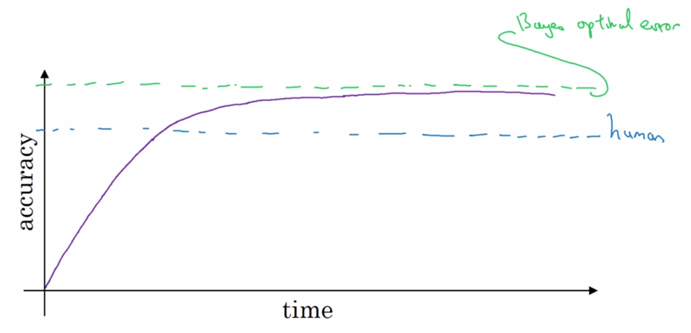

Deep Learning Specialization, Course C
**Structuring Machine Learning Projects** by deeplearning.ai, ***Andrew Ng,*** [Coursera]( https://www.coursera.org/learn/neural-networks-deep-learning/home/info)

***Week 1:*** *ML Strategy (1)*

1. Understand why Machine Learning strategy is important
2. Apply satisficing and optimizing metrics to set up your goal for ML projects
3. Choose a correct train/dev/test split of your dataset
4. Understand how to define human-level performance
5. Use human-level perform to define your key priorities in ML projects
6. Take the correct ML Strategic decision based on observations of performances and dataset

<!-- more -->

### Introduction to ML Strategy

#### Why ML Strategy?

- collect more data
- collect more diverse training set
- train algorithm longer with gradient descent
- try Adam instead of GD
- try bigger / smaller network
- try dropout
- add L2 regularization
- network architecture
  - activation functions
  - \# hidden units
  - ...

#### Orthogonalization

- fit training set well on cost function
  - bigger network
  - Adam
- fit dev set well on cost function
  - regularization
  - bigger training set
- fit test set well on cost function
  - bigger dev set
- performs well in real world
  - change dev set
  - change cost function

### Setting up your Goal

#### Single Number Evaluation Metric

- **Precision**
  % are real cat of examples recognized as cat
- **Recall**
  % of actual cats are correctly recognized
- **F1 score**
  harmonic mean of precision and recall
  $F_1 = \dfrac{2}{\dfrac{1}{P}+\dfrac{1}{R}}$

| Classifier | Precision | Recall | F1 Score |
| :--------: | :-------: | :----: | :-----------------: |
|   **A**    |   95 %    |  90 %  |     **92.4 %**      |
|   **B**    |   98 %    |  85 %  |       91.0 %        |

*dev set + single number evaluation metric speed up iterating process*

#### Satisficing and Optimizing Metric

| Classifier |     Accuracy     |   Running Time    |
| :--------: | :--------------: | :---------------: |
|   **A**    |       90 %       |       80 ms       |
|   **B**    |     **92 %**     |    ***95 ms***    |
|   **C**    |       95 %       |      1500 ms      |
|            | ***optimizing*** | ***satisficing*** |

**maximize accuracy** subject to ***running time < 100 ms***

- ***N metric:*** 1 optimizing, N-1 satisficing

#### Train / Dev / Test Distributions

make dev and test sets obey same distribution ← randomly shuffle into dev / test

choose a dev set and test set to reflect data you expect to get in the future and consider important to do well on

#### Size of Dev and Test Sets

train / dev / test

- ~ 1k examples: 70%-30% or 60%-20%-20%
- ~ 1m examples: 98%-1%-1%, smaller dev and test sets

*set test set to be big enough to give high confidence in the overall performance of the system (no test set might be okay)*

#### When to Change Dev / Test Sets and Metrics

Metric + Dev: prefers A *(misprediction)*  
You / Users: prefers B

$\begin{aligned}{\rm classification}\ &{\rm error}  _{\strut} \\ \textsf{Algorithm A: }& 3\%\ {\rm error} \textsf{ but contains pornographies} \\ \textsf{Algorithm B: }& 5\%\ {\rm error} _{\strut} \\ \textsf{Error: }& \dfrac{1}{m_{dev}} \sum_{i=1}^{m_{dev}} L\left\{ y_{\rm pred}^{\left(i\right)} \neq y^{\left(i\right)} \right\} \\ \textsf{New Error: }& \dfrac{1}{ \sum_{i=1}^{m_{dev}} \omega^{\left(i\right)}} \sum_{i=1}^{m_{dev}} \omega^{\left(i\right)} L\left\{ y_{\rm pred}^{\left(i\right)} \neq y^{\left(i\right)} \right\} \\ & \qquad\qquad \omega^{\left(i\right)}= \begin{cases} 1 \ \ &{\rm if}\ x^{\left(i\right)}\ {\rm is}\ {\rm non}\!\!-\!\!{\rm porn} \\ 10 &{\rm if}\ x^{\left(i\right)}\ {\rm is}\ {\rm porn} \end{cases} \end{aligned}$

1. ***Place the target:*** define a metric to evaluate classifiers
2. ***Shoot at target:*** worry separately about how to do well on this metric

*if doing well on metric + dev/test set does not correspond to doing well on application, change metric and/or dev/test set*

### Comparing to Human-Level Performance

#### Why Human-Level Performance?

as long as machine learning is worse than humans, you can:

- get labeled data from humans
- gain insight from manual error analysis
- better analysis of bias / variance

#### Avoidable Bias

| Humans Error | Train Error | Dev Error |                       |
| :----------: | :---------: | :-------: | :-------------------: |
|     1 %      |     8 %     |   10 %    |   Focus on **Bias**   |
|    7.5 %     |     8 %     |   10 %    | Focus on **Variance** |

##### human-level error as a proxy for Bayes error

***bias:*** compare to 0% error  
***avoidable bias:*** minimum level of error that you cannot get below  
&emsp;&emsp;*(cannot do better than Bayes error unless overfitting)*

#### Understanding Human-Level Performance

**human-level error** as a proxy for ***Bayes error***

#### Surpassing Human-Level Performance

- Structed Data &emsp; (↔ not Natural Perception)
- Lots of Data

#### Improving your Model Performance

##### two fundamental assumptions of supervised learning

1. you can fit the training set pretty well (avoidable bias)
2. the training set performance generalizes pretty well to the dev / test set (variance)

##### reducing (avoidable) bias and variance

$\textsf{human-leval error } \leftarrow avoidable\ bias \rightarrow \textsf{ training error } \leftarrow variance \rightarrow \textsf{ dev error}$

- **Avoidable Bias**
  - Train bigger model
  - Train longer / better optimization algorithms (momentum, RMSProp, Adam)
  - NN architecture / hyperparameters search (RNN, CNN)
- **Variance**
  - More data
  - Regularization (L2, dropout, data augmentation)
  - NN architecture / hyperparameters search
