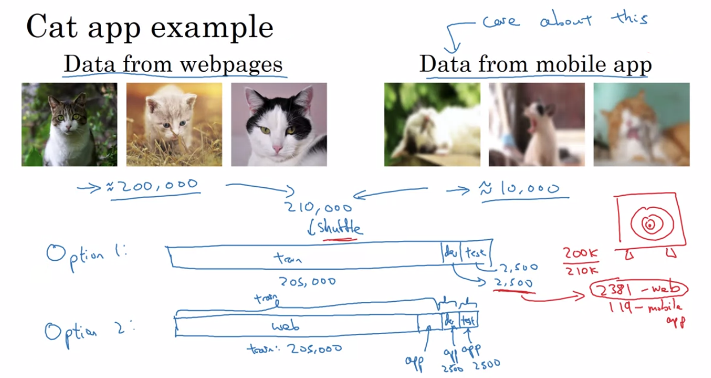
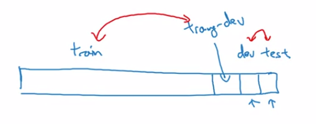
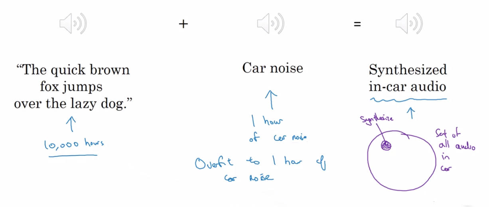
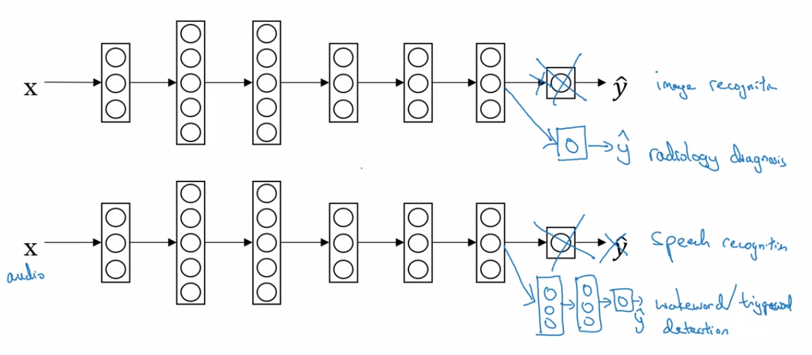

Deep Learning Specialization, Course C
**Structuring Machine Learning Projects** by deeplearning.ai, ***Andrew Ng,*** [Coursera]( https://www.coursera.org/learn/neural-networks-deep-learning/home/info)

***Week 2:*** *ML Strategy (2)*

1. Understand what multi-task learning and transfer learning are
2. Recognize bias, variance and data-mismatch by looking at the performances of your algorithm on train/dev/test sets

<!-- more -->

### Error Analysis

#### Carrying out Error Analysis

***Error analysis:*** Should you try to make your cat classifier do better on dogs?

- get ~ 100 mislabeled dev set examples
- count up how many are dogs (5%? / 50%?) **→ ceiling on  performance**

|     Image      | Dogs | Great Cats | Blurry  | Incorrectly Labeled | Comments |
| :------------: | :--: | :--------: | :-----: | :-----------------: | :------: |
|       1        |  ✓   |            |         |                     | pitbull  |
|       2        |      |            |    ✓    |                     |          |
|       3        |      |     ✓      |    ✓    |                     |  rainy   |
|      ...       | ...  |    ...     |   ...   |         ...         |   ...    |
| **% of total** |  8%  |  **43%**   | **61%** |         6%          |  &emsp;  |

#### Cleaning up Incorrectly Labeled Data

- deep learning algorithms are quite robust to **random** errors in the training set
- goal of dev set is to help you select between two classifiers A & B
- apply same process to your dev and test sets to make sure they continue to come from the same distribution
- consider examining examples your algorithm got right as well as ones it got wrong
- train and dev/test data may now come from slightly different distributing

#### Build your First System Quickly and then Iterate

- Set up dev / test set and metric
- Build initial system quickly
- Use bias / variance analysis and error analysis to prioritize next steps

### Mismatched Training and Dev / Test Set

#### Training and Testing on Different Distributions

- **Option 1** ×

  set up the dev set to optimize for a different distribution of data than what you actually care about.

- **Option 2** ✓

  aiming the target where you want it to be

#### Bias and Variance with Mismatched Data Distributions

> increase in dev error ***(1)*** is because the algorithm didn't see the data in the dev set ***(variance problem)*** or ***(2)*** is because the dev set data is just different ***(distribution problem)***

***training-dev set:*** same distribution as training set, but not used for training

|       ~ 0% Human Error&emsp;&emsp; | Avoidable Bias | Variance | Data Mismatch |
| ---------------------------------: | :------------: | :------: | :-----------: |
|     **Training Error**&emsp;&emsp; |      10 %      |   1 %    |      1 %      |
| **Training-Dev Error**&emsp;&emsp; |      11 %      |   9 %    |     1.5 %     |
|          **Dev Error**&emsp;&emsp; |      12 %      |   10 %   |     10 %      |

$\qquad \begin{aligned} \textrm{Human Level Error} & \quad 4\% \\ & \quad \updownarrow \qquad \textsf{avoidable bias} \\ \textrm{Training Set Error} & \quad 7\% \\ & \quad \updownarrow \qquad \textsf{variance} \\ \textrm{Training-Dev Set Error} & \quad 10\% \\ & \quad \updownarrow \qquad \textsf{data mismatch} \\ \textrm{Dev Set Error} & \quad 6\% \\ & \quad \updownarrow \qquad \textsf{degree of overfitting to dev set} \\ \textrm{Test Set Error} & \quad 6\%  \end{aligned}$

#### Addressing Data Mismatch

- carry out manual error analysis to try to understand difference between training and dev / test sets
- make training data more similar; or collect more data similar to dev / test sets

##### Artificial Data Synthesis

***be careful:*** *overfit subsets*

### Learning from Multiple Tasks

#### Transfer Learning

**pre-training → fine-tuning**

- initialize the last layer's weights W[L], b[L]
- retrain the one last 1~2 layers (with small data set)  
  or retrain all the parameters in the network (with large data set)

**when transfer learning makes sense**

- task A and B have the same input x
- a lot more data for task A than task B
- low level features from A could be helpful for learning B

#### Multi-Task Learning

$\begin{aligned} \hat{y}^{\left(i\right)}_{\Tiny{4\times1}} = \frac{1}{m}\sum_{i=1}^{m}\sum_{j=1}^{4}L\left( \hat{y}^{\left(i\right)}_j,\,y^{\left(i\right)}_j \right) \end{aligned}$

one image can have multiple labels (unlike softmax regression)

multi-task learning works even if some of the images are labeled only some of the objects (sum over j with 0/1 label only)

**when multi-task learning makes sense**

- training on a set of tasks that could benefit from having shared lower-level features
- usually, amount of data for each data is quite similar
- can train a big enough neural network to do well on all the tasks

### End-to-End Deep Learning

#### What is End-to-End Deep Learning?

***Key question: Do you have sufficient data to learn the function of the complexity needed to map from X to Y?***

#### Whether to Use End-to-End Deep Learning

- **Pros**
  - let the data speak
  - less hand-designing of components needed
- **Cons**
  - may need large amount of data
  - excludes potentially useful hand-designed components
