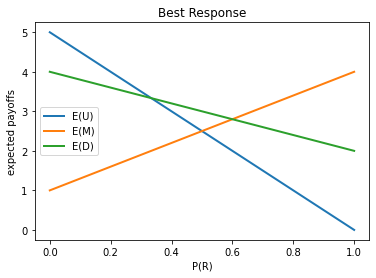
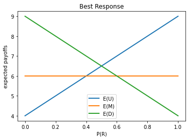
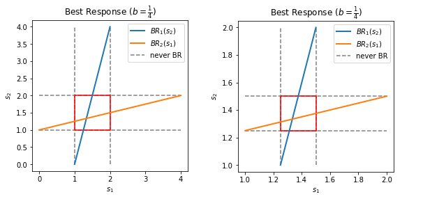
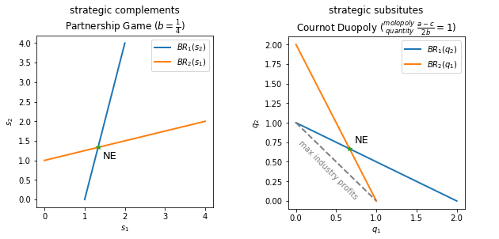

Yale University, **Game Theory,** Economics 159

> Game theory is a method of studying strategic situations.

 

## Class 1 - Prisoners' Dilemma


#### Game 1
$\begin{matrix} & \begin{matrix} \textrm{Pair} \end{matrix} &&& \textrm{payoffs} \textit{  (evil gits)} && \textrm{payoffs} \textit{  (indignant angels)} \\ \begin{matrix} \\ \textrm{Me} \end{matrix} & \begin{matrix} &\alpha&\beta \\ \alpha&\textrm{B-, B-}&\textrm{A, C} \\ \beta&\textrm{C, A}&\textrm{B+, B+} \end{matrix} &&& \begin{matrix} &\alpha&\beta \\ \alpha&0,0&3,-1 \\ \beta&-1,3&1,1 \end{matrix} && \begin{matrix} &\alpha&\beta \\ \alpha&0,0&-1,-3 \\ \beta&-3,-1&1,1 \end{matrix} \\ & &&& {}_\texttt{Prisoners' Dilemma} && {}_\texttt{Coordination Problem} \end{matrix}$


<!-- more -->



<strong>Lesson 1:</strong> Do not play a strictly <em>(weakly)</em> dominated strategy.

<strong>Lesson 2:</strong> Rational choice can lead to outcomes that "suck" <em>(Pareto Inefficient)</em>. &emsp; <strong>Prisoners' Dilemma</strong>

<strong>Lesson 3:</strong> You can't get what you want till you know what you want <em>(payoffs)</em>.

<strong>Lesson 4:</strong> Put yourself in others' shoes and try to figure out what they will do.

<strong>Lesson 5:</strong> Yale students are evil.



 

## Class 2 - Deleting Dominated Strategies

$ \textrm{ingredients of a game: } \begin{cases} \texttt{players} \\ \texttt{strategies} \\ \texttt{payoffs} \end{cases}$



#### Game 2

Pick a number between 1 and 100. The winner is the person whose number is closest to 2/3 times the average number.

$\begin{cases} 67 \sim 100 \ \ & & \textrm{weakly dominated} & \textit{ lesson 1} \\ 45 \sim 67 & \texttt{rationality} & \textrm{weakly dominated after delete 67~100} & \textit{ lesson 4} \\ 30 \sim 45 & \texttt{know others are rational} & \textrm{weakly dominated after delete 45~67 and 67~100} & \textit{ in shoes in shoes} \\ \,\vdots && \texttt{iterative deletion of dominated strategies} \\ 1 & \texttt{R, KR, KKR, KKKR, ...} & {}_\texttt{Common Knowledge} \end{cases}$

***Mutual knowledge doesn't imply common knowledge.***



 

## Class 3 - Median Voter Theorem



#### Game 3

**model of politics:** 2 candidates, uniformly distributed voters, $\textrm{choose: }\xrightarrow[\textrm{political spectrum}]{1\,2\,3\,4\,5\,6\,7\,8\,9\,10}$

$\begin{matrix} \textrm{2 strictly dominates 1} \\  \textrm{9 strictly dominates 10} \end{matrix} \longrightarrow \begin{matrix} \textrm{3 strictly dominates 2} \\  \textrm{8 strictly dominates 9} \end{matrix} \cdots\xrightarrow[\texttt{ dominated strategies }]{\texttt{ iterative deletion of }}\cdots \begin{matrix} \textrm{5 strictly dominates 4} \\  \textrm{6 strictly dominates 7} \end{matrix}$

**Median Voter Theorem:** candidates close to each other, close to the center



 

## Class 4 - Best Response



#### Game 4

$\begin{matrix} &L&R \\ U&5,1&0,2 \\ M&1,3&4,1 \\ D&4,2&2,3 \end{matrix} \qquad \begin{matrix} \textit{U does best against L} \\ \textit{M does best against R} \end{matrix}\quad \texttt{best response based on belief} $





#### Game 5

**Penalty Kick Game**

$\begin{matrix} &L&R \\ U&4,-4&9,-9 \\ M&6,-6&6,-6 \\ D&9,-9&4,-4 \end{matrix} \qquad \begin{matrix} \textrm{no dominated strategies, but:} \\ \textrm{M is not a best response to any belief} \end{matrix}$





<strong>Lesson 6:</strong> Do not choose a strategy that is never a best response to any belief.





#### Game 6

**Partnership Game:** 2 agents, own firm jointly, share $50\%$ of the profit each. Each agent chooses the effort level to put in the firm, $S_i\in\left[\,0,4\,\right]$ *(continuum)*. The frim profit is given by $4\left(s_1+s_2+b\cdot s_1\,s_2\right),\,\Tiny{0\leq b\leq1/4}$. Payoffs are: $U_1\left(s_1,\,s_2\right)=1/2\cdot4\left(s_1+s_2+b\cdot s_1\,s_2\right)-s_1^2$, $U_2\left(s_1,\,s_2\right)=1/2\cdot4\left(s_1+s_2+b\cdot s_1\,s_2\right)-s_2^2$

$\max_{s_1}2\left(s_1+s_2+b\cdot s_1\,s_2\right)-s_1^2$

$\dfrac{\partial U_1}{\partial s_1} = 2 + 2b\,s_2 - 2 \hat s_1 =0 \quad\Rightarrow\quad \mathrm{BR}_1\left(s_2\right) = \hat s_1 = 1 + b\,s_2 \,,\,\, \mathrm{BR}_2\left(s_1\right) = \hat s_2 = 1 + b\,s_1$

$\texttt{iterative deletion until converge} \quad\Rightarrow\quad s_1^\ast = s_2^\ast = \dfrac{1}{1-b} \qquad {}_\texttt{Nash Equilibrium}$

**Externality:** my effort benefits you, not just for me.



 

## Class 5 - Nash Equilibrium (Coordination Problems)

**Nash Equilibrium:** players are playing a best response to each other. no individual can do **strictly** better by deviating, holding everyone else's actions *(no regrets)*.



#### Game 7

$\begin{matrix} & \begin{matrix} \textrm{P2} \end{matrix}  \\ \begin{matrix} \\ \textrm{P1} \end{matrix} & \begin{matrix} &L&C&R \\ U&0,\hat4&\hat4,0&5,3 \\ M&\hat4,0&0,\hat4&5,3 \\ D&3,5&3,5&\hat6,\hat6 \end{matrix} &&& \begin{cases} \mathrm{BR}_1\left(L\right)=M \\ \mathrm{BR}_1\left(C\right)=U \\ \mathrm{BR}_1\left(R\right)=D \end{cases} & \begin{cases} \mathrm{BR}_2\left(U\right)=L \\ \mathrm{BR}_2\left(M\right)=C \\ \mathrm{BR}_2\left(D\right)=R \end{cases} \\ & &&&\Rightarrow\ \mathrm{NE} = \left(D,R\right) \end{matrix}$

$\begin{matrix} & \begin{matrix} \textrm{P2} \end{matrix}  \\ \begin{matrix} \\ \textrm{P1} \end{matrix} & \begin{matrix} &L&C&R \\ U&0,2&2,\hat3&4,\hat3 \\ M&\hat9,1&\hat3,\hat2&0,0 \\ D&0,\hat3&1,0&\hat8,0 \end{matrix} &&& \begin{cases} \mathrm{BR}_1\left(L\right)=M \\ \mathrm{BR}_1\left(C\right)=M \\ \mathrm{BR}_1\left(R\right)=D \end{cases} & \begin{cases} \mathrm{BR}_2\left(U\right)=C,R \\ \mathrm{BR}_2\left(M\right)=C \\ \mathrm{BR}_2\left(D\right)=L \end{cases} \\ & &&&\Rightarrow\ \mathrm{NE} = \left(M,C\right) \end{matrix}$





#### Game 8

**Investment Game:** choose: invest $0$ or $10$ dollar.
if you do not invest, $\mathrm{payoff}=0$, if you invest, $\mathrm{payoff}=\begin{cases}\\$5&\textrm{if }\geq90\%\textrm{ invest}&\texttt{coordination} \\ -\\$10&\textrm{if }<90\%\textrm{ invest}\end{cases}$

guess and check: **2 NEs** $\quad \mathrm{NE}_1 \textrm{:  all invest,} \quad \mathrm{NE}_2 \textrm{:  no one invest}$

*play converged fairly rapidly to the ("bad" maybe) Nash Equilibrium*



**In Coordination Problems, unlike Prisoners' Dilemma, *communication* can help. 
Nash Equilibrium can be a self-enforcing agreement.**



#### Game 9

**Going to the movie**

$\begin{matrix} & \begin{matrix} &&&&&&&\textrm{P2} \end{matrix}  \\ \begin{matrix} \\ \textrm{P1} \end{matrix} & \begin{matrix} &\textit{BU}&\textit{GS}&\textit{SW} \\ \textit{Bourne Ultimatum}&\underline{2,1}&0,0&0,-1 \\ \textit{Good Shepherd}&0,0&\underline{1,2}&0,-1 \\ \textit{Snow White}&-1,0&-1,0&-2,-2&\times \\ &&&\times \end{matrix} \end{matrix}$

**the Battle of the Sexes:** different people disagree about where they'd like to coordinate.



 

## Class 6 - Nash Equilibrium (Cournot Duopoly)



#### Game 10

**Cournot Duopoly** (a few players, many strategies)

**players:** 2 firms, **strategies:** quantities of an identical product $q$, **cost of production:** constant marginal cost $c$, **prices:** $p=a-b\left(q_1+q_2\right)$, **payoffs:** profit $u_1\left(q_1,q_2\right)=pq_1-cq_1=aq_1-bq_1^2-bq_1q_2-cq_1$

$\dfrac{\partial u_1}{\partial p_1} = a-2bq_1-bq_2-c = 0 \quad\Rightarrow\quad \mathrm{BR}_1\left(q_2\right) = \hat q_1 = \dfrac{a-c}{2b} - \dfrac{q_2}{2} \,,\,\, \mathrm{BR}_2\left(q_1\right) = \hat q_2 = \dfrac{a-c}{2b} - \dfrac{q_1}{2}$

$\begin{cases}\begin{aligned} \dfrac{a-c}{b} && \texttt{competitive quantity} \\ \dfrac{2}{3}\cdot\dfrac{a-c}{b} && {}\texttt{cournot quantity} \\ \dfrac{1}{2}\cdot\dfrac{a-c}{b} && \texttt{molopoly quantity} \end{aligned}\end{cases}$


