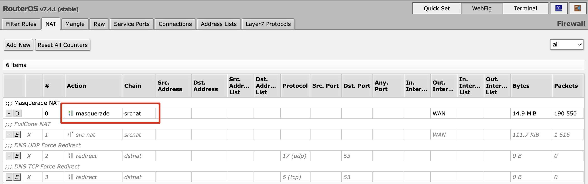
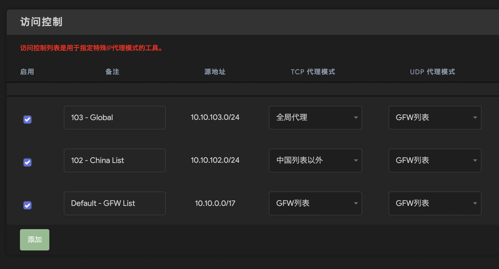
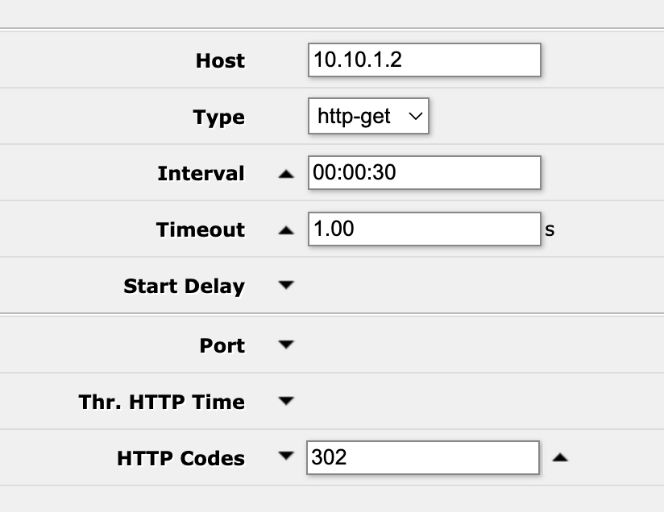

因为实在受不了 [pfSense](https://www.pfsense.org/) 开机太慢而且 WebUI 巨卡<sup> [1] </sup>, 和一些 DNS 设置奇奇怪怪的问题, 终于下定决心把主路由给换了. 调研使用了一波以后, 发现还是 [RouterOS](https://mikrotik.com/download) 可以比较相对**简单**地实现需求 (well, ROS 以复杂出名.. but<sup> [2] </sup>), 那正好开坑写一个系列, 重组内网服务器.

1. 虽说把 pfSense 给换了, 但是有一说一这是一个相对完善的路由系统 (而且本身就是防火墙系统), 首先他有内置的 DNS 解析服务, 还有非常好用的 DHCP 静态分配, 可以给每一个主机指定单独的 DNS 服务器和 Gateway, 这样可以把一些奇怪的职责解耦到不同的旁路由上<sup> [3] </sup>, 然后对设备终端也是非侵入的. 可能以后如果需要对外暴露服务的话我还得把这个防火墙请回来..
2. 跑通 ROS 其实不复杂... 网上那么多教程, 或者跟着官方 [Getting Started](https://help.mikrotik.com/docs/display/ROS/First+Time+Configuration) 几分钟就行了. 主要是高级设置, 或者说中级功能没有其他路由系统直观, 要实现高级功能反而还是好用的 (用到在学嘛), 而且官方文档很全面.
3. 虽说在 DHCP Static 上指定 Gateway 不用单独每个终端设备去设置, 但是导致服务器之间耦合在一起了, 如果某个服务挂了其实并不能简单快速地恢复. 所以这次的目标就是用好 ROS 的监听, 让主路由可以独立完成所有任务, 然后其他花里胡哨的功能外挂去做, 这些服务挂了可以自动切回 ROS 维持基本需求. 说不定哪天墙塌了, 我直接把旁路由一关! ...

<!-- more -->

前言说完了, 开整.


# 系统安装

咱系统都装在 PVE 上, 方便备份和迁移. 之前装 PVE 的时候正好写了些备忘录, 那就把上一篇作为第 0 期呗.

物理机做路由器最少只需要两个网口, 一个做 WAN 口, 一个做 LAN 口就够了.


然后, 从 RouterOS 官方下载 [Cloud Hosted Router](https://mikrotik.com/download), 选 Raw disk image, 之后上传到 PVE. 这里简单说下怎么在 PVE 导入原盘, 之后 OpenWrt 和其他一些原盘安装都是一样的.

首先按正常操作新建虚拟机, 但不需要使用任何介质. 按照想要的配置一直下一步, 直接创建机器, 然后就会在硬件里看到初始分配的磁盘, 把这块盘分离并删除.


然后导入原盘, 使用命令

```sh
qm importdisk 100 /mnt/pve/disk/template/iso/ros-chr.img local-zfs
```

其中, 100 是虚拟机的 ID, 然后是上传镜像的路径, 最后是存储位置, 这两项可以在 `数据中心/存储` 选项里看到.


然后还是在硬件里, 双击未使用的磁盘, 给他添加上去.


添加完以后, 可以根据需要扩容.


另外因为路由器需要俩网口, 而创建虚拟机的时候只能分配一个, 所以现在给他添加一个.


BTW, ROS 和 OP 都是支持 QEMU Guest Agent 的, 所以可以给他打开.

已经结束啦! **调整引导顺序**, 开机就行了.

# 基础配置

不想重复造轮子了, TLDR, RouterOS 的安装可以看官方的 [Getting Started](https://help.mikrotik.com/docs/display/ROS/First+Time+Configuration) 或者[这个视频](https://www.youtube.com/watch?v=h6K5FThk-T4), 总之, 最后的配置要点是:

俩网卡 (多 LAN 口用网桥)


做一层 NAT



分配 DHCP


接下来可以配合旁路由使用了. OpenWrt 可以直接用 [eSir 的旁路由固件](https://drive.google.com/drive/folders/1ktbDgnnP8pTMERjpPuETNphzAjNA6hZ2), 安装方法可以看[他自己的视频](https://www.youtube.com/watch?v=e4IAZdAZ60w). 

# 科学上网

首先, 必须弄好科学上网! 先在旁路由做好代理, 然后在 ROS 添加一条分流, 可以自己配置需要匹配的项目, 如 IP 地址等.




Mark 的是啥 routing 呢? 就是 Gateway 到旁路由


然后呢, 就可以用到 ROS 的 Netwatch, 旁路由挂了自动屏蔽这条路由. ROS 改配置超级快, 不用重载秒生效, 无敌


```ros
# on up
/ip firewall mangle enable number=4

# on down
/ip firewall mangle disable number=4
```

必须要说, 这个方法目前有俩问题, 从我的注释上就能看出来:

1. 现在是全局代理, 只要去了旁路由, 就必须过代理, 如果不过代理, 从网关回来, 又会被打回去... 这个问题有两个解, 
   - 一种是破掉这个环, 比如说旁路由的网关不是这个 ROS? 或者得有办法分辨这个回来的流量, 试了下没通, 还在想咋搞
   - 另外一种就是流控在 ROS 做, 导入 China IP / GFW List, 但是这个东西 OpenWrt 上都有现成的轮子, 懒得再弄一遍
2. 似乎只能 TCP, UDP 不通, 我还没仔细看, 不重要不紧急 (或许重要?) 先暂时不管了



折腾半天还是传统的网关模式结构比较正常.. 要点就是, 设备的网关指向旁路由, 然后旁路由再绕回主路由:


这样的话就可以在旁路由上配置代理策略了



好了, 用上 ROS 强大的 Netwatch, OpenWrt 挂了把网关自动改回 ROS.


```ros
# on up
/ip dhcp-server network set 0 gateway="10.10.1.2"

# on down
/ip dhcp-server network set 0 gateway="10.10.1.1"
```

OK, 这样只有最后一点小问题了, 那就是 Netwatch 的 simple type 用的是 ping, 那就会出现梯子挂了 ping 路由器还是通的情况. 不过这个很好办, 自己写一个脚本测一下 Google 通不通就行了, Netwatch 可以用 http code 等方法判断的. 比如可以这样:



# DNS 服务

ROS 也有非常好用的 DNS 缓存功能, 但是在墙内走 UDP 协议总有被劫持的情况. 而因为旁路由是带梯子的, 而且可以比较方便地配置 DoH/DoT, 所以可以直接在墙外拿到无污染的 DNS, 对 GFW DNS 劫持说不! 当然如果旁路由挂了, 下面这个脚本也会自动给上游 DNS 切回来.


```ros
# on up
:local dns "10.10.1.2"
/ip dns set servers=$dns

# on down
:local dns "114.114.114.114, 114.114.115.115"
/ip dns set servers=$dns
```

顺便提一下, 我也装了 PiHole, 懒得单独开一篇了, 一起说了吧, PiHole 装好以后, 他的上游 DNS 设置为 ROS, 因为我在 ROS 里设置了本地 DNS 解析记录 (虽然 PiHole 也可以设置 Local DNS, 不过咱们说了要把主体服务全部控制在主路由, 这样以后说不定秒换 AdGuard 呢).


然后, 同样是用 Netwatch 监控 PiHole, 如果挂了, DNS 服务器自动切回 ROS.


```ros
# on up
:local dns "10.10.2.1, 10.10.2.1"
/ip dhcp-server network set 0 dns-server=$dns

# on down
:local dns "10.10.1.1, 10.10.1.2"
/ip dhcp-server network set 0 dns-server=$dns
```

哦对了, 如果你按照官方的 [Building Your First Firewall](https://help.mikrotik.com/docs/display/ROS/Building+Your+First+Firewall) 配了防火墙, 记得关掉这一条, 它屏蔽了一些本地流量, 导致连接特别慢 :(


# Fullcone NAT

最后相当于个备忘吧, ROS 里的 Masquerade NAT 似乎并没有对应到常用的几种 NAT 类型, 我自己测了下是显示 Fullcone 的, 不过还是抄了个似乎更 "full" 的配置:


这里的 To Address 需要配置成 WAN 口的 IP 地址, 而这有可能是变动的, 所以祭出脚本和 Netwatch, 动态更新起来


```ros
:local wanPort [/ip address find interface=WAN]
:local wanAddr [/ip address get $wanPort address]
:set wanAddr [:pick $wanAddr 0 ([len $wanAddr] - 3)]
/ip firewall nat set 1 to-address=$wanAddr
```

我是用 Netwatch 造了一个定时任务, 这样就会动态更新啦


```ros
/system script run fullcone_nat_script
```

