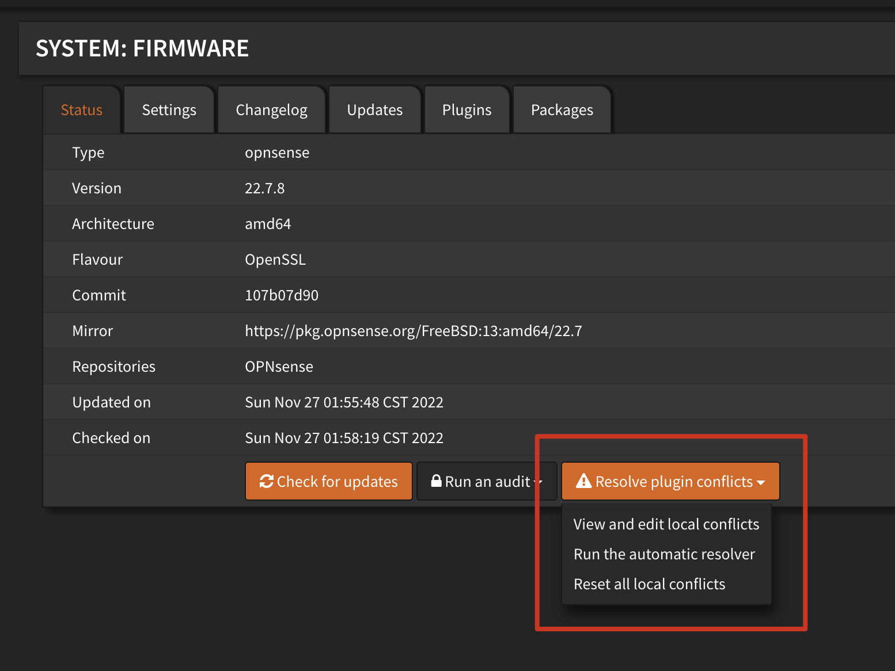

# 前言

前面说到, 换到 RouterOS 确实系统启动快了非常多, 资源消耗也非常小, 但是又引出了几个新的痛点...

1. ROS 的界面实在是不直观, 高情商: 专业, 低情商: 难看. 维护的过程中给自己增加了难度.
2. ROS 的 DHCP 不能指定网关, 只能用 magle 标记做透明代理, 而不直观的问题又增加了配置和排查的难度 :(

此外感觉网络拓扑整的太复杂并没有什么卵用, 还是应该用奥卡姆剃刀剃一下, 这样出问题也好排查.

看了半天还是决定用主路由 OPNsense + 旁路由 OpenClash 分流. 主路由经过试用, OPNsense 似乎有更好的响应速度和易用性, 所以就用它踢掉 pfSense. OPNsense 有全面的 [API 接口](https://docs.opnsense.org/development/api.html#api-reference) , 方便做一些自动化的开发, 也不需要学 ROS 的语法.

而且, OPNsense有非常好看的前端界面!

<!-- more -->

# 安装

安装 OPNsense 相对比较简单, 需要注意的是 CPU 最好手动打开 AES 支持.

试用后我决定分配 16G 硬盘, 轻度使用并不需要超大容量, 我也不希望主路由跑一堆服务, 整的很复杂也很慢. ( 事实上第一次安装选了 64G, 实在太大了, 一方面占用我的 ssd, 另外快照时间也很长. 不过要夸赞下 OPNsense 的备份和高可用, 配置可以无缝切换! ) PVE 用光盘安装, 上游有 DHCP 的话, OPNsense 可以自动识别 LAN 和 WAN, 并分配 IP, 直到这个界面:

用户 `installer` , 密码 `opnsense` , 进入安装程序. 对于文件系统, 我倾向于使用 UFS, 因为它有更好的性能. 而 ZFS, 首先我的 PVE 就用了 ZFS 文件系统, 其次, 对于文件损坏, 虚拟机可以直接快照回滚. 所以感觉不值得做出额外的内存和速度开销.

# 配置

安装完成后, root 用户的默认密码也是 `opnsense` . 既然我是已经安装完了, 就说下配置备份和转移的方法吧.

我是同时运行了新旧两个虚拟机实例以保证折腾过程中互联网的可用性, 为了保证配置正常, 我还是下载了一份 xml 文件, 在 Backups tab restore. 恢复速度非常快, 几秒钟, 重启以后就 ok 了. 重启切换过程中关闭旧的实例, 这样服务不可用可以做到秒级. 如果之前有安装插件包的话, 在 Firmware tab 下有详细列出缺少的插件, 装回来以后配置也会自动恢复.

如果是新安装的话, 也需要在这里安装各类插件. 首先就是 dark mode! 几个主题都试用过以后, 我还是选择了这个 cicada theme, 下载后在 Settings/General 配置主题即可. 此外, 因为运行在虚拟机中, 我们需要 VMware tools, 和 QEMU GA. UPNP 我装了, 不过还没有测试可用性和稳定性, 这篇暂时不说.

下面写一下系统基础配置的简介.

### System

#### Settings

非常重要的一点, DNS Servers 请留空, 让系统请求自身的 DNS 服务器 (默认是 Unbound DNS). 这样可以实现纯净的 DoT/DoH, 这项稍后说.

### Interface

#### WAN

对于 WAN 口, 根据自己的连接方式选择 DHCP / PPPoE.

#### LAN

LAN 口的话, IPv4选静态 IP, IPv6 选跟踪上游就行, 其他的配置可以看个人喜好配置.

### Services

#### DHCPv4

这里, 可以设置默认的 DNS Server 和 Gateway 为本机, 之后在静态分配时可以指定为旁路由地址, 实现按需分流.

创建静态分配点加号即可, IP Address, DNS Servers, Gateway, Domain Name 等等都可以单独指定.

#### Unbound DNS

TBD

# 高可用

TBW
