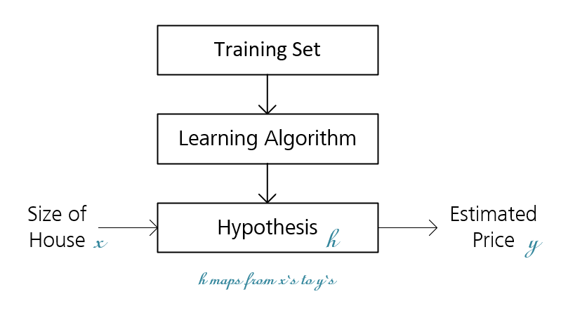

Stanford University, **Machine Learning,** *Andrew Ng,* [Coursera](https://www.coursera.org/learn/machine-learning/home/info)

***Week 1:*** Introduction, Linear Regression with One Variable

### Machine Learning Introduction

Machine learning is the field of study that gives computers the ability to learn without being explicitly programmed.

***Definition:*** a computer program is said to learn from **experience E** with respect to some **task T** and some performance **measure P,** if its performance on T, as measured by P, improves with experience E.

<!-- more -->

#### Algorithms

- **Supervised Learning**
  *Given the "right answer" for each of our examples*
  - **Regression:** Predict real-valued output
  - **Classification:** Predict discrete-valued output
- **Unsupervised Learning**
  - **Clustering**
  - **Non-clustering** *(The Cocktail Party Algorithm)*
- **Reinforcement Learning**
- **Recommender Systems**

### Linear Regression

- **Model Representation**
  - **m** = number of training examples
  - **x'**s = *input* variable / features
  - **y'**s = *output* variable / *target* variable
  - **(x(i), y(i))** = ith training example

#### Linear Regression with One Variable *(univariate linear regression)*

- ***Parameters:*** $\theta _{0},\theta _{1}$

- ***Hypothesis:*** $h_{\theta }\left( x\right) =\theta _{0}+\theta _{1}x$

- ***Cost Function:*** $J\left( \theta _{0},\theta _{1}\right) =  \dfrac {1}{2m} \sum ^{m}_{i=1}\left( h_{\theta }\left( x^{\left(i\right)}\right) -y^{\left(i\right)}\right) ^{2} $ *(squared error function)*

- ***Goal:*** $\min _{\theta _{0},\theta _{1}}J\left( \theta _{0},\theta _{1}\right) $ *(minimize the cost function)*

### Parameter Learning

$\min _{\theta _{0},\theta _{1},...,\theta _{n}}J\left( \theta _{0},\theta _{1},...,\theta _{n}\right) $ 

#### Gradient Descent Outline

- Start with some $\theta _{0},\theta _{1}$
- Keep changing $\theta _{0},\theta _{1}$ to reduce $J\left( \theta _{0},\theta _{1}\right) $ until end up at a *(local)* minimum

#### Gradient Descent Algorithm

***repeat until convergence:***
&emsp;&emsp;$\theta _{j}:=\theta _{j}-\alpha \cdot \dfrac {\partial }{\partial \theta _{j}}J\left( \theta _{0},\theta _{1}\right)$&emsp;&emsp;*for $j=0$ and $j=1$*

- **Simultaneously** Update θ0 and θ1
- **Learning Rate** $\alpha$
  - **too small:** slow
  - **too large:** overshoot *(fail to converge / diverge)*
  
  *As we approach a local minimum, the derivative term will automatically get smaller, and so gradient descent will automatically take smaller steps, no need to decrease α over time.*

#### Gradient Descent For Linear Regression

***"Batch" Gradient Decent:*** Each step uses all training examples

$\begin{aligned} \dfrac {\partial }{\partial \theta _{j}}J\left( \theta _{0},\theta _{1}\right) & = \dfrac {\partial }{\partial \theta _{j}} \dfrac {1}{2m} \sum ^{m}_{i=1}\left( h_{\theta }\left( x^{\left(i\right)}\right) -y^{\left(i\right)}\right) ^{2} \\& = \dfrac {\partial }{\partial \theta _{j}} \dfrac {1}{2m} \sum ^{m}_{i=1}\left( \theta _{0}+\theta _{1}x^{\left(i\right)} -y^{\left(i\right)}\right) ^{2} \end{aligned}$

$\begin{aligned} \theta _{0}=\dfrac {\partial }{\partial \theta _{0}}J\left( \theta _{0},\theta _{1}\right) = \dfrac {1}{m} \sum ^{m}_{i=1}\left( h_{\theta }\left( x^{\left(i\right)}\right) -y^{\left(i\right)}\right) \end{aligned}$

$\begin{aligned} \theta _{1}=\dfrac {\partial }{\partial \theta _{1}}J\left( \theta _{0},\theta _{1}\right) = \dfrac {1}{m} \sum ^{m}_{i=1}\left( h_{\theta }\left( x^{\left(i\right)}\right) -y^{\left(i\right)}\right) \cdot x^{\left(i\right)} \end{aligned}$

***repeat until convergence:***
&emsp;&emsp;$\begin{aligned} \theta _{0}:=\theta _{0}-\alpha \cdot \dfrac {1}{m} \sum ^{m}_{i=1}\left( h_{\theta }\left( x^{\left(i\right)}\right) -y^{\left(i\right)}\right) \end{aligned}$
&emsp;&emsp;$\begin{aligned} \theta _{1}:=\theta _{1}-\alpha \cdot \dfrac {1}{m} \sum ^{m}_{i=1}\left( h_{\theta }\left( x^{\left(i\right)}\right) -y^{\left(i\right)}\right) \cdot x^{\left(i\right)} \end{aligned}$&emsp;&emsp;***simultaneously***

*The cost function for linear regression is always going to be a convex function that doesn't have any local optima except for the one global optimum.*
