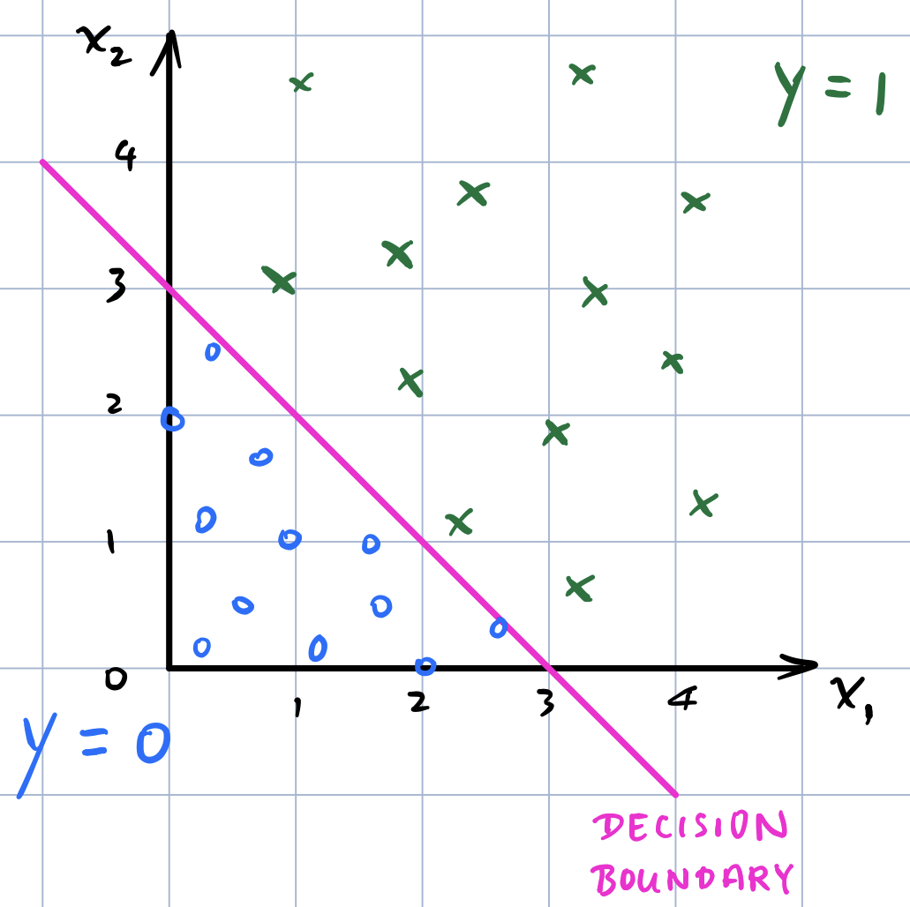
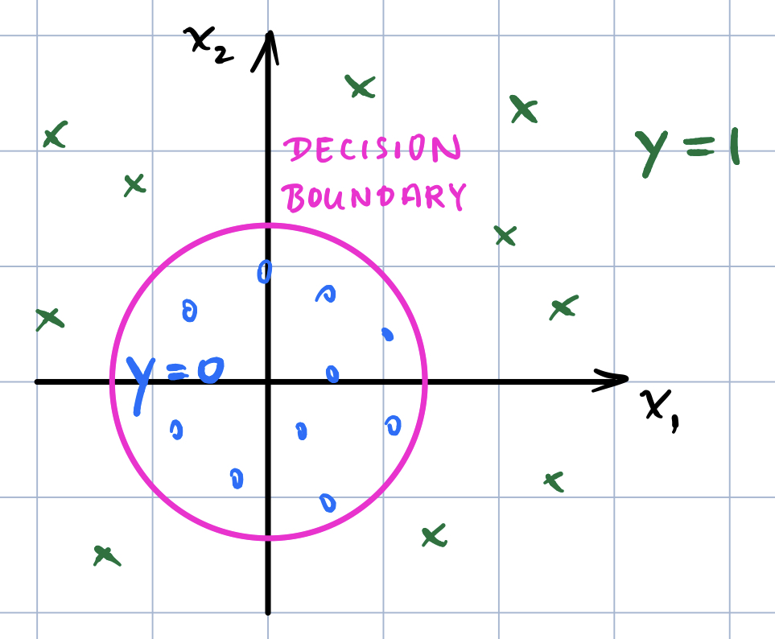
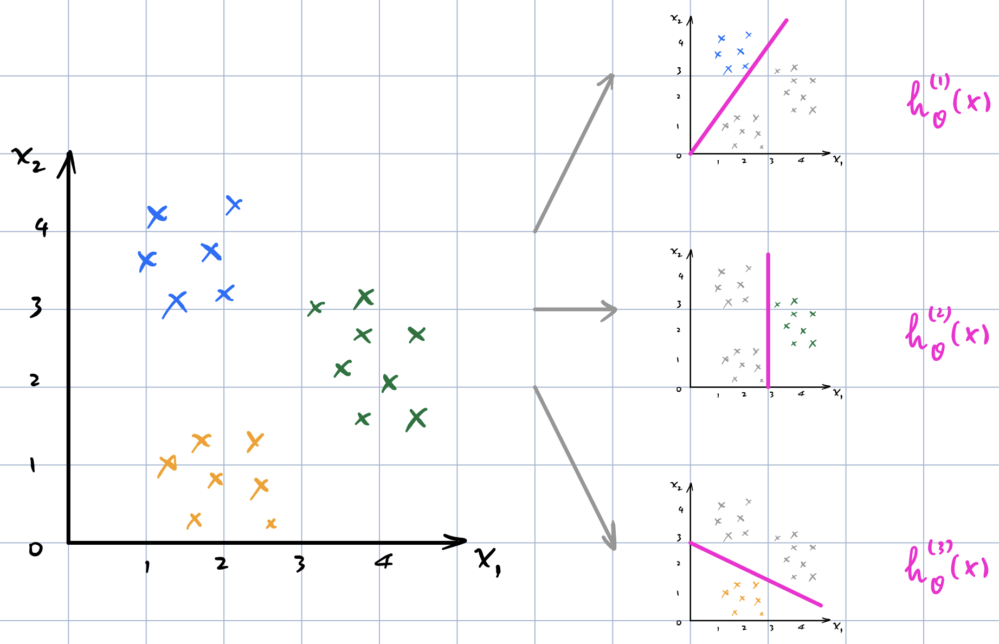

Stanford University, **Machine Learning,** *Andrew Ng,* [Coursera]( https://www.coursera.org/learn/machine-learning/home/info )

***Week 3:*** Logistic Regression, Regularization

### Logistic Regression

#### Classification and Representation

**Binary Classification** $y\in\{0,\,1\}$

- **0:** Negative Cass
- **1:** Positive Class

Logistic Regression (Classification) $0 \leq h_\theta\left(x\right) \leq 1$

<!-- more -->

##### Hypothesis Representation

$\begin{aligned} h_\theta\left(x\right) &= g\left( \theta^{\mathsf{T}} x \right) \qquad g\left(z\right) = \dfrac{1}{1+e^{-z}} \quad \textsf{Sigmoid Function} \\ \Rightarrow \ h_\theta\left(x\right) &= \dfrac{1}{1+e^{-\theta^{\mathsf{T}}x}} \quad \textsf{estimated probability that y=1 on input x} \end{aligned}$

##### Decision Boundary

- predict **y=1** if $h_\theta\left(x\right)\geq0.5\quad\Rightarrow\quad\theta^{\mathsf{T}}x\geq0$
- predict **y=0** if $h_\theta\left(x\right)<0.5\quad\Rightarrow\quad\theta^{\mathsf{T}}x<0$

#### Logistic Regression Model

##### Cost Function

- **Linear Regression**

  $\begin{aligned} J\left(\theta\right) = \dfrac{1}{m} \sum_{i=1}^{m} {\dfrac{1}{2} \left( h_\theta\left( x^\left(i\right) \right) - y^\left(i\right) \right) ^2 } \end{aligned}$

- **Logistic Regression**

  ${\rm Cost}\left(h_\theta,\,y\right) = \dfrac{1}{2} \left( h_\theta\left( x \right) - y \right) ^2$ → ***J(θ) is non-convex***

  ${\rm Cost}\left(h_\theta,\,y\right) = \begin{cases} -\log \left( h_\theta\left( x \right)\right) &\quad {\rm if} \ \ y=1 \\ -\log \left(1- h_\theta\left( x \right)\right) &\quad {\rm if} \ \ y=0 \end{cases}$

  $\begin{aligned} J\left(\theta\right) = - \dfrac{1}{m} \sum_{i=1}^{m} \left[ y^\left(i\right) \log \left( h_\theta\left( x^\left(i\right) \right)\right) + \left(1-y^\left(i\right)\right) \log \left(1- h_\theta\left( x^\left(i\right) \right)\right) \right] \end{aligned}$

##### Gradient Descent

&emsp;&emsp;$\begin{aligned} & \min _{\theta}J\left(\theta\right),\ \textsf{repeat:} \\ & \qquad \theta_j := \theta_j - \alpha \cdot \dfrac{\partial}{\partial \theta_j} J\left(\theta\right) = \theta_j - \alpha \cdot \dfrac{1}{m} \sum_{i=1}^{m} \left( h_\theta\left( x^\left(i\right) \right) - y^\left(i\right) \right) x_j ^\left(i\right) \\ & \qquad \text{simultaneously update for every } j=0,\,\dots,\,n \end{aligned}$

&emsp;&emsp;*algorithm looks identical to linear regression* $\left( h_\theta\left(x\right) = \theta^{\mathsf{T}}x ,\ h_\theta\left(x\right) = \left. {1} \middle/ {\left(1+e^{-\theta^{\mathsf{T}}x}\right)} \right. \right)$

&emsp;&emsp;**vectorized implementation**

&emsp;&emsp;$\qquad\begin{aligned}\theta := \theta - \alpha \cdot \dfrac{1}{m} X^\mathsf{T} \left( g\left( X\theta \right) - \vec{y} \right) \end{aligned}$

##### Advanced Optimization

**Optimization Algorithms**

- Gradient Descent
- Conjugate Gradient
- BFGS
- L-BFGS

**Pros**

- no need to manually pick α
- often faster than gradient descent

**Cons**

- more complex

#### Multiclass Classification

**One-vs-all Classification** $y\in\{0,\,1,\,2,\,\dots\}$

$h_\theta^{\left(i\right)}\left(x\right) = P\left(y=i\,|\,x;\theta\right),\quad i=1,\,2,\,3 \qquad\Rightarrow\qquad \max_i h_\theta^{\left(i\right)}\left(x\right)$

### Regularization

#### Overfitting

##### The Problem of Overfitting

**Underfit** *(high bias)* &mdash; "just right" &mdash; **Overfit** *(high variance)*

**Addressing Overfitting**

- Reduce number of features
  - Manually select which features to keep
  - Model selection algorithms
- Regularization
  - Keep all the features, but reduce magnitude/values of parameters θj
  - Works well when we have a lot of features, each of which contributes a bit to predicting y

##### Cost Function

<!--$\begin{aligned} & \hat{y} = \theta_0 + \theta_1x + \theta_2x^2 + \theta_3x^3 + \theta_4x^4 \\ \Rightarrow{}& \min_\theta \dfrac{1}{2m} \sum_{i=1}^{m} {\left( h_\theta\left( x^\left(i\right) \right) - y^\left(i\right) \right) ^2 } + A\theta_3^2 +B\theta_4^2 \qquad \textsf{penalize and make } \theta_3,\,\theta_4 \textsf{ really small} \end{aligned}$-->

**small values for parameters ** $\left(\theta_0,\right)\,\theta_1,\,\theta_2,\,\dots,\,\theta_n$

- simpler hypothesis
- less prone to overfitting

$\begin{aligned} J\left(\theta\right) = \dfrac{1}{2m} \left[ \sum_{i=1}^{m} { \left( h_\theta\left( x^\left(i\right) \right) - y^\left(i\right) \right) ^2 } + \lambda \sum_{j=1}^{n} \theta_j^{\,2} \right] \end{aligned}$

##### Regularized Linear Regression

**Gradient Descent**

$\begin{aligned} & \min _{\theta}J\left(\theta\right),\ \textsf{repeat:} \\ & \qquad \begin{aligned} \theta_0 := {}& \theta_0 - \alpha \cdot \dfrac{1}{m} \sum_{i=1}^{m} \left( h_\theta\left( x^\left(i\right) \right) - y^\left(i\right) \right) x_0 ^\left(i\right) & \qquad j &= 0 \\ \theta_j := {}& \theta_j - \alpha \left[ \dfrac{1}{m} \sum_{i=1}^{m} \left( h_\theta\left( x^\left(i\right) \right) - y^\left(i\right) \right) x_j ^\left(i\right) + \dfrac{\lambda}{m} \, \theta_j \right] & \qquad j &= 1,\,2,\,\dots \\ = {}& \left(1-\alpha\,\dfrac{\lambda}{m}\right) \theta_j - \alpha \cdot \dfrac{1}{m} \sum_{i=1}^{m} \left( h_\theta\left( x^\left(i\right) \right) - y^\left(i\right) \right) x_j ^\left(i\right) \end{aligned} \end{aligned}$

**Normal Equation**

$\begin{aligned} x &= \left[ \begin{matrix} x_0^{\left(i\right)} \\ x_1^{\left(i\right)} \\ \vdots \\ x_n^{\left(i\right)} \end{matrix} \right] \in \mathbb{R} ^{n+1} \qquad X = \left[ \begin{matrix} -- & \left( x^{\left(1\right)}\right) ^{\mathsf{T}} & -- \\ -- & \left( x^{\left(2\right)}\right) ^{\mathsf{T}} & -- \\ &\vdots& \\ -- & \left( x^{\left(m\right)}\right) ^{\mathsf{T}} & -- \end{matrix} \right] \in \mathbb{R} ^{m \times \left(n+1\right)} \qquad y= \left[ \begin{matrix} y^{\left(1\right)} \\ y^{\left(2\right)} \\ \vdots \\ y^{\left(m\right)} \end{matrix} \right] \in \mathbb{R} ^{m} \\ & \begin{aligned} \Rightarrow ^{\strut} \quad \theta &= { { \left(X^{\mathsf{T}}X\right) ^{-1} } } X^{\mathsf{T}} y && \left(X^{\mathsf{T}}X\right) \textsf{ is non-invertible if } m < n \\\\ \Rightarrow ^{\strut} \quad \theta &= { {\left(X^{\mathsf{T}}X +\lambda \cdot L \right)} }^{-1} X^{\mathsf{T}} y && \left(X^{\mathsf{T}}X +\lambda \cdot L \right) \textsf{ is invertible if } \lambda \> 0 \\ L &= \left[\begin{matrix} 0 \\ &1 \\ &&1 \\ &&&\ddots \\ &&&&1 \end{matrix}\right] ^{\strut} \end{aligned} \end{aligned}$

##### Regularized Logistic Regression

**Cost Function**

$\begin{aligned} J\left(\theta\right) = - \dfrac{1}{m} \sum_{i=1}^{m} \left[ y^\left(i\right) \log \left( h_\theta\left( x^\left(i\right) \right)\right) + \left(1-y^\left(i\right)\right) \log \left(1- h_\theta\left( x^\left(i\right) \right)\right) \right] + \dfrac{\lambda}{2m} \sum_{j=1}^{n} \theta_j^{\,2} \end{aligned}$

**Gradient Descent**

$\begin{aligned} & \min _{\theta}J\left(\theta\right),\ \textsf{repeat:} \\ & \qquad \begin{aligned} \theta_0 := {}& \theta_0 - \alpha \cdot \dfrac{1}{m} \sum_{i=1}^{m} \left( h_\theta\left( x^\left(i\right) \right) - y^\left(i\right) \right) x_0 ^\left(i\right) & \qquad j &= 0 \\ \theta_j := {}& \theta_j - \alpha \left[ \dfrac{1}{m} \sum_{i=1}^{m} \left( h_\theta\left( x^\left(i\right) \right) - y^\left(i\right) \right) x_j ^\left(i\right) + \dfrac{\lambda}{m} \, \theta_j \right] & \qquad j &= 1,\,2,\,\dots \end{aligned} \end{aligned}$

