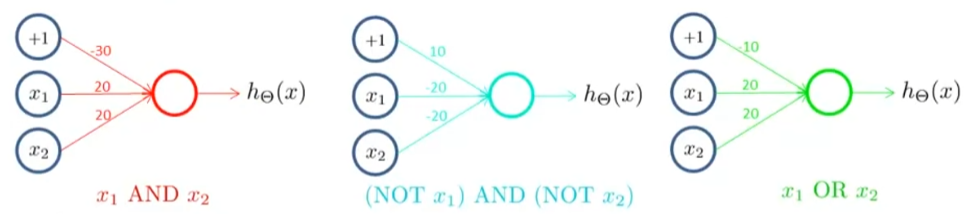

Stanford University, **Machine Learning,** *Andrew Ng,* [Coursera](https://www.coursera.org/learn/machine-learning/home/info)

***Week 4:*** Neural Networks: Representation

### Neural Networks: Representation

#### Motivations

##### Non-linear Hypotheses

$\textrm{polynomial terms:} \quad n_{\textsf{}^{\textsf{quadratic}}_{\textsf{features}}} \sim O\left( n_{\textsf{}^{\textsf{original}}_{\textsf{features}}} ^2 \right) \qquad n_{\textsf{}^{\textsf{cubic}}_{\textsf{features}}} \sim O\left( n_{\textsf{}^{\textsf{original}}_{\textsf{features}}} ^3 \right)$

<!-- more -->

#### Neural Networks

##### Model Representation

**Neuron Model:** logistic unit

$x=\left[\begin{matrix} x_0\\x_1\\x_2\\x_3 \end{matrix}\right] \qquad \theta=\left[\begin{matrix} \theta_0\\\theta_1\\\theta_2\\\theta_3 \end{matrix}\right] \qquad h_\theta \left(x\right) = \dfrac{1}{1+e^{-\theta^{\mathsf{T}}x}}$

**Neuron Network**

Forward Propagation

$\begin{aligned} a_1^{\left(2\right)} &= g\left( \Theta_{10}^{\left(1\right)}x_0 + \Theta_{11}^{\left(1\right)}x_1 + \Theta_{12}^{\left(1\right)}x_2 + \Theta_{13}^{\left(1\right)}x_3 \right) \\ a_2^{\left(2\right)} &= g\left( \Theta_{20}^{\left(1\right)}x_0 + \Theta_{21}^{\left(1\right)}x_1 + \Theta_{22}^{\left(1\right)}x_2 + \Theta_{23}^{\left(1\right)}x_3 \right) \\ a_3^{\left(2\right)} &= g\left( \Theta_{30}^{\left(1\right)}x_0 + \Theta_{31}^{\left(1\right)}x_1 + \Theta_{32}^{\left(1\right)}x_2 + \Theta_{33}^{\left(1\right)}x_3 \right) \\ h_\Theta \left(x\right) = a_1^{\left(3\right)} &= g\left( \Theta_{10}^{\left(2\right)}a_0^{\left(2\right)} + \Theta_{11}^{\left(2\right)}a_1^{\left(2\right)} + \Theta_{12}^{\left(2\right)}a_2^{\left(2\right)} + \Theta_{13}^{\left(2\right)}a_3^{\left(2\right)} \right) \end{aligned}$

*vectorized implementation*

$\begin{aligned} z^{\left(2\right)} = \Theta^{\left(1\right)} a^{\left(1\right)} \quad&\quad a^{\left(2\right)} = g\left( z^{\left(1\right)} \right) \qquad \textrm{add } a_0^{\left(2\right)}=1 \\ z^{\left(3\right)} = \Theta^{\left(2\right)} a^{\left(2\right)} \quad&\quad a^{\left(3\right)} = g\left( z^{\left(3\right)} \right) = h_\Theta \left(x\right) \end{aligned}$

#### Applications

**XOR / XNOR**

##### Multiclass Classification

