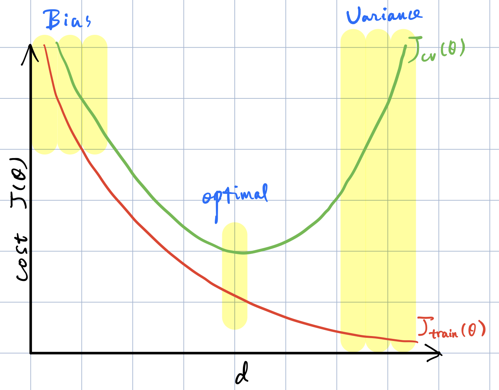

Stanford University, **Machine Learning,** *Andrew Ng,* [Coursera](https://www.coursera.org/learn/machine-learning/home/info)

***Week 6:*** Advice for Applying Machine Learning, Machine Learning System Design

### Advice for Applying Machine Learning

#### Evaluating a Learning Algorithm

##### Deciding What to Try Next

- get more training examples
- try smaller sets of features
- try getting additional features
- try adding polynomial features
- try decreasing / increasing $\lambda$

<!-- more -->

##### Evaluating a Hypothesis

$\textsf{Dataset} \begin{cases} 70\% \textsf{ Training set} \\ 30\% \textsf{ Test set} \end{cases}$

1. Learn parameter $\theta$ from training data
2. Compute test set error $J_{test}\left(\theta\right)$

##### Model Selection and Train / Validation / Test Sets

**Model selection:** pick $\min J_{test}\left(\theta_d\right), \; d = \textsf{degree of polynomial}$

***Problem:*** $J_{test}\left(\theta_d\right)$ is likely to be an optimistic estimate of generalization error, i.e. our extra parameter $d$ is fit to test set.

$\textsf{Dataset} \begin{cases} 60\% \textsf{ Training set} \\ 20\% \textsf{ Cross validation set (CV)}  \\ 20\% \textsf{ Test set} \end{cases}$

**Model selection:** pick $\min J_{cv}\left(\theta_d\right)$, estimate generalization error for test set $J_{test}\left(\theta_d\right)$

#### Bias vs. Variance

##### Diagnosing Bias vs. Variance

$\begin{matrix} \textsf{High Bias} & - & \textsf{just right} & - & \textsf{High Variance} \\ \textsf{underfit}&&&&\textsf{overfit} \end{matrix}$

Training error: $\begin{aligned} J_{train}\left(\theta\right) = \dfrac{1}{2m}\sum_{i=1}^{m} \left( h_\theta \left( x^{\left(i\right)} \right) - y^{\left(i\right)} \right) ^2 \end{aligned}$

Validation error: $\begin{aligned} J_{cv}\left(\theta\right) = \dfrac{1}{2m_{cv}}\sum_{i=1}^{m_{cv}} \left( h_\theta \left( x_{cv}^{\left(i\right)} \right) - y_{cv}^{\left(i\right)} \right) ^2 \end{aligned}$ or $\begin{aligned} J_{test}\left(\theta\right) \end{aligned}$

- **Bias (underfit):** $\begin{aligned} J_{train}\left(\theta\right) \end{aligned}$ will be high, $\begin{aligned} J_{cv}\left(\theta\right) \approx J_{train}\left(\theta\right) \end{aligned}$
- **Variance (overfit):** $\begin{aligned} J_{train}\left(\theta\right) \end{aligned}$ will be low, $\begin{aligned} J_{cv}\left(\theta\right) \gg J_{train}\left(\theta\right) \end{aligned}$

##### Regularization and Bias / Variance

**Linear regression with regularization**

$\begin{aligned} \textsf{Model: } & h_\theta \left(x\right) = \theta_0 + \theta_1x + \theta_2x^2 + \theta_3x^3 + \theta_4x^4 \\ & J\left(\theta\right) = \dfrac{1}{2m} \sum_{i=1}^{m} \left( h_\theta \left( x^{\left(i\right)} \right) - y^{\left(i\right)} \right) ^2 + \underbrace{ \dfrac{\lambda}{2m} \sum_{j=1}^{m} \theta_j^2 } \end{aligned}$

$\begin{matrix} \textsf{Large } \lambda && \textsf{Intermediate } \lambda && \textsf{Small } \lambda \\ \textsf{High Bias} & - & \textsf{just right} & - & \textsf{High Variance} \\ \textsf{underfit}&&&&\textsf{overfit} \end{matrix}$

**Choosing the regularization parameter** $\lambda$

$\begin{aligned} J\left(\theta\right) &= \dfrac{1}{2m} \sum_{i=1}^{m} \left( h_\theta \left( x^{\left(i\right)} \right) - y^{\left(i\right)} \right) ^2 + \dfrac{\lambda}{2m} \sum_{j=1}^{m} \theta_j^2 \\ J_{train}\left(\theta\right) &= \dfrac{1}{2m}\sum_{i=1}^{m} \left( h_\theta \left( x^{\left(i\right)} \right) - y^{\left(i\right)} \right) ^2 \\ J_{cv}\left(\theta\right) &= \dfrac{1}{2m_{cv}}\sum_{i=1}^{m_{cv}} \left( h_\theta \left( x_{cv}^{\left(i\right)} \right) - y_{cv}^{\left(i\right)} \right) ^2 \\ J_{test}\left(\theta\right) &= \dfrac{1}{2m_{test}}\sum_{i=1}^{m_{test}} \left( h_\theta \left( x_{test}^{\left(i\right)} \right) - y_{test}^{\left(i\right)} \right) ^2 \end{aligned}$

try $\lambda = 0 ,\, 0.01 ,\, 0.02 ,\, 0.04 ,\, 0.08 ,\, \dots ,\, 10.24$, train $\min_\theta J\left(\theta\right)$, pick $\min J_{cv}\left(\theta\right)$, estimate $J_{test}\left(\theta\right)$

##### Learning Curves

##### Deciding What to Do Next Revisited

- **fix high bias**
  - try getting additional features
  - try adding polynomial features
  - try decreasing $\lambda$

- **fix high variance**
  - get more training examples
  - try smaller sets of features
  - try increasing $\lambda$

- ***small* neural network**
  - fewer parameters
  - more prone to underfitting
  - computationally cheaper

- ***large* neural network**
  - more parameters
  - more prone to overfitting
  - computationally more expensive
  - use regularization to address overfitting

### Machine Learning System Design

#### Building a Spam Classifier

##### Prioritizing What to Work on

- Collect lots of data
- Develop sophisticated features
- Develop algorithms to process your input in different ways

##### Error Analysis

- Start with a simple algorithm, implement it quickly, and test it early on your cross validation data.
- Plot learning curves to decide if more data, more features, etc. are likely to help.
- Manually examine the errors on examples in the cross-validation set and try to spot a trend where most of the errors were made.

#### Handling Skewed Data

##### Error Metrics for Skewed Classes

**Precision / Recall**

$y=1$ in presence of rare class:

$\begin{matrix} & \textrm{actual class} \\ \begin{matrix} \\ \textrm{predicted} && 1 \\ \textrm{class} && 0 \end{matrix} & \begin{matrix} 1 & 0 \\ \textsf{True Positive} & \textsf{False Positive} \\  \textsf{False Negative} & \textsf{True Negative} \end{matrix} \end{matrix}$

$\Rightarrow \; \begin{cases} \textsf{Precision} = \dfrac{\textsf{True Positive}}{\textsf{Predicted Positive}} &= \dfrac{\textsf{True Positive}}{\textsf{True Positive}+\textsf{False Positive}} \\ \textsf{Recall} = \dfrac{\textsf{True Positive}}{\textsf{Actual Positive}} &= \dfrac{\textsf{True Positive}}{\textsf{True Positive}+\textsf{False Negative}} ^\strut \end{cases}$

##### Trading Off Precision and Recall

$\begin{matrix} \begin{matrix} \textsf{lower precision} \\ \textsf{higher recall} \end{matrix}  & \begin{matrix} \xrightarrow{ {\rm diffident} \qquad {\rm confident} } \end{matrix} & \begin{matrix} \textsf{higher precision} \\ \textsf{lower recall} \end{matrix} \end{matrix}$

Predict $1$ if $h_\theta \left(x\right) \geq \textsf{threshold}$

$\Rightarrow \; \textsf{F}_\textsf{1}\textsf{ Score} = \dfrac{2PR}{P+R}$

#### Using Large Data Sets

##### Data For Machine Learning

*It's not who has the best algorithm that wins; it's who has the most data.*

**Large data rationale**

- Assume feature $x\in\mathbb{R}^{n+1}$ has sufficient information to predict $y$ accurately
- Use a learning algorithm with many parameters
- Use a very large training set (unlikely to overfit)
