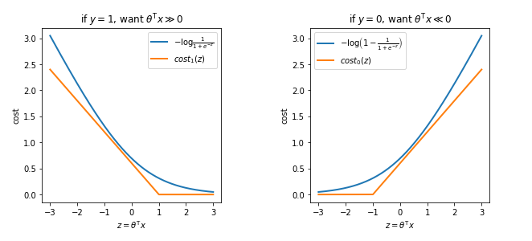
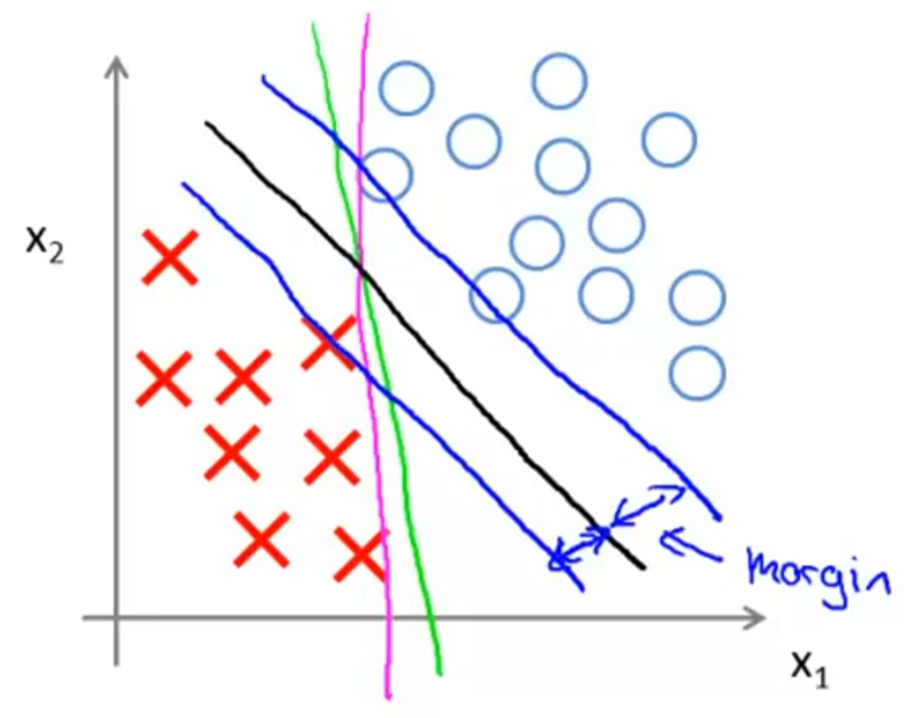
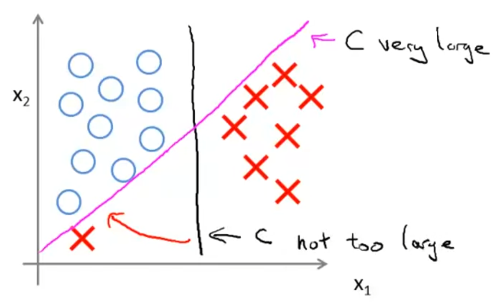
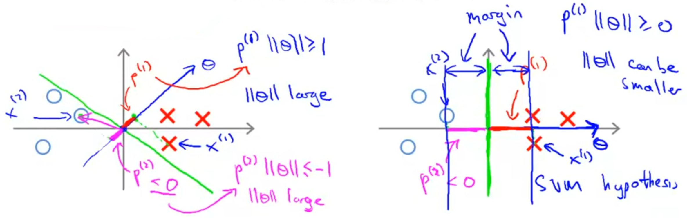
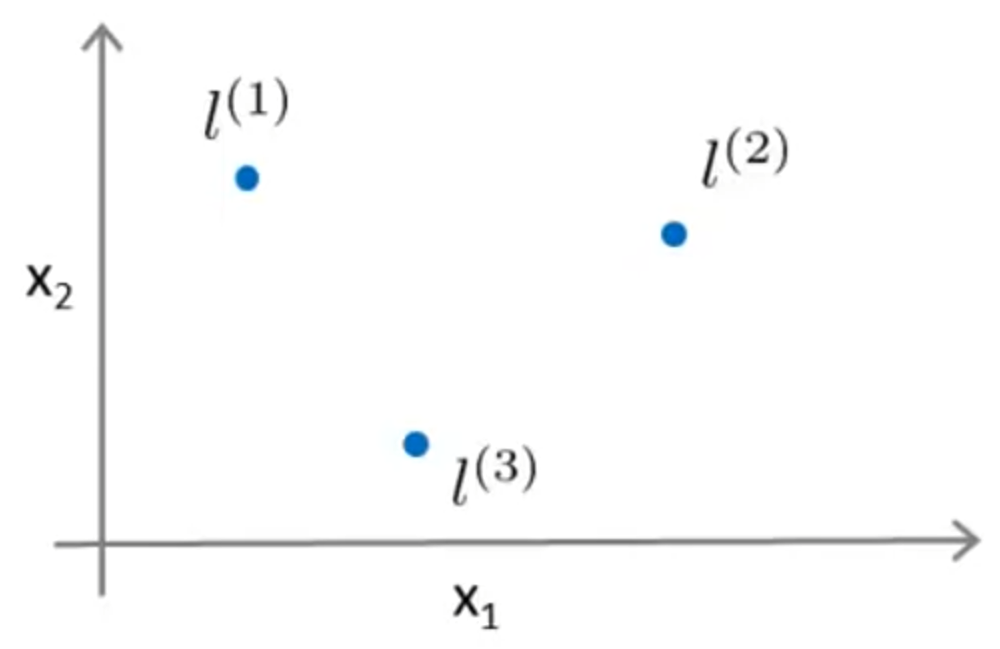
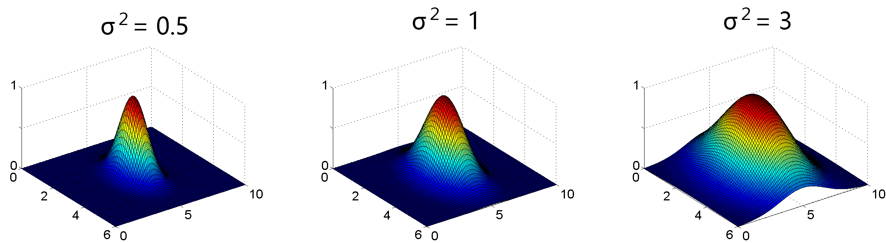
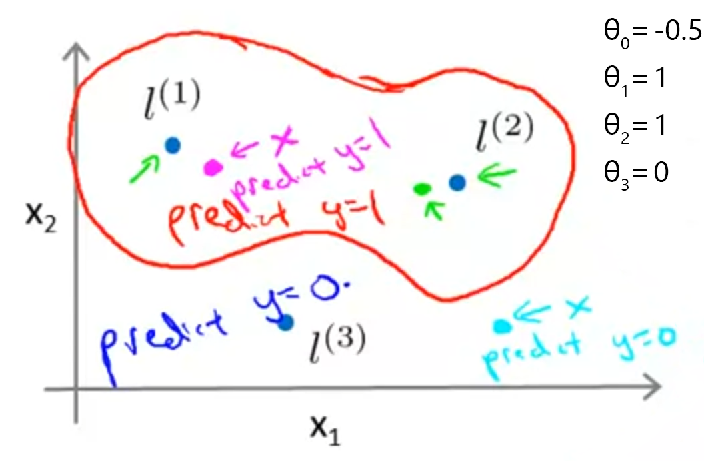

Stanford University, **Machine Learning,** *Andrew Ng,* [Coursera]( https://www.coursera.org/learn/machine-learning/home/info )

***Week 7:*** Support Vector Machines

### Support Vector Machines

#### Large Margin Classification

##### Optimization Objective

**Logistic Regression**

$h_{\theta}\left(x\right) = \dfrac{1}{1+e^{ -\theta^\mathsf{T}x }}$

if $y=1$, we want $h_{\theta}\left(x\right)\approx1$, $\theta^\mathsf{T}x\gg0$ 
if $y=0$, we want $h_{\theta}\left(x\right)\approx0$, $\theta^\mathsf{T}x\ll0$

cost function $-y \log h_{\theta}\left(x\right) - \left(1-y\right) \log \left( 1- h_{\theta}\left(x\right) \right)$

<!-- more -->

**Support Vector Machine**

- **logistic regression** *"A+λB"*  
  $\begin{aligned} \min_\theta \dfrac{1}{m} \left[ \sum_{i=1}^m y ^\left(i\right) \left[ -\log h_\theta \left( x^\left(i\right) \right) \right] + \left( 1-y^\left(i\right) \right) \left[ -\log \left( 1- h_\theta \left( x^\left(i\right) \right) \right) \right] \right] + \dfrac{\lambda}{2m} \sum_{j=1}^{n} \theta_j^{\,2} \end{aligned}$

- **support vector machine** *"CA+B"*  
  $\begin{aligned} \min_\theta {\color{lightgrey} {\dfrac{1}{m}} } C\cdot \left[ \sum_{i=1}^m y ^\left(i\right) \left[ \mathsf{cost}_\mathsf{1} \hspace{-0.5mm} \left( \theta^\mathsf{T} x^\left(i\right) \right) \right] + \left( 1-y^\left(i\right) \right) \left[ \mathsf{cost}_\mathsf{0} \hspace{-0.5mm} \left( \theta^\mathsf{T} x^\left(i\right) \right) \right] \right] + \dfrac{1}{2 {\color{lightgrey} {m} }} \sum_{j=1}^{n} \theta_j^{\,2} \end{aligned}$

  hypothesis: $h_{\theta}\left(x\right)= \begin{cases} 1 & \textsf{if } \theta^\mathsf{T}x\geq0 \\ 0 & \textsf{otherwise} \end{cases}$

##### Large Margin Intuition

$\begin{aligned} \min_\theta \; C\cdot \sum_{i=1}^m \left[ y ^\left(i\right) \, \mathsf{cost}_\mathsf{1} \hspace{-0.5mm} \left( \theta^\mathsf{T} x^\left(i\right) \right) + \left( 1-y^\left(i\right) \right) \mathsf{cost}_\mathsf{0} \hspace{-0.5mm} \left( \theta^\mathsf{T} x^\left(i\right) \right) \right] + \dfrac{1}{2} \sum_{j=1}^{n} \theta_j^{\,2} \end{aligned}$

if $y=1$, we want $\theta^\mathsf{T}x\geq+1$ &emsp; (not just $\geq0$) 
if $y=0$, we want $\theta^\mathsf{T}x\lt-1$ &emsp; (not just $\lt0$)

**SVM Decision Boundary:** linearly separable case

*large margin classifier in presence of outliers*

##### Mathematics Behind Large Margin Classification

$\begin{aligned} & \min_\theta \dfrac{1}{2} \sum_{j=1}^{n} \theta_j^{\,2} = \dfrac{1}{2} \left\| \theta \right\| ^2 \\ & \quad \begin{matrix} \textrm{s.t.} & p^\left(i\right) \cdot \left\| \theta \right\| \geq +1 & \textsf{if } y^\left(i\right)=1 \\ & p^\left(i\right) \cdot \left\| \theta \right\| \lt -1 & \textsf{if } y^\left(i\right)=0 \end{matrix} \\ & \textrm{where } p^\left(i\right) \textrm{ is the projection of } x^\left(i\right) \textrm{ onto the vector } \theta \end{aligned}$

#### Kernels

##### Kernels

Given $x$, compute new feature depending on proximity to landmarks $l^\left(1\right) ,\, l^\left(2\right) ,\, l^\left(3\right)$

$\begin{aligned} f_1 &= \mathrm{similarity} \hspace{-0.5mm} \left( x,\,l^\left(1\right) \right) = \exp \left( - \dfrac{ \left\| x-l^\left(1\right) \right\| ^2 }{2\sigma^2} \right) \\ f_2 &= \mathrm{similarity} \hspace{-0.5mm} \left( x,\,l^\left(2\right) \right) = \exp \left( - \dfrac{ \left\| x-l^\left(2\right) \right\| ^2 }{2\sigma^2} \right) \\ f_3 &= \underbrace{\mathrm{similarity}}_\textsf{kernel} \hspace{-0.5mm} \left( x,\,l^\left(3\right) \right) = \exp \left( - \dfrac{ \left\| x-l^\left(3\right) \right\| ^2 }{2\sigma^2} \right) \quad \textsf{Gaussian kernel} \end{aligned}$

Predict $1$ when $\theta_0 + \theta_1f_1 + \theta_2f_2 + \theta_3f_3 \geq 0$

##### SVM with Kernels

Given $\left(x^\left(1\right),\,y^\left(1\right)\right) ,\, \left(x^\left(2\right),\,y^\left(2\right)\right) ,\,\dots,\, \left(x^\left(m\right),\,y^\left(m\right)\right)$, 
Choose $l^\left(1\right)=x^\left(1\right) ,\, l^\left(2\right)=x^\left(2\right) ,\,\dots,\, l^\left(m\right)=x^\left(m\right)$. 
Given example $x$: 
&emsp; $f = \begin{bmatrix} f_0 \\ f_1 \\ f_2 \\ \vdots \\ f_m \end{bmatrix} = \begin{bmatrix} 1 \\ \mathrm{similarity} \hspace{-0.5mm} \left( x,\,l^\left(1\right) \right) \\ \mathrm{similarity} \hspace{-0.5mm} \left( x,\,l^\left(2\right) \right) \\ \vdots \\ \mathrm{similarity} \hspace{-0.5mm} \left( x,\,l^\left(m\right) \right) \end{bmatrix}$ 
For training example $\left(x^\left(i\right),\,y^\left(i\right)\right)$: 
&emsp; $f_i^\left(i\right) = \mathrm{similarity} \hspace{-0.5mm} \left( x^\left(i\right),\,l^\left(i\right) \right) = \mathrm{similarity} \hspace{-0.5mm} \left( x^\left(i\right),\,x^\left(i\right) \right) = \exp \left( -\dfrac{0}{2\sigma^2} \right) =1$ 
&emsp; $f = \begin{bmatrix} f_0^\left(i\right) \\ f_1^\left(i\right) \\ f_2^\left(i\right) \\ \vdots \\ f_m^\left(i\right) \end{bmatrix} = \begin{bmatrix} 1 \\ \mathrm{similarity} \hspace{-0.5mm} \left( x^\left(i\right),\,l^\left(1\right) \right) \\ \mathrm{similarity} \hspace{-0.5mm} \left( x^\left(i\right),\,l^\left(2\right) \right) \\ \vdots \\ \mathrm{similarity} \hspace{-0.5mm} \left( x^\left(i\right),\,l^\left(m\right) \right) \end{bmatrix}$

**Hypothesis**  
&emsp; Given $x$, compute features $f \in \mathbb{R}^{m+1}$ 
&emsp; Predict $y=1$ if $\theta^\mathsf{T}f\geq0$ 
&emsp; Predict $y=0$ if $\theta^\mathsf{T}f\lt0$

**Training**  
&emsp; $\begin{aligned} \min_\theta \; C\cdot \sum_{i=1}^m \left[ y ^\left(i\right) \, \mathsf{cost}_\mathsf{1}  \hspace{-0.5mm} \left( \theta^\mathsf{T} f^\left(i\right) \right) + \left( 1-y^\left(i\right) \right) \mathsf{cost}_\mathsf{0} \hspace{-0.5mm} \left( \theta^\mathsf{T} f^\left(i\right) \right) \right] + \dfrac{1}{2} \sum_{j=1}^{m} \theta_j^{\,2} \end{aligned}$

**SVM Parameters**  
&emsp; $C \ _{ \tiny \left( \sim \dfrac{1}{\lambda} \right) } \ \ \begin{cases} \textsf{Large } C \textsf{: low bias, high variance} \\ \textsf{Small } C \textsf{: high bias, low variance} \end{cases}$ 
&emsp; $\sigma^2 \ \ \begin{cases} \textsf{Large } \sigma^2 \textsf{: features } f_i \textsf{ vary more smoothly, high bias, low variance} \\ \textsf{Small } \sigma^2 \textsf{: features } f_i \textsf{ vary less smoothly, low bias, high variance} \end{cases} ^\strut$

#### SVMs in Practice

##### Using an SVM

**Choice of kernel (similarity function)**

- **No kernel (linear kernel)**  
  Predict $y=1$ if $\theta^\mathsf{T}x\geq0$
- **Gaussian kernel**  
  $f_i = \exp \left( - \dfrac{ \left\| x-l^\left(i\right) \right\| ^2 }{2\sigma^2} \right) \qquad l^\left(i\right)=x^\left(i\right)$ 
  need to choose $\sigma^2$ 
  perform feature scaling before using Gaussian kernel
- **Polynomial kernel**  
  $\mathrm{similarity} \hspace{-0.5mm} \left( x,\,l \right) = \left( x^\mathsf{T}l +\mathit{const} \right) ^\mathit{degree}$
- String kernel, chi-square kernel, histogram intersection kernel, ...

*Not all similarity functions $\mathrm{similarity} \hspace{-0.5mm} \left( x,\,l \right)$ make valid kernels.*  
*Need to satisfy technical condition called "Mercer's Theorem" to make sure SVM packages' optimizations run correctly, and do not diverge.*

**Multi-class Classification**

- built-in functionality
- use one-vs-all method

**Logistic Regression vs. SVMs**

$\begin{aligned} n &= \textsf{number of features} \quad x \in \mathbb{R}^{n+1} \\ m &= \textsf{number of training examples} \end{aligned}$

- **if $n$ is large (relative to $m$)**  
  use logistic regression, or SVM without a kernel (linear kernel)
- **if $n$ is small, $m$ is intermediate**  
  use SVM with Gaussian kernel
- **if $n$ is small, $m$ is large**  
  create/add more features, then use logistic regression or SVM without a kernel
- Neural network likely to work well for most of these settings, but maybe slower to train
