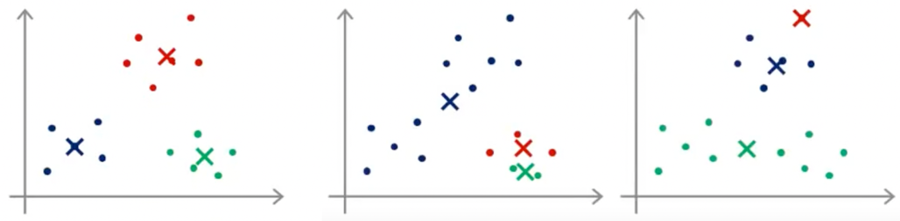
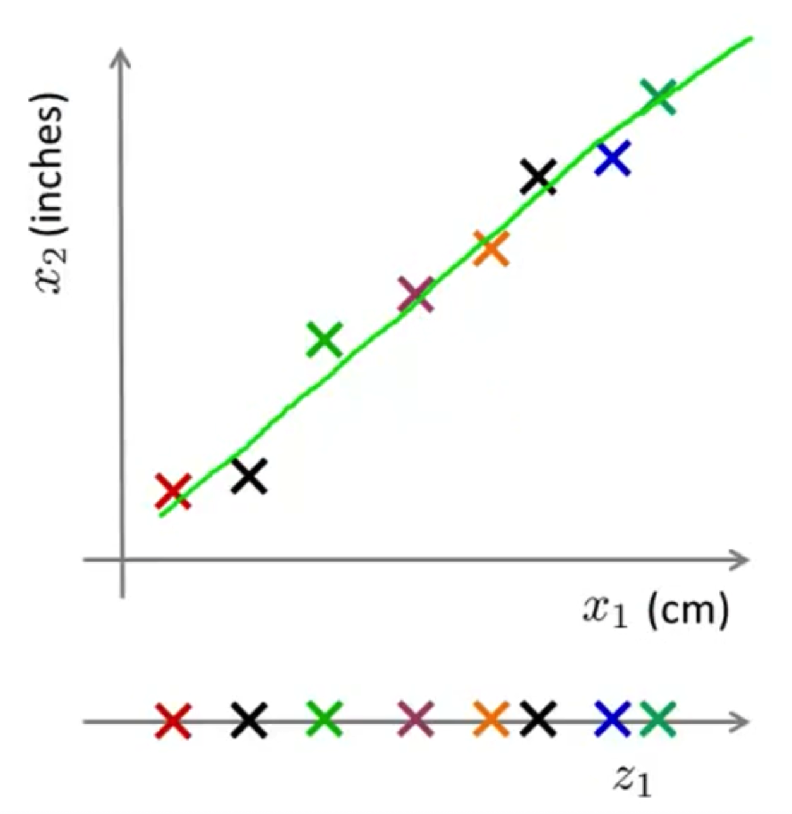
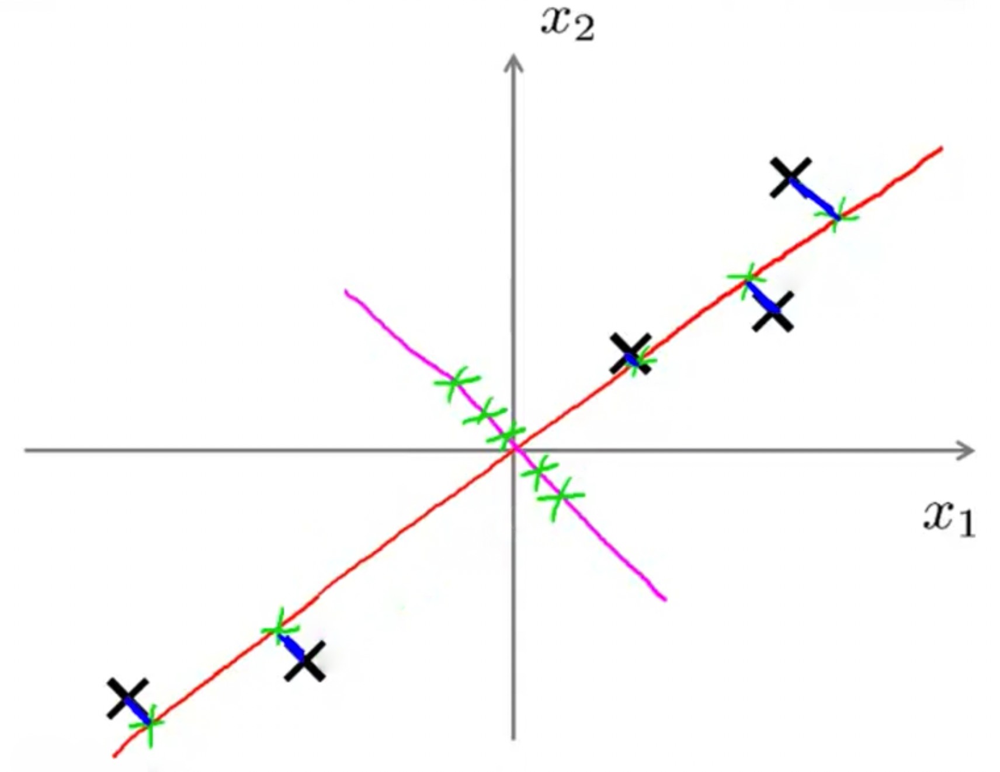
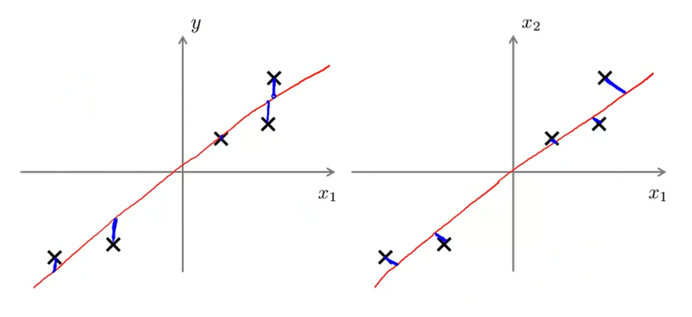

Stanford University, **Machine Learning,** *Andrew Ng,* [Coursera](https://www.coursera.org/learn/machine-learning/home/info)

***Week 8:*** Unsupervised Learning, Dimensionality Reduction

### Unsupervised Learning

#### Clustering

##### Unsupervised Learning: Introduction

training set: $\left\{ x^{\left(1\right)},\, x^{\left(2\right)},\, x^{\left(3\right)},\, \dots ,\, x^{\left(m\right)} \right\}$

##### K-Means Algorithm

**step 1:** cluster assignment
**step 2:** move centroid

<!-- more -->

**Inputs**

- $K$ (number of clusters)
- Training set $\left\{ x^{\left(1\right)},\, x^{\left(2\right)},\, \dots ,\, x^{\left(m\right)} \right\}$, $x^{\left(1\right)} \in \mathbb{R}^n$ (drop $x_0=1$ convention)

**Algorithm**

$\begin{aligned} & \textsf{Randomly initialize } K \textsf{ cluster centroids } \mu_1,\, \mu_2,\, \dots ,\, \mu_K \in \mathbb{R^n} \\ & \textsf{Repeat} \\ & \qquad \textsf{for } i=1 \textsf{ to } m \qquad \textrm{// cluster assignment step} \\ & \qquad\qquad c^{\left(i\right)} := \textsf{index of cluster centroid closest to } x^{\left(i\right)} \\ & \qquad \textsf{for } k=1 \textsf{ to } K \qquad \textrm{// move centroid step} \\ & \qquad\qquad \mu_k := \textsf{average mean of points assigned to cluster } k \end{aligned}$

##### Optimization Objective

- $c^{\left(i\right)}$: index of cluster $\left( 1,\,2,\,\dots,\,K \right)$ to which example $x^{\left(i\right)}$ is currently assigned
- $\mu_k$: cluster centroid $k$ $\left( \mu_k \in \mathbb{R}^n \right)$
- $\mu_{c^{\left(i\right)}}$: cluster centroid of cluster to which example $x\left(i\right)$ has been assigned

**Optimization Objective**

$\begin{aligned} & J\left( c^{\left(1\right)} ,\, \dots ,\, c^{\left(m\right)} ,\, \mu_1 ,\, \dots ,\, \mu_K \right) = \dfrac{1}{m} \sum_{i=1}^{m} \left\| x^{\left(i\right)} - \mu_{ c^{\left(i\right)} } \right\| ^2 \\ & \min_{ \substack{ c^{\left(i\right)} ,\,\dots,\, c^{\left(m\right)} , \\ \mu_1 ,\,\dots,\, \mu_K } } J\left( c^{\left(1\right)} ,\, \dots ,\, c^{\left(m\right)} ,\, \mu_1 ,\, \dots ,\, \mu_K \right) \qquad \textsf{distortion} \end{aligned}$

1. **cluster assignment step**
   minimize $J\left( c^{\left(1\right)} ,\, \dots ,\, c^{\left(m\right)} ,\, \mu_1 ,\, \dots ,\, \mu_K \right)$ with respect to $c^{\left(1\right)} ,\, \dots ,\, c^{\left(m\right)}$, holding $\mu_1 ,\, \dots ,\, \mu_K$ fixed
2. **move centroid step**
   minimize $J\left( c^{\left(1\right)} ,\, \dots ,\, c^{\left(m\right)} ,\, \mu_1 ,\, \dots ,\, \mu_K \right)$ with respect to $\mu_1 ,\, \dots ,\, \mu_K$, holding $c^{\left(1\right)} ,\, \dots ,\, c^{\left(m\right)}$ fixed

##### Random Initialization

Randomly pick $K$ training examples and set $\mu_1 ,\,\dots,\, \mu_K$ equal to these $K$ examples. $\left( K \lt m \right)$

**Local Optima**



*multiple random initializations*

$\begin{aligned} & \textsf{for } i=1 \textsf{ to } 100 \\ & \qquad \textsf{randomly initialize K-means} \\ & \qquad \textsf{run K-means, get } c^{\left(1\right)} ,\, \dots ,\, c^{\left(m\right)} ,\, \mu_1 ,\, \dots ,\, \mu_K \\ & \qquad \textsf{compute distortion } J\left( c^{\left(1\right)} ,\, \dots ,\, c^{\left(m\right)} ,\, \mu_1 ,\, \dots ,\, \mu_K \right) \\ & \textsf{pick clustering that gave lowest cost } J\left( c^{\left(1\right)} ,\, \dots ,\, c^{\left(m\right)} ,\, \mu_1 ,\, \dots ,\, \mu_K \right) ^\strut \end{aligned}$

##### Choosing the Number of Clusters

- Elbow method
- Performance on downstream purpose

### Dimensionality Reduction

#### Motivation

##### Data Compression

Reduce data from 2D to 1D



##### Data Visualization

#### Principal Component Analysis

##### Problem Formulation



**Reduce from 2-dimension to 1-dimension:** Find a direction (a vector $u^{\left(1\right)} \in \mathbb{R}^n$) onto which to project the data, so as to minimize the projection error.  
**Reduce from n-dimension to k-dimension:** Find $k$ vectors $u^{\left(1\right)} ,\, u^{\left(2\right)} ,\,\dots,\, u^{\left(k\right)}$ onto which to project the data, so as to minimize the projection error.

**Principal Component Analysis is not Linear Regression**



$\textsf{LR: } x \rightarrow y \qquad\qquad \textsf{PCA: } x_1 ,\, x_2 ,\,\dots,\, x_n$

##### PCA Algorithm

**Data Preprocessing**

Training set: $x^{\left(1\right)} ,\, x^{\left(2\right)} ,\,\dots,\, x^{\left(m\right)}$  
Preprocessing: feature scaling / mean normalization,  
&emsp;&emsp; $\begin{aligned} \mu_j = \dfrac{1}{m} \sum_{i=1}^m x_j^{\left(i\right)} \end{aligned}$  
&emsp;&emsp; replace each $x_j^{\left(i\right)}$ with $x_j-\mu_j$  
&emsp;&emsp; if different features on different scales, scale features to have comparable range of values.

**Dimensionality Reduction**

Compute covariance matrix  
&emsp;&emsp; $\begin{aligned} \Sigma = \dfrac{1}{m} \sum_{i=1}^{n} \left( x^{\left(i\right)} \right) \left( x^{\left(i\right)} \right) ^\mathsf{T} \quad \in\mathbb{R} ^{n \times n} \end{aligned}$  
Compute eigenvectors $U$ of matrix $\Sigma$  
&emsp;&emsp; $U = \left[ \begin{matrix} \Big| & \Big| & & \Big| & & \Big| \\ u^{\left(1\right)} & u^{\left(2\right)} & \cdots & u^{\left(k\right)} & \cdots & u^{\left(n\right)} \\ \Big| & \Big| & & \Big| & & \Big| \end{matrix} \right]  \quad \in\mathbb{R}^{n \times n}$  
$x \in \mathbb{R}^n \ \longrightarrow \ z \in \mathbb{R}^k$  
&emsp;&emsp; $z _{k \times 1} = U_{\textrm{reduce}}^{\ \mathsf{T}} x = \left( \left[ \begin{matrix} \Big| & \Big| & & \Big| \\ u^{\left(1\right)} & u^{\left(2\right)} & \cdots & u^{\left(k\right)} \\ \Big| & \Big| & & \Big| \end{matrix} \right] ^\mathsf{T} \right) _{k \times n} x _{n \times 1}$

```matlab
[U, S, V] = svd(Sigma)  % singular value decomposition
```

#### Applying PCA

##### Reconstruction from Compressed Representation

$z = U_{\textrm{reduce}}^{\ \mathsf{T}} x \qquad x_{\textrm{approx}} = U_{\textrm{reduce}} z$

##### Choosing the Number of Principal Components

Averaged squared projection error
&emsp;&emsp; $\begin{aligned} \dfrac{1}{m} \sum_{i=1}^{m} \left\| x^{\left(i\right)} - x^{\left(i\right)}_\mathrm{approx} \right\| ^2 \end{aligned}$  
Total variation in the data
&emsp;&emsp; $\begin{aligned} \dfrac{1}{m} \sum_{i=1}^{m} \left\| x^{\left(i\right)} \right\| ^2 \end{aligned}$

Typically, choose $k$ to be smallest value so that  
&emsp;&emsp; $\begin{aligned} \dfrac{ \begin{aligned} \dfrac{1}{m} \sum_{i=1}^{m} \left\| x^{\left(i\right)} - x^{\left(i\right)}_\mathrm{approx} \right\| ^2 \end{aligned} } { \begin{aligned} \dfrac{1}{m} \sum_{i=1}^{m} \left\| x^{\left(i\right)} \right\| ^2 \end{aligned} } \leq 0.01 \end{aligned}$ &emsp;&emsp; *99% of variance is retained*

$S = \begin{bmatrix} \begin{matrix} s_{11} & \\ & s_{22} \end{matrix} & \Large{0} \\ \Large{0} & \begin{matrix} \ddots & \\ & s_{nn} \end{matrix} \end{bmatrix}$

For given $k$  
&emsp;&emsp; $\begin{aligned} \dfrac{ \begin{aligned} \dfrac{1}{m} \sum_{i=1}^{m} \left\| x^{\left(i\right)} - x^{\left(i\right)}_\mathrm{approx} \right\| ^2 \end{aligned} } { \begin{aligned} \dfrac{1}{m} \sum_{i=1}^{m} \left\| x^{\left(i\right)} \right\| ^2 \end{aligned} } = 1- \dfrac{ \begin{aligned} \sum_{i=1}^{k} s_{ii} \end{aligned} } { \begin{aligned} \sum_{i=1}^{n} s_{ii} \end{aligned} } \end{aligned}$

##### Advice for Applying PCA

**Supervised Learning Speedup**

$\begin{matrix} x^{\left(1\right)} ,\, x^{\left(1\right)} ,\,\dots,\, x^{\left(1\right)} \quad \in \mathbb{R}^{10000} \\ \qquad \big\downarrow \qquad \textrm{PCA} \\ z^{\left(1\right)} ,\, z^{\left(1\right)} ,\,\dots,\, z^{\left(1\right)} \quad \in \mathbb{R}^{1000} \end{matrix}$

**Note:** Mapping $x^{\left(i\right)} \rightarrow z^{\left(i\right)}$ should be difined by running PCA only on the training set. This mapping can be applied as well to $x^{\left(i\right)} _\textrm{cv}$ and $x^{\left(i\right)} _\textrm{test}$ in the cross validation and test sets.

**Application of PCA**

- **Compression**
  - Reduce memory/disk space
  - Speed up learning algorithm
- **Visualization**
- Misuses
  - Use PCA to provent overfitting is not recommended
  - Try original/raw data before implementing PCA
