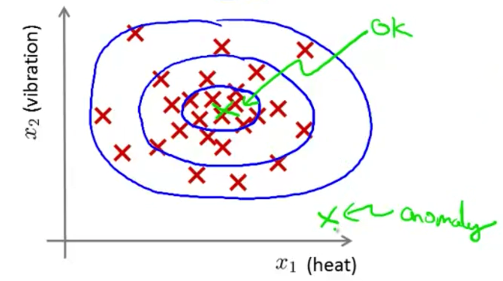
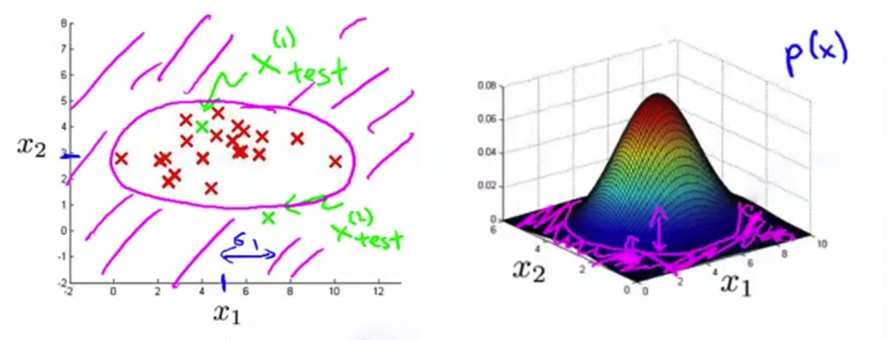
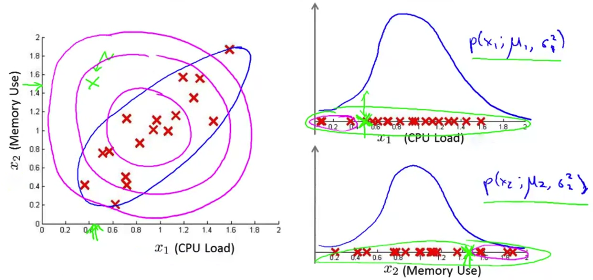
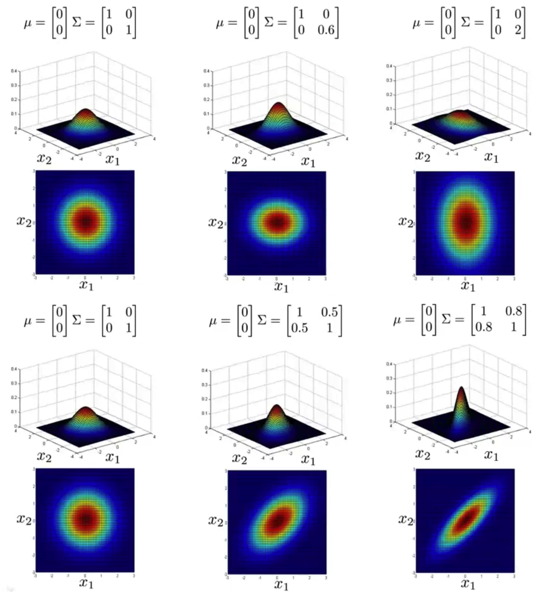
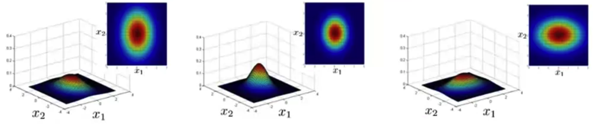

Stanford University, **Machine Learning,** *Andrew Ng,* [Coursera]( https://www.coursera.org/learn/machine-learning/home/info )

***Week 9:*** Anomaly Detection, Recommender Systems  `Part 1`

### Anomaly Detection

#### Density Estimation

##### Problem Motivation

Dataset $\left\{ x^\left(1\right) ,\, x^\left(2\right) ,\,\dots,\, x^\left(m\right) \right\}$, is $x_\mathrm{test}$ anomalous?

Model $p\left(x\right) \begin{cases} \lt \varepsilon & \rightarrow \textsf{flag anomaly} \\ \geq \varepsilon & \rightarrow \textsf{OK} \end{cases}$

<!-- more -->

- fraud detection
- manufacturing
- monitoring computers in a data center

##### Gaussian Distribution

Gaussian (Normal) Distribution $x \sim \mathcal{N} \left( \mu ,\, \sigma^2 \right)$ 
$x$ is a distributed Gaussian with mean $\mu$, variance $\sigma^2$. 
$p\left( x;\,\mu,\,\sigma^2\right) = \dfrac{1}{\sqrt{2\pi}\sigma} \exp{ \left( - \dfrac{ \left(x-\mu\right)^2 }{ 2\sigma^2 } \right) }$

**Parameter Estimation**

Dataset $\left\{ x^\left(1\right) ,\, x^\left(2\right) ,\,\dots,\, x^\left(m\right) \right\} \quad x^\left(i\right) \in\mathbb{R}$ $\quad \Leftarrow \quad x^\left(i\right) \sim \mathcal{N} \left( \mu ,\, \sigma^2 \right)$

Maximum Likelihood Estimation 
$\mu = \dfrac{1}{m} \displaystyle\sum_{i=1}^{m} x^\left(i\right) \qquad \sigma^2 = \dfrac{1}{m} \displaystyle\sum_{i=1}^{m} \left( x^\left(i\right)-\mu \right)^2$

##### Algorithm

**Density Estimation**

Training set: $\left\{ x^\left(1\right) ,\, x^\left(2\right) ,\,\dots,\, x^\left(m\right) \right\}$ 
Each example is $x\in\mathbb{R}^n$ 
$p\left(x\right) = \displaystyle\prod_{j=1}^{n} p\left( x_j;\,\mu_j,\,\sigma_j^2\right)$

**Anomaly Detection Algorithm**

1. Choose features $x_i$ that might be indicative of anomalous examples

2. Fit parameters $\mu_1,\,\dots,\,\mu_n,\,\sigma_1^2,\,\dots,\,\sigma_n^2$

   $\mu = \dfrac{1}{m} \displaystyle\sum_{i=1}^{m} x^\left(i\right) \qquad \sigma^2 = \dfrac{1}{m} \displaystyle\sum_{i=1}^{m} \left( x^\left(i\right)-\mu \right)^2$

3. Given a new example $x$, compute $p\left(x\right)$

   $p\left(x\right) = \displaystyle\prod_{j=1}^{n} p\left( x_j;\,\mu_j,\,\sigma_j^2\right) = \displaystyle\prod_{j=1}^{n} \dfrac{1}{\sqrt{2\pi}\sigma_j} \exp{ \left( - \dfrac{ \left(x_j-\mu_j\right)^2 }{ 2\sigma_j^2 } \right) }$

   Flag an anomaly if $p\left(x\right) \lt \varepsilon$

#### Building an Anomaly Detection System

##### Developing and Evaluating an Anomaly Detection System

Assume we have some labeled data of anomalous and non-anomalous examples.
&emsp;&emsp;($y=0$ if normal, $y=1$ if anomalous). 
Training set: $x^\left(1\right) ,\,x^\left(2\right) ,\,\dots ,\,x^\left(m\right)$ (assume normal examples / not anomalous) 
Cross validation set: $\left( x^\left(1\right)_\textrm{cv} ,\, y^\left(1\right)_\textrm{cv} \right) ,\, \left( x^\left(2\right)_\textrm{cv} ,\, y^\left(2\right)_\textrm{cv} \right) ,\, \dots ,\, \left( x^\left(m_\textrm{cv}\right)_\textrm{cv} ,\, y^\left(m_\textrm{cv}\right)_\textrm{cv} \right)$ 
Test set: $\left( x^\left(1\right)_\textrm{test} ,\, y^\left(1\right)_\textrm{test} \right) ,\, \left( x^\left(2\right)_\textrm{test} ,\, y^\left(2\right)_\textrm{test} \right) ,\, \dots ,\, \left( x^\left(m_\textrm{test}\right)_\textrm{test} ,\, y^\left(m_\textrm{test}\right)_\textrm{test} \right)$

**Algorithm Evaluation**

Fit model $p\left(x\right)$ on the training set $\left\{ x^\left(1\right) ,\,x^\left(2\right) ,\,\dots ,\,x^\left(m\right) \right\}$ 
On a cross-validation / test example $x$, predict 
$\qquad y= \begin{cases} 1 & \textsf{if } p\left(x\right) \lt \varepsilon \quad \textrm{ (anomaly)} \\ 0 & \textsf{if } p\left(x\right) \geq \varepsilon \quad \textrm{ (normal)} \end{cases}$ 
Possible evaluation metrics:
$\qquad \begin{aligned} & \textsf{- True Positive, False Positive, True Negative, False Negative} \\ & \textsf{- Precision / Recall} \\ & \textsf{- F}_\textsf{1}\textsf{ score } \end{aligned}$ 
Can also use cross-validation set to choose parameter $\varepsilon$

##### Anomaly Detection vs. Supervised Learning

| Anomaly Detection                                            | Supervised Learning                                          |
| :----------------------------------------------------------- | :----------------------------------------------------------- |
| Very small number of positive examples $\left(y=1\right)$;  Large number of negative examples $\left(y=0\right)$. | Large number of positive and negative examples.              |
| Many different types of anomalies. Hard for any algorithm to learn from positive examples what the anomalies look like. | Enough positive examples for algorithm to set a sense of what positive examples are like. |
| Future anomalies may look nothing like any of the anomalous examples we've seen so far. | Future positive examples likely to be similar to ones in training set. |

##### Choosing What Features to Use

**Non-gaussian Features**

transform: $x\leftarrow \log\left(x+c\right) ,\, x^{1/t} ,\,\dots$

**Error Analysis for Anomaly Detection**

Want large $p\left(x\right)$ for normal examples $x$, small $p\left(x\right)$ for anomalous examples $x$. 
The most common problem: $p\left(x\right)$ is comparable for normal and anomalous examples. 
Look at the anomaly that failed to flag, and see if that inspires creating new features.

#### Multivariate Gaussian Distribution

##### Multivariate Gaussian Distribution

**Multivariate Gaussian Distribution**

$x\in\mathbb{R}^n$. Don't model $p\left(x_1\right) ,\, p\left(x_2\right) ,\, \dots$ separately; model $p\left(x\right)$ all in one go. 
**Parameters:** $\mu \in \mathbb{R}^n ,\, \Sigma \in \mathbb{R}^{n \times n}$ (covariance matrix) 
$p\left(x;\,\mu,\,\Sigma\right) = \dfrac{1}{\left(2\pi\right)^{\frac{n}{2}} \left|\Sigma\right|^{\frac{1}{2}}} \exp\left( -\dfrac{1}{2} \left(x-\mu\right)^\mathsf{T} \Sigma^{-1} \left(x-\mu\right) \right)$

##### Anomaly Detection using the Multivariate Gaussian Distribution

**Parameters** $\mu ,\, \Sigma$ 
$p\left(x;\,\mu,\,\Sigma\right) = \dfrac{1}{\left(2\pi\right)^{\frac{n}{2}} \left|\Sigma\right|^{\frac{1}{2}}} \exp\left( -\dfrac{1}{2} \left(x-\mu\right)^\mathsf{T} \Sigma^{-1} \left(x-\mu\right) \right)$

**Parameter Fitting** 
Given training set $\left\{ x^\left(1\right) ,\, x^\left(2\right) ,\, \dots ,\, x^\left(m\right) \right\}$ 
$\mu=\dfrac{1}{m} \displaystyle\sum_{i=1}^{m} x^\left(i\right) \qquad \Sigma=\dfrac{1}{m} \displaystyle\sum_{i=1}^{m} \left( x^\left(i\right)-\mu \right) \left( x^\left(i\right)-\mu \right)^\mathsf{T}$

**Anomaly Detection Algorithm**

1. Fit model $p\left(x\right)$ by setting

   $\mu=\dfrac{1}{m} \displaystyle\sum_{i=1}^{m} x^\left(i\right) \qquad \Sigma=\dfrac{1}{m} \displaystyle\sum_{i=1}^{m} \left( x^\left(i\right)-\mu \right) \left( x^\left(i\right)-\mu \right)^\mathsf{T}$

2. Given a new example $x$, compute $p\left(x\right)$

   $p\left(x\right) = \dfrac{1}{\left(2\pi\right)^{\frac{n}{2}} \left|\Sigma\right|^{\frac{1}{2}}} \exp\left( -\dfrac{1}{2} \left(x-\mu\right)^\mathsf{T} \Sigma^{-1} \left(x-\mu\right) \right)$

   Flag an anomaly if $p\left(x\right) \lt \varepsilon$

**Relationship to Original Model**

Original model $p\left(x\right) = p\left( x_1;\,\mu_1,\,\sigma_1^2\right) \times p\left( x_2;\,\mu_2,\,\sigma_2^2\right) \times \cdots \times p\left( x_n;\,\mu_n,\,\sigma_n^2\right)$ 
Corresponds to multivariate Gaussian $p\left(x\right) = \dfrac{1}{\left(2\pi\right)^{\frac{n}{2}} \left|\Sigma\right|^{\frac{1}{2}}} \exp\left( -\dfrac{1}{2} \left(x-\mu\right)^\mathsf{T} \Sigma^{-1} \left(x-\mu\right) \right)$ 
where $\Sigma = \begin{bmatrix} \begin{matrix} \sigma_1^2 & \\ & \sigma_2^2 \end{matrix} & \Large{0} \\ \Large{0} & \begin{matrix} \ddots & \\ & \sigma_n^2 \end{matrix} \end{bmatrix}$

| Original Model                                               | Multivariate Gaussian                                        |
| ------------------------------------------------------------ | ------------------------------------------------------------ |
| $p\left(x\right) = \displaystyle\prod_{j=1}^{n} p\left( x_j;\,\mu_j,\,\sigma_j^2\right)$ | $p\left(x\right) = \dfrac{1}{\left(2\pi\right)^{\frac{n}{2}} \left(\det\Sigma\right)^{\frac{1}{2}}} \exp\left( -\dfrac{1}{2} \left(x-\mu\right)^\mathsf{T} \Sigma^{-1} \left(x-\mu\right) \right)$ |
| Manually create features to capture anomalies where $x_1,\,x_2$ take unusual combinations of values. | Automatically captures correlations between features.        |
| Computationally cheaper. (scales better to large $n$)        | Computationally more expensive.                              |
| OK even if training set size $m$ is small.                   | Must have $m\gt n$, or else $\Sigma$ is non-invertible.      |
