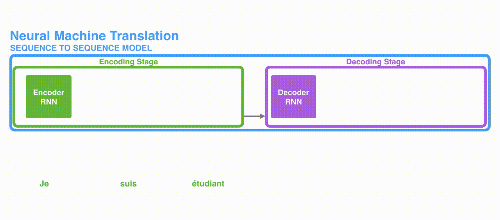

### [Attention is All You Need](https://proceedings.neurips.cc/paper_files/paper/2017/file/3f5ee243547dee91fbd053c1c4a845aa-Paper.pdf)

**Abstract:** The dominant sequence transduction models are based on complex recurrent or convolutional neural networks that include an encoder and a decoder. The best performing models also connect the encoder and decoder through an attention mechanism. We propose a new simple network architecture, the Transformer, based solely on attention mechanisms, dispensing with recurrence and convolutions entirely. Experiments on two machine translation tasks show these models to be superior in quality while being more parallelizable and requiring significantly less time to train. Our model achieves 28.4 BLEU on the WMT 2014 English-to-German translation task, improving over the existing best results, including ensembles, by over 2 BLEU. On the WMT 2014 English-to-French translation task, our model establishes a new single-model state-of-the-art BLEU score of 41.0 after training for 3.5 days on eight GPUs, a small fraction of the training costs of the best models from the literature.

<!--more-->

#### Introduction

Recurrent models generate a sequence hidden status $h_t = f(h_{t-1} ,\, t)$, which precludes parallelization as memory constraints limit batching across examples.

Transformer relies entirely on self-attention to draw global dependencies between input and output, for more parallelization.

#### Model Architecture

##### Encoder-Decoder Structure

**Encoder** maps an input sequence of symbol representations $\mathbf x = (x_1 ,\, x_2 ,\, \dots ,\, x_n)$ to a sequence of continuous representation $\mathbf z = (z_1 ,\, z_2 ,\, \dots ,\, z_n)$.

**Decoder** uses $\mathbf z = (z_1 ,\, z_2 ,\, \dots ,\, z_n)$ to generate  an output sequence $\mathbf y = (y_1 ,\, y_2 ,\, \dots ,\, y_n)$ one element at a time.

Masking ensures that the predictions for position $i$ can depend only on the known outputs at positions less than $i$.

##### Attention

An attention function maps a query and a set of key-value pairs to an output.


\mathrm{Attention}(Q ,\, K ,\, V) = \mathrm{softmax}\left( \dfrac{Q K ^ \mathsf{T}}{\sqrt{d_k}} \right) V \tag{1}


scale the dot products by $1\big/\sqrt d_k$ because the dot products grow large in magnitude, pushing the softmax function into regions where it has extremely small gradients.

Multi-head attention allows the model to jointly attend to information from different representation subspaces at different positions. With a single attention head, averaging inhibits this.


\begin{align} \mathrm{MultiHead}(Q ,\, K ,\, V) &= \mathrm{concat}\left( \mathrm{head}_1 ,\, \mathrm{head}_2 ,\, \dots ,\, \mathrm{head}_h \right) W^O \\ \mathrm{head}_i &= \mathrm{Attention}(QW_i^Q ,\, KW_i^K ,\, VW_i^V) \end{align} \tag{2}


where $W_i^Q \in \mathbb{R}^{ d_\textrm{model} \times d_k }$, $W_i^K \in \mathbb{R}^{ d_\textrm{model} \times d_k }$, $W_i^V \in \mathbb{R}^{ d_\textrm{model} \times d_v }$, $W^O \in \mathbb{R}^{ hd_v \times d_\textrm{model}  }$

here, using $h=8$ parallel attention layers, each $d_k = d_v = d_\textrm{model}/h = 64$.

- In "encoder-decoder attention" layers, the queries come from the previous decoder layer, and the memory keys and values come from the output of the encoder. This allows every position in the decoder to attend over all positions in the input sequence.
- In a self-attention layer all of the keys, values and queries come from the same place, in this case, the output of the previous layer. Masking out (setting to −∞) all values in the input of the softmax which correspond to illegal connection to prevent leftward information flow in the decoder.

##### Feed Forward

2-layer fully connected network with ReLU activation


\textrm{FFN} (x) = \max \left( 0,\, xW_1+b_1 \right) W_2 + b_2 \tag{3}


input and output dimension $d_\textrm{model}=512$, inner-layer $d_\textrm{ff}=2048$.

##### Embeddings and Softmax

- **Embedding:** convert tokens to vectors of dimension $d_\textrm{model}$
- **Softmax:** convert decoder output to next-token probabilities

##### Positional Encoding

Add "positional encodings" to the input embeddings at the bottoms of the encoder and decoder stacks, in order for the model to make use of the
order of the sequence.


\begin{align} \mathrm{PE}_{(pos,\,2i)} &= \sin \left( \mathrm{pos} \big/ 10000^{2i/d_\textrm{model}} \right) \\ \mathrm{PE}_{(pos,\,2i+1)} &= \cos \left( \mathrm{pos} \big/ 10000^{2i/d_\textrm{model}} \right) \end{align} \tag{4}

where $\mathrm{pos}$ is the position, $i$ is the dimension. Having same dimension $d_\textrm{model}$ as embeddings, so can be summed.

|   Layer Type   |     Complexity per Layer      | Sequential Operations |  Max Path Length  |
|:--------------:|:-----------------------------:|:---------------------:|:-----------------:|
| Self-Attention | $O\left( n^2 \cdot d \right)$ |   $O\left(1\right)$   | $O\left(1\right)$ |
| Recurrent | $O\left( n \cdot d^2 \right)$ |   $O\left(n\right)$   | $O\left(n\right)$ |
|Convolutional|$O\left( r \cdot n \cdot d \right)$|$O\left(1\right)$|$O\left( \log_k (n) \right)$|

### [Visualizing Attention](https://jalammar.github.io/visualizing-neural-machine-translation-mechanics-of-seq2seq-models-with-attention/)

The **encoder** processes each item in the input sequence, it compiles the information it captures into a vector (called the **context**). After processing the entire input sequence, the **encoder** sends the **context** over to the **decoder**, which begins producing the output sequence item by item.

#### RNN

Each step: $\left( \textrm{Input} + \textrm{HiddenState} \right) \Rightarrow \left( \textrm{Output} + \textrm{HiddenState}' \right)$

The <mark>context</mark> vector turned out to be a bottleneck for these types of models. It made it challenging for the models to deal with long sentences.

#### Attention

The attention encoder passes a lot more data to the decoder. Instead of passing the last hidden state of the encoding stage, the encoder passes <mark>all</mark> the hidden states to the decoder

An attention decoder does an extra step before producing its output:

1. Look at the set of encoder hidden states it received – each encoder hidden state is most associated with a certain word in the input sentence
2. Give each hidden state a score
3. Multiply each hidden state by its softmaxed score, thus amplifying hidden states with high scores, and drowning out hidden states with low scores

### [The Illustrated Transformer](http://jalammar.github.io/illustrated-transformer/)

The decoder has both those layers, but between them is an attention layer that helps the decoder focus on relevant parts of the input sentence (similar what attention does in seq2seq models).

#### Embedding

The abstraction that is common to all the encoders is that they receive a list of vectors each of the size 512. In the bottom encoder that would be the word embeddings, but in other encoders, it would be the output of the encoder that’s directly below. The size of this list is hyperparameter we can set – basically it would be the length of the longest sentence in our training dataset.

Here we begin to see one key property of the Transformer, which is that the word in each position flows through its own path in the encoder.

#### Self-Attention

As the model processes each word (each position in the input sequence), self attention allows it to look at other positions in the input sequence for clues that can help lead to a better encoding for this word.

##### Step 1. Queries, Keys, Values

For each word, create a Query vector, a Key vector, and a Value vector by multiplying the embedding by three matrices that were trained during the training process.

where projection $q_i = X_i W^Q$, $k_i = X_i W^K$, $v_i = X_i W^V$

##### Step 2. Scoring

We need to score each word of the input sentence against this word. The score determines how much focus to place on other parts of the input sentence as we encode a word at a certain position.

where $\mathrm{score}_i = q_i \cdot k_i$

##### Step 3. Normalize

Softmax normalizes the scores so they’re all positive and add up to 1. This softmax score determines how much each word will be expressed at this position.

Multiply each value vector by the softmax score, to keep intact the values of the words we want to focus on, and drown-out irrelevant words.

##### Step 4. Output

Sum up the weighted value vectors, which produces the output of the self-attention layer at this position that to be sent to the feed-forward neural network.

##### Matrix Calculation

$\begin{align} Q &= X W^Q && \;\;\;\;\;\;\;\,\,\, X \in \mathbb{R}^{n^\textit{\tiny tokens} \times d_\mathrm{model}^\textit{\tiny embedding}} \\ K &= XW^K && \;\;\;\;\;\;\;\,\, W \in \mathbb{R}^{d_\mathrm{model} \times (d_\mathrm{model}/h^\textit{\tiny heads})^\textit{\tiny * can be others}} \\ V &= XW^V && Q,K,V \in \mathbb{R}^{n \times (d_\mathrm{model}/h)} \end{align}$

$\mathrm{Attention}\ Z(Q ,\, K ,\, V) = \mathrm{softmax}\left( \dfrac{Q K ^ \mathsf{T}}{\sqrt{d_k}} \right) V \;\;\;\;\; Z \in \mathbb{R}^{n \times (d_\mathrm{model}/h)}$

##### Multi-Head

$\begin{align} Z_{\textrm{concat}} &= [Z_0 \; Z_1 \; \cdots \; Z_h] && Z_i \in \mathbb{R}^{n \times (d_\mathrm{model}/h)}, \, Z_{\textrm{concat}} \in \mathbb{R}^{n \times d_\mathrm{model}} \\ Z &= Z_{\textrm{concat}} W^O && W^O \in \mathbb{R}^{d_\mathrm{model} \times d_\mathrm{model}} ,\, Z \in \mathbb{R}^{n^\textit{\tiny tokens} \times d_\mathrm{model}^\textit{\tiny embedding}} \end{align}$

#### Positional Encoding

A way to account for the order of the words in the input sequence. These vectors follow a specific pattern that the model learns, which helps it determine the position of each word, or the distance between different words in the sequence.

#### Residuals

#### Decoder

The output of the top encoder is then transformed into a set of attention vectors K and V. These are to be used by each decoder in its “encoder-decoder attention” layer which helps the decoder focus on appropriate places in the input sequence.

In the decoder, the self-attention layer is only allowed to attend to earlier positions in the output sequence. This is done by masking future positions (setting them to `-inf`) before the softmax step in the self-attention calculation.

#### Final Layer

#### Loss Function

How do you compare two probability distributions? We simply subtract one from the other. For more details, look at [cross-entropy](https://colah.github.io/posts/2015-09-Visual-Information/) and [Kullback–Leibler divergence](https://www.countbayesie.com/blog/2017/5/9/kullback-leibler-divergence-explained).

Now, because the model produces the outputs one at a time, we can assume that the model is selecting the word with the highest probability from that probability distribution and throwing away the rest. That’s one way to do it (called greedy decoding). Another way to do it would be to hold on to, say, the top two words (say, ‘I’ and ‘a’ for example), then in the next step, run the model twice: once assuming the first output position was the word ‘I’, and another time assuming the first output position was the word ‘a’, and whichever version produced less error considering both positions #1 and #2 is kept. We repeat this for positions #2 and #3…etc. This method is called “beam search”, where in our example, beam_size was two (meaning that at all times, two partial hypotheses (unfinished translations) are kept in memory), and top_beams is also two (meaning we’ll return two translations). These are both hyper-parameters that you can experiment with.
