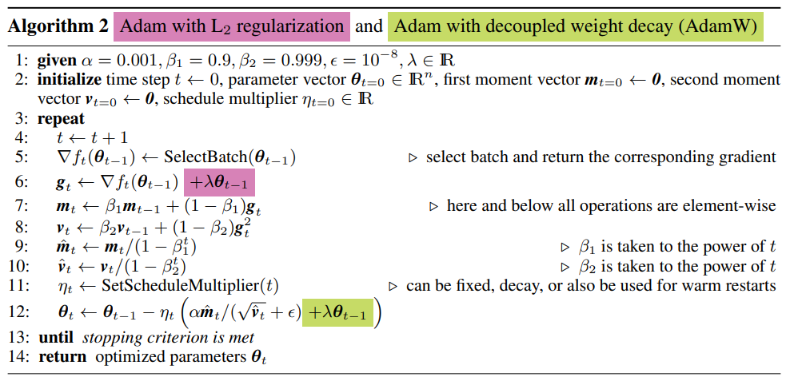
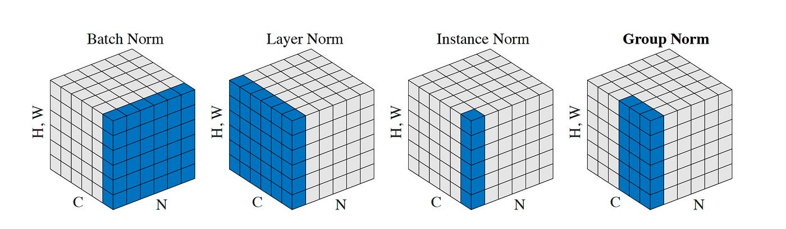

深度学习不求甚解

#### Optimizers

TLDR by ChatGPT

| **优化器** | **学习率调整方式** | **优点** | **缺点** |
| :---: | :---: | :---: | :---: |
| **SGD**         | 固定学习率               | 实现简单           | 对学习率敏感，震荡明显，局部最优   |
| **Momentum**    | 固定学习率 + 动量         | 减少震荡           | 学习率和动量参数敏感，可能过冲    |
| **NAG**         | 固定学习率 + 提前感知动量  | 修正动量方向        | 学习率和动量参数敏感，复杂度高    |
| **AdaGrad**     | 自动调节（历史累积）       | 对稀疏数据友好      | 学习率会持续下降，后期收敛缓慢    |
| **RMSProp**     | 自动调节（平滑加权）       | 学习率动态调整      | 学习率和动量因子参数敏感         |
| **AdaDelta**    | 自适应学习率              | 适合不同尺度梯度    | 存储和计算开销较高              |
| **Adam**        | 综合动量和 RMSProp        | 自适应调整学习率    | 对初始超参数敏感，有时会过拟合    |
| **AdamW**       | Adam（权重衰减优化）       | 适合多种任务       | 需要调整额外的正则化参数         |

<!-- more -->

##### [Gradient Descent](https://pytorch.org/docs/stable/generated/torch.optim.SGD.html#torch.optim.SGD)

$\begin{aligned}
g_{t} &= \nabla_{\theta} J(\theta) \\
\theta_{t+1} &= \theta_{t} - \alpha \cdot g_{t}
\end{aligned}$

|  Batch Gradient Descent   |  Stochastic Gradient Descent   |  Mini-batch Gradient Descent   |
| :---: | :---: | :---: |
| 每次迭代使用全部样本 | 每次迭代使用一个样本 | 每次迭代使用一个batch |

SGD (mini-batch) 对梯度震荡敏感，容易陷入局部最优或鞍点。学习率对性能影响显著，$\alpha$ 通常设置为 $0.01$。

##### [Momentum](https://pytorch.org/docs/stable/generated/torch.optim.SGD.html#torch.optim.SGD)

$\begin{aligned}
m_{t} &= \beta \cdot m_{t-1} + (1-\beta') \cdot g_{t} \\
\theta_{t+1} &= \theta_{t} - \alpha \cdot m_{t}
\end{aligned}$

Momentum 通过累积之前的梯度信息，减小梯度震荡，加速收敛。$\beta$ 通常设置为 $0.9$。$\beta'$ 也称为 dampening factor，通常可设置为 $0$。

##### [NAG](<https://pytorch.org/docs/stable/generated/torch.optim.SGD.html#torch.optim.SGD>)

$\begin{aligned}
\theta'_{t} &= \theta_{t} - \alpha \cdot \beta \cdot m_{t-1} \\
m_{t} &= \beta \cdot m_{t-1} + \nabla_{\theta} J(\theta'_{t}) \\
\theta_{t+1} &= \theta_{t} - \alpha \cdot m_{t}
\end{aligned}$

Momentum首先计算一个梯度，然后在加速更新梯度的方向进行一个大的跳跃；NAG (Nesterov Accelerated Gradient) 首先在之前加速的梯度方向进行一个大的跳跃，计算梯度然后进行校正。

##### [AdaGrad](https://pytorch.org/docs/stable/generated/torch.optim.Adagrad.html#torch.optim.Adagrad)

$\begin{aligned}
G_{t} &= G_{t-1} + g_{t} \odot g_{t} \\
\theta_{t+1} &= \theta_{t} - \alpha \cdot \frac{g_{t}}{\sqrt{G_{t} + \varepsilon}}
\end{aligned}$

AdaGrad (Adaptive Gradient Algorithm) 算法能够在训练中自动的对学习率进行调整。通过累加之前的梯度平方和 $G_{t}$，能够调整对于出现频率较低参数采用较大的学习率更新，而对于出现频率较高的参数采用较小的学习率更新。因此，对稀疏特征有较好的效果。

##### [RMSprop](https://pytorch.org/docs/stable/generated/torch.optim.RMSprop.html#torch.optim.RMSprop)

$\begin{aligned}
G_{t} &= \beta \cdot G_{t-1} + (1-\beta) \cdot g_{t} \odot g_{t} \\
\theta_{t+1} &= \theta_{t} - \alpha \cdot \frac{g_{t}}{\sqrt{G_{t} + \varepsilon}}
\end{aligned}$

RMSprop (Root Mean Square Propagation) 是对 AdaGrad 的改进，通过引入一个衰减系数 $\beta$，使得梯度平方和不再是累加，而是一个衰减平均。这样解决了分母会不断积累，学习率就会收缩并最终会变得非常小的问题。

##### [AdaDelta](https://pytorch.org/docs/stable/generated/torch.optim.Adadelta.html#torch.optim.Adadelta)

$\begin{aligned}
G_{t} &= \beta \cdot G_{t-1} + (1-\beta) \cdot g_{t} \odot g_{t} \\
D_{t-1} &= \beta \cdot D_{t-2} + (1-\beta) \cdot d_{t-1} \odot d_{t-1} \\
d_{t} &= - \frac{\sqrt{D_{t-1} + \varepsilon}}{\sqrt{G_{t} + \varepsilon}} \odot g_{t} \\
\theta_{t+1} &= \theta_{t} + d_{t}
\end{aligned}$

AdaDelta 通过引入 $D_{t}$ 存储之前更新的平方梯度的指数衰减平均，来替代固定的学习率 $\alpha$，避免了手动调节学习率的过程。当梯度较大时，更新步长会变小；当梯度较小时，更新步长会变大。

##### [Adam](https://pytorch.org/docs/stable/generated/torch.optim.Adam.html#torch.optim.Adam)

$\begin{aligned}
m_{t} &= \beta_{1} \cdot m_{t-1} + (1-\beta_{1}) \cdot g_{t} \\
v_{t} &= \beta_{2} \cdot v_{t-1} + (1-\beta_{2}) \cdot g_{t} \odot g_{t} \\
\hat{m}_{t} &= \frac{m_{t}}{1-\beta_{1}^{t}} \\
\hat{v}_{t} &= \frac{v_{t}}{1-\beta_{2}^{t}} \\
\theta_{t+1} &= \theta_{t} - \alpha \cdot \frac{\hat{m}_{t}}{\sqrt{\hat{v}_{t} + \varepsilon}}
\end{aligned}$

Adam (Adaptive Moment Estimation) 是结合了 Momentum 和 RMSprop 的优点，$m_t$ 计算历史梯度的一阶指数平滑值，$v_t$ 计算历史梯度的二阶指数平滑值。$\beta_1$ 和 $\beta_2$ 通常设置为 $0.9$ 和 $0.999$。

在迭代过程中，如果某一维度方向梯度较为稳定，那么 $v_t$ 会变小，从而使得学习率变大，加速收敛；如果某一维度方向梯度变化较大，那么 $v_t$ 会变大，从而使得学习率变小，稳定收敛。

##### [AdamW](https://pytorch.org/docs/stable/generated/torch.optim.AdamW.html#torch.optim.AdamW)

在Adam中，权重衰减 (Weight Decay, L2 Norm) 的正则项是直接加在梯度 $g_t$ 上的，这就导致权重衰减的梯度也会去除以分母。当梯度的平方和累积过大时，权重衰减的作用就会被大大削弱，所以导致了用Adam算法训练出来的模型泛化能力较弱。

AdamW 是对 Adam 的改进，将权重衰减和Adam算法解耦，让权重衰减的梯度单独去更新参数。

#### Activation Functions

##### [Sigmoid](https://pytorch.org/docs/stable/generated/torch.nn.Sigmoid.html#torch.nn.Sigmoid)

$\sigma(x) = \dfrac{1}{1+e^{-x}}$

Sigmoid 函数是一种常用的激活函数，将输入值压缩到 $(0, 1)$ 之间，适用于二分类问题。但是 Sigmoid 函数在输出接近饱和区域时，梯度会变得非常小，导致梯度消失问题。

##### [Tanh](https://pytorch.org/docs/stable/generated/torch.nn.Tanh.html#torch.nn.Tanh)

$\tanh(x) = \dfrac{e^{x} - e^{-x}}{e^{x} + e^{-x}}$

Tanh 函数是 Sigmoid 函数的变形，输出值范围为 $(-1, 1)$，这样可以解决 Sigmoid 函数的输出不是零中心的问题。

##### [ReLU](https://pytorch.org/docs/stable/generated/torch.nn.ReLU.html#torch.nn.ReLU)

$\text{ReLU}(x) = \max(0, x)$

ReLU (Rectified Linear Unit) 是一种简单的非线性激活函数，能够在正数区域保持梯度不变，加速收敛。但是在负数区域输出为 0，可能导致神经元死亡，梯度消失。

##### [Leaky ReLU](https://pytorch.org/docs/stable/generated/torch.nn.LeakyReLU.html#torch.nn.LeakyReLU)

Leaky ReLU 通过引入一个小的斜率 $\alpha$，解决了 ReLU 在负数区域的输出为 0 的问题。

$\text{LeakyReLU}(x) = \max(\alpha x, x)$

##### [ELU](https://pytorch.org/docs/stable/generated/torch.nn.ELU.html#torch.nn.ELU)

$\text{ELU}(x) = \begin{cases} x & \text{if } x > 0 \\ \alpha \cdot (e^{x} - 1) & \text{if } x \leq 0 \end{cases}$

ELU (Exponential Linear Unit) 在 $x \leq 0$ 时，引入了一个非线性因子，使得激活函数的输出均值接近于 0，有助于缓解梯度消失问题。

##### [Softmax](https://pytorch.org/docs/stable/generated/torch.nn.Softmax.html#torch.nn.Softmax)

$\text{Softmax}(x) = \dfrac{e^{x_i}}{\sum_{j} e^{x_j}}$

在实际计算softmax函数时，防止数值溢出的常见方法是通过减去输入中的最大值，以避免指数函数计算中可能导致的数值范围过大问题，因为指数函数是平移不变的。

$\text{Softmax}(x) = \dfrac{e^{x_i - \max(x)}}{\sum_{j} e^{x_j - \max(x)}}$

#### Normalization

|  Batch Normalization   |  Layer Normalization   |
| :---: | :---: |
| $\begin{aligned} \mu_{\beta} &= \frac{1}{m} \sum_{i=1}^{m} \beta_{i} \\ \sigma_{\beta}^{2} &= \frac{1}{m} \sum_{i=1}^{m}\left(\beta_{i}-\mu_{\beta}\right)^{2} \\ \hat{\beta}_{i} &= \frac{\beta_{i}-\mu_{\beta}}{\sqrt{\sigma_{\beta}^{2}+\varepsilon}} \end{aligned}$ | $\begin{aligned} \mu_{\gamma} &= \frac{1}{n} \sum_{i=1}^{n} \gamma_{i} \\ \sigma_{\gamma}^{2} &= \frac{1}{n} \sum_{i=1}^{n}\left(\gamma_{i}-\mu_{\gamma}\right)^{2} \\ \hat{\gamma}_{i} &= \frac{\gamma_{i}-\mu_{\gamma}}{\sqrt{\sigma_{\gamma}^{2}+\varepsilon}} \end{aligned}$ |
| BN 将**一个batch内**的所有特征 归一化为符合正态分布的数据 | LN 将**一个样本内**的所有特征 归一化为符合正态分布的数据 |
| 抹平了不同特征之间的分布差异 保留了不同样本之间的分布差异 | 抹平了不同样本之间的分布差异 保留了不同特征之间的分布差异 |

**如果在一个维度内进行normalization，那么在这个维度内，相对大小有意义的，是可以比较的；但是在normalization后的不同的维度之间，相对大小是没有意义的。**

BN广泛应用于CV，针对同一特征，以跨样本的方式开展归一化，也就是对不同样本的同一channel间的所有像素值进行归一化，因此不会破坏不同样本同一特征之间的关系。

而NLP中不用BN，因为对不同样本同一特征的信息进行归一化没有意义，反而舍弃了同一个样本的不同维度的信息。此外，NLP用BN的话，padding的部分特征会扰乱正常非padding的那部分特征，而LN适用于处理不定长行为序列场景。



For BN, we estimate the mean and variance of the test set using the running averages of the training set.

$\begin{aligned} \mu^{t}_{\rm{run}} &= \left( 1-\alpha \right) \mu^{t-1}_{\rm{run}} + \alpha \mu^{t} \\ {\sigma^2}^{t}_{\rm{run}} &= \left( 1-\alpha \right) {\sigma^2}^{t-1}_{\rm{run}} + \alpha {\sigma^2}^{t} \end{aligned}$

> Exponential Moving Average, EMA: $\alpha$ usually set to 0.01.

At test time, we normalize the test set using the running averages computed during the training phase.

$\begin{aligned}\hat{\mathbf{z}}^t &= \frac{\mathbf{z}- \mu^{t}_{\rm{run}} }{\sqrt{ {\sigma^2}^{t}_{\rm{run}} +\epsilon}} \\ \mathbf{y}^t &= \gamma \hat{\mathbf{z}}^t + \beta \end{aligned}$


