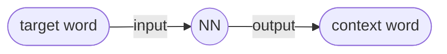

大模型小抄

### Transformer

<!-- more -->

### Tokenization

#### Byte Pair Encoding

BPE 是一种基于统计的词分割算法，通过迭代地最常出现的子词对合并，直到词汇表达到预定的大小时停止。

> LLaMA基于BBPE实现，即 Byte-level BPE。用基于UTF-8的BBPE，词表可以相比于BPE减少到1/8。

#### WordPiece

WordPiece 非常接近BPE，不同之处在于它做合并时，并不是直接找最高频的组合，而是找能够最大化训练数据似然的组合。

#### Unigram

Unigram 从一个巨大的词汇表出发，再逐渐删除trim down其中的词汇，直到预定的大小。初始的词汇表可以采用所有预分词器分出来的词，再加上所有高频的子串。

### Embeddings

**Encodings of meaning into numbers** such that words that are close in meaning have numbers that are close.

- each word has a vector
- two words with similar meaning have similar victors

#### Distributional Hypothesis

Words appearing in similar **contents** are related.

#### To compute the similarity

- TFIDF
- Euclidean distance
- Cosine similarity $=\dfrac{A \cdot B}{\|A\| \|B\|}$

#### Training

**Vocabulary** of the network is the set of words it can predict from/to. The simplest way to represent the input output is **one-hot encoding**.

The embeddings, typically hold in a matrix, will be used to represent each **target word**. They will be *learned* in the training process. Predict **context word** as probabilities using softmax.

##### (target word, context word) pair

Select pairs of words for each sample in the dataset that are ***close enough*** to be related.

**Skip Gram with negative sampling** instead do a binary prediction of whether two words are related or not. - need negative examples
