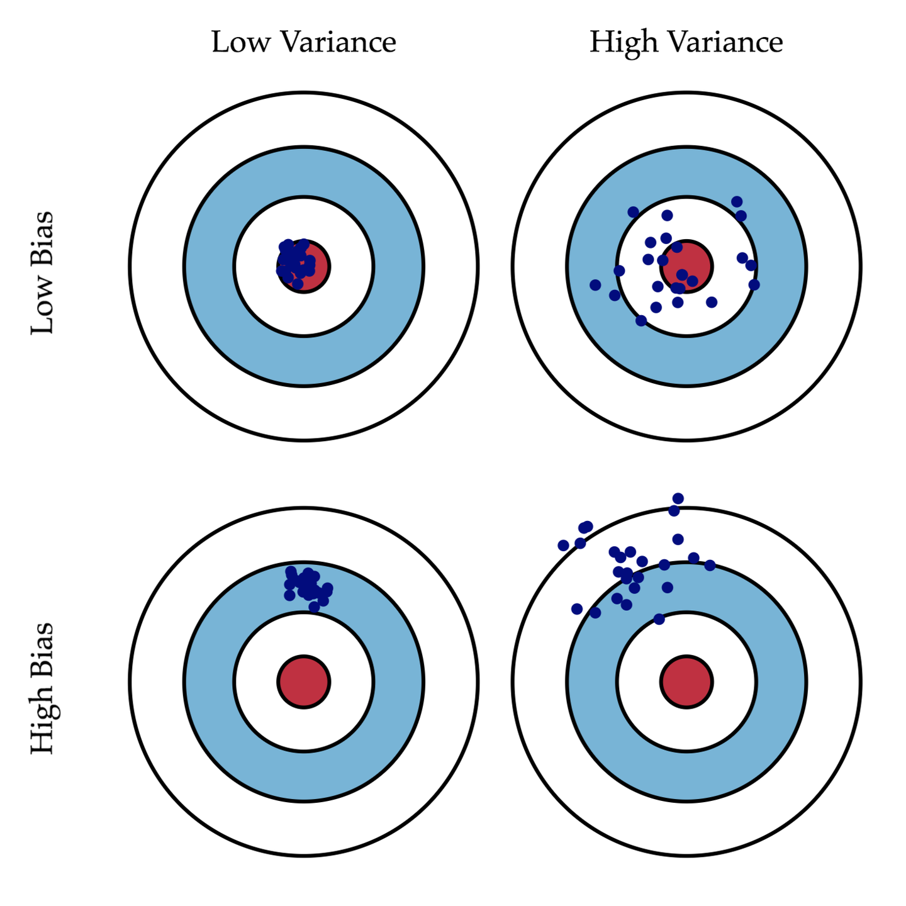
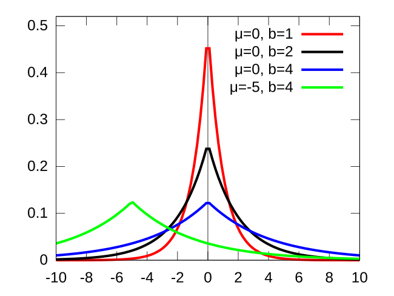
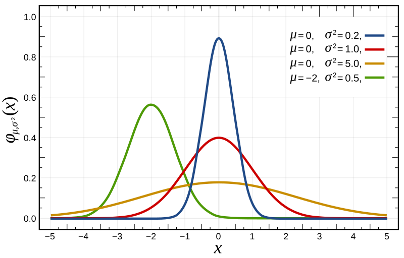
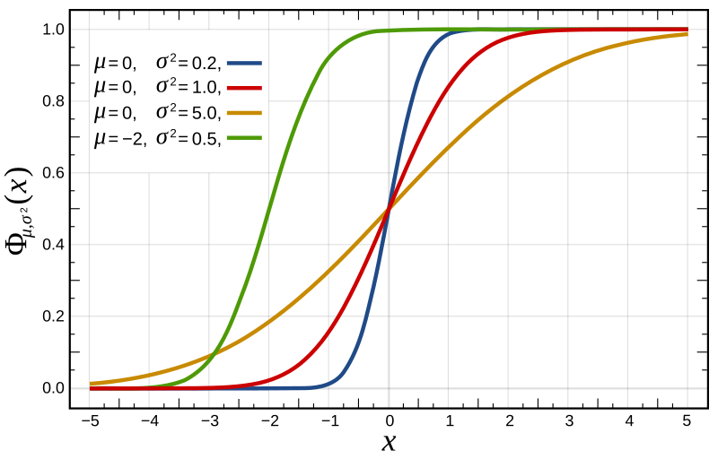
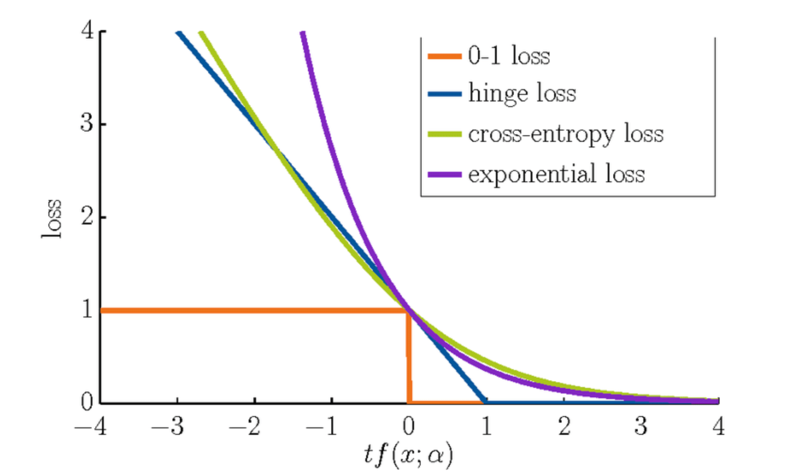

机器学习八股文

### Generative / Discriminative Models

| 生成模型 | 判别模型 |
| :-----: | :-----: |
| $P(X, Y)$ | $P(Y/X)$ |
| Probability Density | Decision Boundary |
| Generate Data | Classify Data |

<!-- more -->

### Overfitting / Underfitting

过拟合：训练 ACC 高，但是验证 ACC 低很多，loss较大

| 解决过拟合 | 解决欠拟合 |
| :------- | :------- |
| 降低模型复杂度 | 增加模型复杂度 |
| 增加数据量 | 增加特征量 |
| Data Augmentation | 减小正则化参数 |
| Feature Selection | |
| Regularization | |
| Normalization | |
| Early Stopping | |
| Ensemble |  |

#### Bias-Variance Tradeoff

Bias：模型预测值与真实值之间的差距
Variance：模型对数据的敏感程度

### Metrics

#### Confusion Matrix

| ${}_\textsf{Actual} \ \big\backslash \ {}^\textsf{Predicted}$ | Positive | Negative |
| :---: | :---: | :---: |
| Positive | TP | FN |
| Negative | FP | TN |

#### Binary Classification

Accuracy: $\text{ACC} = \dfrac{TP+TN}{TP+TN+FP+FN}$

Precision：$P = \dfrac{TP}{TP+FP}$

Recall：$R = \dfrac{TP}{TP+FN}$

F1 Score：$F1 = \dfrac{1}{\frac{1}{P} + \frac{1}{R}}$

#### Unbalanced Classification

ROC 曲线(Receiver Operating Characteristic)：横轴为 FPR(False Positive Rate)，纵轴为 TPR(True Positive Rate). AUC (Area Under ROC Curve)：ROC 曲线下的面积。

TPR (True Positive Rate)：$TPR = \dfrac{TP}{TP+FN}$

FPR (False Positive Rate)：$FPR = \dfrac{FP}{FP+TN}$

Lowering the threshold allows more items to be classified as positive, thus increasing both true positive rate and false positive rate.

### MLE / MAP

#### Maximum Likelihood Estimation (MLE)

频率学派的观点，认为参数是固定的，数据是随机的，通过最大化似然函数来估计参数。


假设 $X = \left\{ x_1,\, x_2,\, \cdots,\, x_n \right\}$ 是 i.i.d. 的抽样, 服从某个分布，参数为 $\theta$，似然函数为 $L(\theta) = P(X;\theta)$，则最大似然估计为

$\begin{aligned}
\hat{\theta}_{\rm MLE}
&= \arg \max_{\theta} L(\theta) \\
&= \arg \max_{\theta} \prod_{i=1}^{n} P(x_i;\theta) \\
&= \arg \max_{\theta} \sum_{i=1}^{n} \log P(x_i;\theta) \\
&= \arg \min_{\theta} \sum_{i=1}^{n} -\log P(x_i;\theta)
\end{aligned}$


转为最小化负对数（负对数似然函数，NLL: Negative Log-Likelihood）

#### Maximum A Posteriori Estimation (MAP)

贝叶斯学派的观点，认为参数是随机的，数据是固定的，通过最大化后验概率来估计参数。


假设 $X = \left\{ x_1,\, x_2,\, \cdots,\, x_n \right\}$ 是 i.i.d. 的抽样, 则最大化后验概率

$\begin{aligned}
\hat{\theta}_{\rm MAP}
&= \arg \max_{\theta} P(\theta|X) \\
&= \arg \max_{\theta} \dfrac{P(X|\theta)P(\theta)}{P(X)} \\
&= \arg \max_{\theta} P(X|\theta)P(\theta) \\
&= \arg \max_{\theta} \log P(X|\theta) + \log P(\theta) \\
&= \arg \min_{\theta} -\log P(X|\theta) - \log P(\theta)
\end{aligned}$


最大似然估计是仅通过数据来估计参数，而最大后验估计是通过数据和先验知识来估计参数。MAP 可以看作是在 MLE 的基础上增加了一项「正则化」。当先验分布为均匀分布时，MAP 估计退化为 MLE 估计。

### Regularization

#### L1 Regularization (Lasso)

$\begin{aligned} L_{1} &=\|W\|_{1}=\sum_{i=1}^{n}\left|w_{i}\right| \end{aligned}$



$\hat{\theta}_{\rm MAP} = \arg \min_{\theta} -\log P(X|\theta) - \log P(\theta)$, we focus on the second term.

The Laplace prior for a parameter $\theta$ is defined as $P(\theta) = \frac{1}{2b} \exp \left( -\frac{|\theta|}{b} \right)$, where $b$ is a scale parameter. Taking the negative log of the prior gives $-\log P(\theta) = \log 2b + \frac{|\theta|}{b} \propto |\theta|$.

**Laplace Distribution**







#### L2 Regularization (Ridge)

$\begin{aligned} L_{2} &=\|W\|_{2}^{2}=\sum_{i=1}^{n} w_{i}^{2} \end{aligned}$



$\hat{\theta}_{\rm MAP} = \arg \min_{\theta} -\log P(X|\theta) - \log P(\theta)$, we focus on the second term.

The Gaussian prior for a parameter $\theta$ is defined as $P(\theta) = \frac{1}{\sqrt{2\pi}b} \exp \left( -\frac{\theta^2}{2b^2} \right)$, where $b$ is a scale parameter. Taking the negative log of the prior gives $-\log P(\theta) = \log \sqrt{2\pi}b + \frac{\theta^2}{2b^2} \propto \theta^2$.

**Gaussian Distribution**







L1范数相比于L2范数，更容易得到稀疏解，即L1范数可以将不重要的特征参数优化至0.


施加 L1 正则化，新的损失函数 $L_{1} = ( L + C | x | )$
施加 L2 正则化，新的损失函数 $L_{2} = ( L + C x ^2 ) $

当施加 L2 正则化时，极小值点 $\frac{dL_1}{dx} = \frac{dL}{dx} + 2Cx = 0$, 当且仅当损失函数原本的导数为 $0$ 时，损失函数才会在 $x = 0$ 处极小；而施加 L1 正则化时，极小值点 $\frac{dL_2}{dx} = \frac{dL}{dx} + \text{sign}(x)C = 0$, 仅需满足 $C > | L' |$ 的关系，$x=0$ 便会成为损失函数的一个极小值点。

L1 正则化会使得许多参数的最优值变成 0，使得模型变得稀疏。利用这样的特性，我们便可以使用L1正则化来帮助筛选特征。


### Loss Functions

#### Mean Squared Error

$\begin{aligned} {\rm MSE} = \frac{1}{n} \sum_{i=1}^{n} \left( y^{(i)} - \hat y^{(i)} \right)^2 = \frac{1}{n} ||\mathbf{y} - \hat{\mathbf{y}}|| ^2 \end{aligned}$

##### Closed form solution

$\begin{aligned} \hat{\mathbf{w}} = (\mathbf{X}^T \mathbf{X})^{-1} \mathbf{X}^T \mathbf{y} \end{aligned}$



minimize: $L(\mathbf{w}) = \frac{1}{n} (\mathbf{y} - \mathbf{X} \mathbf{w})^T (\mathbf{y} - \mathbf{X} \mathbf{w})$

$\begin{aligned}0 =  \frac{\partial L(\mathbf{w})}{\partial \mathbf{w}}
&= \frac{\partial (\mathbf{y} - \mathbf{X} \mathbf{w})^T (\mathbf{y} - \mathbf{X} \mathbf{w})}{\partial \mathbf{w}} \\
&= \frac{1}{n} \frac{\partial (\mathbf{y} - \mathbf{X} \mathbf{w})^T (\mathbf{y} - \mathbf{X} \mathbf{w})}{\partial (\mathbf{y} - \mathbf{X} \mathbf{w})}\frac{\partial (\mathbf{y} - \mathbf{X} \mathbf{w})}{\partial \mathbf{w}} \\
&= \frac{2}{n} (\mathbf{y} - \mathbf{X} \mathbf{w})^T (-\mathbf{X})
\end{aligned}$

$\begin{aligned} \Rightarrow 0 &= - \mathbf{X}^T (\mathbf{y} - \mathbf{X} \mathbf{w}) \\ \hat{\mathbf{w}} &= (\mathbf{X}^T \mathbf{X})^{-1} \mathbf{X}^T \mathbf{y} \end{aligned}$



##### Ridge Regression

$\begin{aligned} \hat{\mathbf{w}} = (\mathbf{X}^T \mathbf{X} + \lambda \mathbf{I})^{-1} \mathbf{X}^T \mathbf{y} \end{aligned}$



minimize: $L(\mathbf{w}) = \frac{1}{n} (\mathbf{y} - \mathbf{X} \mathbf{w})^T (\mathbf{y} - \mathbf{X} \mathbf{w}) + \lambda \mathbf{w}^T \mathbf{w}$

$\begin{aligned}0 =  \frac{\partial L(\mathbf{w})}{\partial \mathbf{w}}
&= \frac{1}{n} \frac{\partial (\mathbf{y} - \mathbf{X} \mathbf{w})^T (\mathbf{y} - \mathbf{X} \mathbf{w})}{\partial \mathbf{w}} + \lambda \frac{\partial \mathbf{w}^T \mathbf{w}}{\partial \mathbf{w}} \\
&= \frac{1}{n} \frac{\partial (\mathbf{y} - \mathbf{X} \mathbf{w})^T (\mathbf{y} - \mathbf{X} \mathbf{w})}{\partial (\mathbf{y} - \mathbf{X} \mathbf{w})}\frac{\partial (\mathbf{y} - \mathbf{X} \mathbf{w})}{\partial \mathbf{w}} + 2 \lambda \mathbf{w}^T \\
&= \frac{2}{n} (\mathbf{y} - \mathbf{X} \mathbf{w})^T (-\mathbf{X}) + 2 \lambda \mathbf{w}^T
\end{aligned}$

$\begin{aligned} \Rightarrow 0 &= (\mathbf{y} - \mathbf{X} \mathbf{w})^T (-\mathbf{X}) + \lambda' \mathbf{w}^T \\ &=
-\mathbf{X}^T (\mathbf{y} - \mathbf{X} \mathbf{w}) + \lambda' \mathbf{w} \\ \hat{\mathbf{w}} &= (\mathbf{X}^T \mathbf{X} + \lambda' \mathbf{I})^{-1} \mathbf{X}^T \mathbf{y} \end{aligned}$





$A$ has inverse $\Leftarrow$ positive definite $\Leftrightarrow \forall\ x\neq 0$, quadratic form $x^TAx > 0$

$\begin{align} y^T(X^TX +\lambda I)y &= y^T(X^TX)y + y^T(\lambda I)y \\ &= (Xy)^T(Xy) + \lambda y^T y \\ &= [\geq 0] + \lambda [\gt 0] \quad \Rightarrow \quad \gt 0 \end{align}$



#### Cross Entropy Loss

##### Binary Classification

$\begin{aligned} L(\mathbf{y}, \hat{\mathbf{y}}) = - y \log \hat{y} - (1-y) \log (1-\hat{y}) \end{aligned}$

##### Multi-class Classification

$\begin{aligned} L(\mathbf{y}, \hat{\mathbf{y}}) = - \sum_{i=1}^{n} y_i \log \hat{y}_i \end{aligned}$

在分类问题中，由于经过 Sigmoid 函数，若使用均方误差损失函数则不是凸函数，而交叉熵损失函数是凸函数。



$H(P, Q) = H(P) + D_{KL}(P||Q)$

Relative Entropy measures the difference between two probability distributions.
$D_{KL}(P||Q) = \sum_{i} P(i) \log \frac{P(i)}{Q(i)} = \sum_{i} P(i) \log P(i) - \sum_{i} P(i) \log Q(i)$

KL Divergence is not symmetric.
If $P$ is large and $Q$ is small, the KL divergence $D_{KL}(P||Q)$ will be large;
if $P$ is small and $Q$ is large, the KL divergence $D_{KL}(P||Q)$ will be small.

JS Divergence is symmetric, $D_{JS}(P||Q) = \frac{1}{2} D_{KL}(P||M) + \frac{1}{2} D_{KL}(Q||M)$, where $M = \frac{1}{2} (P+Q)$.



#### Hinge Loss

$\begin{aligned} L(\mathbf{y}, \hat{\mathbf{y}}) = \max(0, 1 - y \cdot \hat{y}) \end{aligned}$

Hinge Loss is used in Support Vector Machine (SVM) for binary classification.

### Support Vector Machine

#### SVM Model

##### Hard Margin SVM

$\begin{aligned} \min_{\mathbf{w}, b} \frac{1}{2} ||\mathbf{w}||^2 \quad \text{s.t.} \quad y_i(\mathbf{w}^T \mathbf{x}_i + b) \geq 1 \end{aligned}$





##### Soft Margin SVM

$\begin{aligned} \min_{\mathbf{w}, b} \frac{1}{2} ||\mathbf{w}||^2 + C \sum_{i=1}^{n} \xi_i \quad \text{s.t.} \quad y_i(\mathbf{w}^T \mathbf{x}_i + b) \geq 1 - \xi_i, \quad \xi_i \geq 0 \end{aligned}$

#### Kernel Trick

$\begin{aligned} K(\mathbf{x}_i, \mathbf{x}_j) = \phi(\mathbf{x}_i)^T \phi(\mathbf{x}_j) \end{aligned}$

Kernel types: Linear, Polynomial, RBF (Gaussian), Sigmoid

#### Multi-class SVM

One-vs-All: $n$ classifiers, choose the class with the highest score.
One-vs-One: $\frac{n(n-1)}{2}$ classifiers, choose the class with the most votes.

### Naive Bayes

$\begin{aligned} P(Y|X) = \frac{P(X|Y)P(Y)}{P(X)} \end{aligned}$

$\begin{aligned} P(Y|X) \propto P(X|Y)P(Y) \end{aligned}$

$\begin{aligned} \hat{Y} &= \arg \max_Y P(X|Y)P(Y) \\
&= \arg \max_Y \log P(X|Y) + \log P(Y) \\
&= \arg \max_Y \sum_{i=1}^{n} \log P(x_i|Y) + \log P(Y) \end{aligned}$

### Decision Tree

1. 特征选择：信息增益、信息增益比、基尼指数
2. 决策树生成：递归地构建决策树
3. 决策树剪枝：防止过拟合

**Prevent overfitting in DT**

- Pruning: Pre-pruning, Post-pruning
- Minimum samples per leaf
- Maximum depth of tree
- Minimum information gain

Entropy: $\begin{aligned} H(X) = - \sum_{i=1}^{n} P(x_i) \log P(x_i) \end{aligned}$

#### ID3 Algorithm

Information Gain: $\begin{aligned} IG(X, Y) = H(X) - H(X|Y) \end{aligned}$

#### C4.5 Algorithm

Gain Ratio: $\begin{aligned} GR(X, Y) = \frac{IG(X, Y)}{H(X)} \end{aligned}$

#### CART (Classification and Regression Tree)

Gini Impurity: $\begin{aligned} G(X) = 1 - \sum_{i=1}^{n} P(x_i)^2 \end{aligned}$
Gini Index: $\begin{aligned} G(X, Y) = \sum_{i=1}^{n} P(Y) G(X) \end{aligned}$
Gini Gain: $\begin{aligned} GG(X, Y) = G(X) - G(X, Y) \end{aligned}$

### Ensemble Learning

#### Bagging

Bagging (Bootstrap Aggregating) is a method to reduce <mark>variance</mark> by averaging multiple models.

1. 从原始数据集中使用 Bootstrap 方法（有放回抽样）抽取 $n$ 个样本，构建一个新的数据集。
2. 重复 $k$ 次，构建 $k$ 个基模型。
3. 聚合 $k$ 个基模型的预测结果，得到最终预测结果。
   - 分类问题：投票法
   - 回归问题：平均法

$\begin{aligned}
\hat{f}_{\text{bagging}}(x) &= \frac{1}{k} \sum_{i=1}^{k} \hat{f}_i(x) \\
\text{Bias}(\hat{f}_{\text{bagging}}(x)) &= \frac{1}{k} \sum_{i=1}^{k} \text{Bias}(\hat{f}_i(x)) \simeq \text{Bias}(\hat{f}_i(x)) \\
\text{Var}(\hat{f}_{\text{bagging}}(x)) &= \frac{1}{k^2} \sum_{i=1}^{k} \text{Var}(\hat{f}_i(x)) \simeq \frac{1}{k} \text{Var}(\hat{f}_i(x))
\end{aligned}$

- **Random Forest:** Bagging + Decision Tree

#### Boosting

Boosting is a method to reduce <mark>bias</mark> by training multiple models sequentially.

1. 初始化训练数据的权重分布。
2. 训练第一个基模型，得到模型 $f_1(x)$。
3. 计算模型 $f_1(x)$ 的误差率，更新训练数据的权重分布。
4. 训练第二个基模型，得到模型 $f_2(x)$。
5. 计算模型 $f_2(x)$ 的误差率，更新训练数据的权重分布。
6. 重复 $k$ 次，得到 $k$ 个基模型。
7. 聚合 $k$ 个基模型的预测结果，得到最终预测结果。

不断迭代弱分类器，从而降低 Bias。

- **GBDT:** Gradient Boosting + Decision Tree
- **XGBoost:** Extreme Gradient Boosting

#### Stacking

Stacking is a method to combine multiple models by training a meta-model.

1. 将训练数据集分为两部分：训练集、验证集。
2. 训练多个基模型，得到多个基模型的预测结果。
3. 将多个基模型的预测结果作为特征，训练一个元模型。
4. 使用元模型对测试集进行预测。

### Clustering

#### K-means

1. 随机初始化 $k$ 个聚类中心。
2. 计算每个样本点到聚类中心的距离，将样本点分配到最近的聚类中心。
3. 更新聚类中心为每个簇的平均值。
4. 重复 2、3 步，直到聚类中心不再变化（或达到最大迭代次数）。

K均值聚类**对质心的初始位置敏感**。它可以收敛到局部最优而不是全局最优，这意味着聚类结果取决于初始质心位置。

选择聚类数量(k)的方法
- Elbow Method: 选择使得损失函数下降速度变缓的点。
- Silhouette Score: 选择使得轮廓系数最大的点。
- Gap Statistic: 选择使得间隔统计量最大的点。
