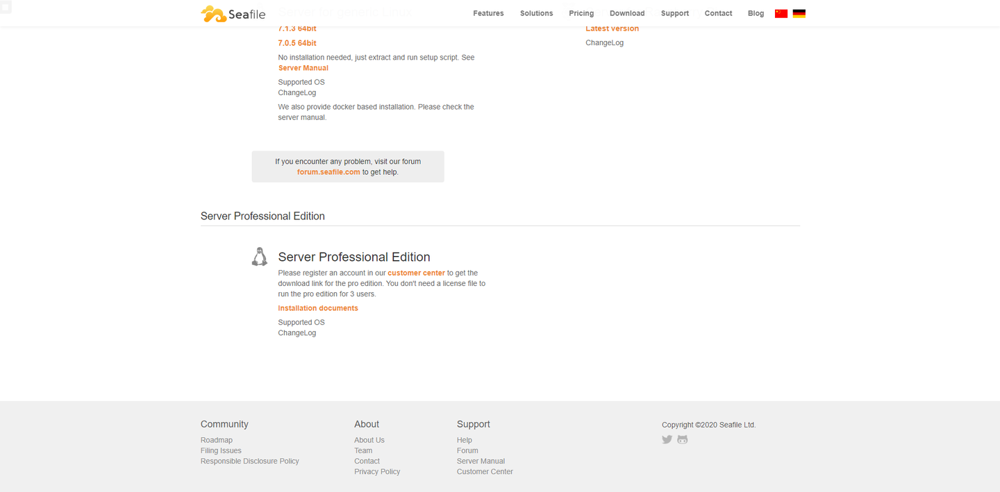
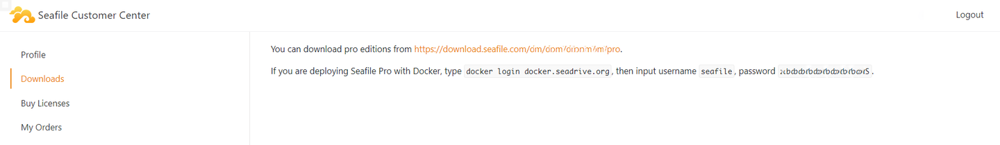
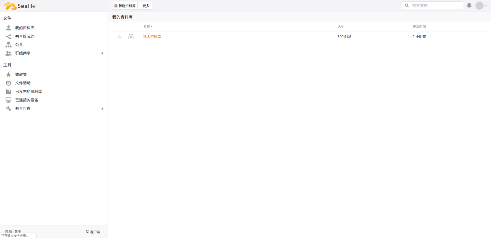
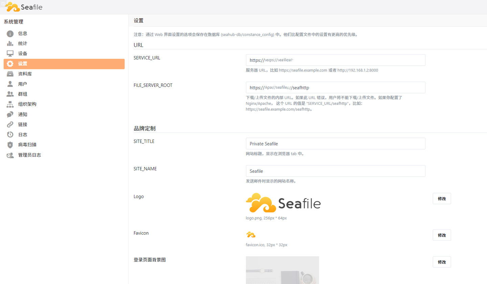
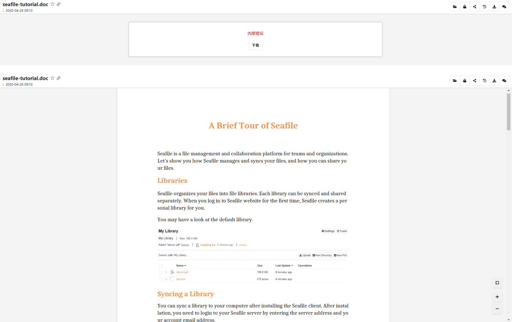
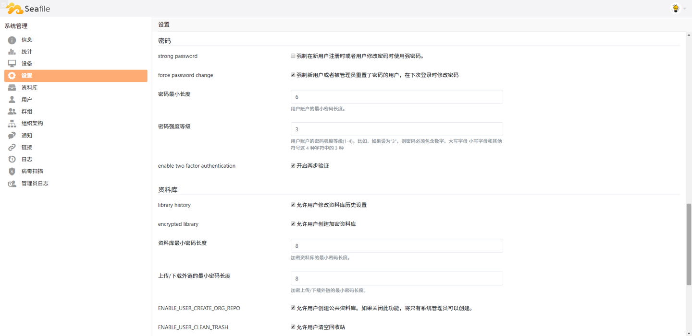
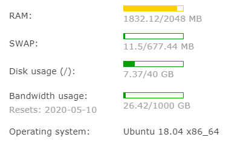

> 本文最初发表于知乎，[原文链接](https://zhuanlan.zhihu.com/p/136892658)。

### 前言

最近百度云放开了文件夹自动备份功能，本该是个好事，但是竟然在右下角有个狗皮膏药永远也关不掉，实在是受不了。加上一天天的我百度爸爸又流氓了一些呢，刚好超会也要过期咯，一年二百五给谁不好呀，刚好手上挺多vps，分一台出来答私有云盘他不香么。


稍微比较了一下 [seafile](https://www.seafile.com/home/)，[nextcloud](https://nextcloud.com/)，[owncloud](https://owncloud.org/)，果断选了seafile，之前搭过一次，不过有百度云就没用它，主要原因还是它有全套的中文文档和中文论坛，就比较省事，然后seafile的专业版是可以免费给三个用户使用的，功能也多一些，毕竟vps的ssd也挺贵的，应该不会有人能开多几个用户吧。anyway，稍微写一下配置过程和一些小坑吧，不然以后就忘了...应该会有一些人想建服务器吧（或者我把自己服务器玩崩了），万一用上了呢。

<!--more-->

### 下载服务端文件

首先进入 [seafile 的下载页面](https://www.seafile.com/download/)，在右上角切换语言为英文（中文页面不显示专业版），然后直接把页面拉到最下面：



只需要注册一个用户，就可以得到一个专有的专业版的下载链接，可以无许可证供给三人使用。点击 [customer center](https://customer.seafile.com/) 注册，然后进入个人中心，在download页面就有下载链接啦。



这里说一下我的配置环境，我用的是[搬瓦工](https://bandwagonhost.com/index.php)的一台机器，40G的硬盘，系统是Ubuntu 18.04 x86_64，所以我选的是目前最新的 `seafile-pro-server_7.1.3_x86-64_Ubuntu.tar.gz` 这个版本，下面也是按照这个配置写的，其他版本还请举一反三。

### 部署服务器

建议阅读 [seafile官方文档](https://cloud.seafile.com/published/seafile-manual-cn/deploy/using_mysql.md) 与本文同步配套使用。我基本上是按照文档做的，部分不好使的我在下面加粗标出来了。哦对了，如果服务器的前置要求不满足的话（nginx，mysql），非常推荐这个[一键脚本](https://lnmp.org/auto.html) ([GitHub Repo](https://github.com/licess/lnmp))。

#### 准备工作

注意，不同的版本请参考上面的链接，看一下官方文档。

```bash
apt-get update
apt-get install python3 python3-setuptools python3-pip python3-ldap -y

pip3 install --timeout=3600 Pillow pylibmc captcha jinja2 sqlalchemy
pip3 install --timeout=3600 psd-tools django-pylibmc django-simple-captcha
```

#### 安装

```bash
cd seafile-server-*
./setup-seafile-mysql.sh
```

按照脚本依次询问的一些问题配置seafile的各项参数。

#### 启动

```
./seafile.sh start    # 启动 Seafile 服务
./seahub.sh start     # 启动 Seahub  网站
```

第一次启动seahub会创建一个管理员帐号。

OK, so easy! 这个时候访问服务器IP就已经可以使用了：`127.0.0.1:8000`，安装这一套总共空间占用大概在5~7GB。



#### 配置开机启动

**注意：**这里是第一个小坑，按照文档里的方法设置无效了，论坛上也有同样的反馈，不知道是脸黑还是就是确实有问题。解决方案是参考了[这篇博文](http://www.r9it.com/20180613/ubuntu-18.04-auto-start.html)，在 `/etc/rc.local` 里配置了开机启动执行：

```bash
/opt/seafile/seafile-server-latest/seafile.sh start
/opt/seafile/seafile-server-latest/seahub.sh start
```

然后手动修改了连接的 `rc.local.service`：

```toml
[Unit]
Description=/etc/rc.local Compatibility
Documentation=man:systemd-rc-local-generator(8)
ConditionFileIsExecutable=/etc/rc.local
After=network.target mysql.service

[Service]
Type=forking
ExecStart=/etc/rc.local start
TimeoutSec=0
RemainAfterExit=yes
GuessMainPID=no

[Install]
WantedBy=multi-user.target
Alias=rc-local.service
```

这样至少是能用了。

### Nginx 配置

#### 准备工作

这里我是直接选了[HTTPS配置](https://cloud.seafile.com/published/seafile-manual-cn/deploy/https_with_nginx.md)的，如果你不知道怎么弄免费的证书，那么[腾讯云](https://console.cloud.tencent.com/ssl)可以方便地申请到免费的证书，这里就不多说了。另外，需要将域名指向服务器IP地址。

#### Nginx 配置文件

**注意：**新版本nginx已废弃文档中示例的部分格式，需要进行修改。这里是我写好的配置文件：

```nginx
server {
    listen       80;
    server_name  {{ server_name }};
    rewrite ^ https://$http_host$request_uri? permanent;    # force redirect http to https

    # Enables or disables emitting nginx version on error pages and in the "Server" response header field.
    server_tokens off;
}

server {
    listen 443 ssl;
    server_name {{ server_name }};

    ssl_certificate     {{ crt }};     # path to your cacert.pem
    ssl_certificate_key {{ key }};     # path to your privkey.pem
    ssl_session_timeout 5m;
    ssl_protocols TLSv1 TLSv1.1 TLSv1.2;
    ssl_ciphers ECDHE-RSA-AES128-GCM-SHA256:HIGH:!aNULL:!MD5:!RC4:!DHE;
    ssl_prefer_server_ciphers on;

    proxy_set_header X-Forwarded-For $remote_addr;
    add_header Strict-Transport-Security "max-age=31536000; includeSubDomains";
    server_tokens off;

    location / {
        proxy_pass         http://127.0.0.1:8000;

        proxy_set_header   Host $host;
        proxy_set_header   X-Real-IP $remote_addr;
        proxy_set_header   X-Forwarded-For $proxy_add_x_forwarded_for;
        proxy_set_header   X-Forwarded-Host $server_name;
        proxy_set_header   X-Forwarded-Proto https;

        access_log      /var/log/nginx/seahub.access.log;
        error_log       /var/log/nginx/seahub.error.log;

        proxy_read_timeout  1200s;
        client_max_body_size 0;
    }

    location /seafhttp {
        rewrite ^/seafhttp(.*)$ $1 break;
        proxy_pass http://127.0.0.1:{{ port }};
        client_max_body_size 0;
        proxy_set_header   X-Forwarded-For $proxy_add_x_forwarded_for;
        proxy_connect_timeout  36000s;
        proxy_read_timeout     36000s;
        proxy_send_timeout     36000s;
        send_timeout           36000s;
    }

    location /media {
        root /opt/seafile/seafile-server-latest/seahub;
    }
}
```

替换上面`{{ server_name }}`,  `{{ crt }}`,  `{{ key }}`,  `{{ port }}`就可以用啦。  
`server_name`是你的域名，`crt`和`key`是证书nginx文件夹下的两个文件，`port`是在seahub脚本下输入的端口。

#### 修改 SERVICE_URL 和 FILE_SERVER_ROOT

登入你的seafile，网页版在右上角头像-系统管理-设置界面，更新`SERVICE_URL`和`FILE_SERVER_ROOT`这两个配置项，否则无法通过web正常的上传和下载文件。



### 专业版功能定制

[Seafile Cloud 官方文档](https://cloud.seafile.com/published/seafile-manual-cn/deploy_pro/README.md)

#### Office 预览

第一步，安装 Libreoffice/UNO 与字体文件.

```bash
sudo apt-get install libreoffice libreoffice-script-provider-python    libsm-dev
sudo apt-get install ttf-wqy-microhei ttf-wqy-zenhei xfonts-wqy
```

第二步，开启配置项。在`/opt/seafile/conf`下修改`conf/seafevents.conf`.  
**注意：**文档里写的是添加，但实际上配置文件里已经有预设值了，直接加一个配置会冲突。

```toml
[OFFICE CONVERTER]
enabled = true
host = 127.0.0.1   # 本机的IP地址，默认 127.0.0.1
port = 6000        # 端口，默认6000
workers = 1        # 并发运行 libreoffice 的进程数
outputdir = /tmp/  # 转换后的 office/pdf 文件的缓存路径
```

**注意：**这里有一个究极大坑，你别看他文档里注释可以写在同一行，实际上根本没法解析，务必务必删掉注释部分再应用！卡了我好久，就是显示不了预览，查日志也全是成功信息，气死我了。

然后打开`conf/seahub_settings.py`，添加:

```python
OFFICE_CONVERTOR_ROOT = '<http://127.0.0.1:6000/>'
# 与 seafevents.conf 中的 host 和 port 保持一致
```

重启服务后，应该就能用了.

```bash
./seafile.sh restart
./seahub.sh restart
```



（之后每一步完成后都需要重启服务，不多赘述）

#### Office 编辑

***TODO：按照官网文档操作onlyoffice并不能够使用，有空我会用libreoffice重试一下。***

这里需要第二台服务器，因此是选配项目。稍微看了一下，seafile支持的几种office server中[OnlyOffice](https://www.onlyoffice.com/)应该是比较方便的。我用的是阿里云的机器，2G内存（虽然说OnlyOffice推荐4G内存，但是单用户应该够用，而且独立机器不会影响到主机性能表现），系统是Ubuntu 16.04 64位的版本。如果是一台新机器的话，建议还是照例先跑一遍[LNMP一键脚本](https://lnmp.org/auto.html)（非必须）。

第一步，安装docker.

```bash
sudo curl -sSL <https://get.docker.com/> | sh
```

第二步，安装OnlyOffice.

```bash
sudo docker run -i -t -d -p 8080:80 onlyoffice/documentserver
```

安装完以后，访问 `http://{{ IP }}:8080/welcome` 应该就能看到成功的页面了：


确认之后就可以用nginx绑定到域名了，在这里就不多介绍了。

*之后这两步是文档里写的，我也试了其他一些，都不能用，如果你解决了，欢迎评论区留言~*

第三步，设置自动保存。在安装了onlyoffice的服务器上修改`/etc/onlyoffice/documentserver/local.json`，添加：

```json
{
    "services": {
        "CoAuthoring": {
            "autoAssembly": {
                "enable": true,
                "interval": "5m"
            }
        }
    }
}
```

第四步，配置seafile服务。添加以下配置信息到`seahub_settings.py`：

```python
# Enable Only Office
ENABLE_ONLYOFFICE = True
VERIFY_ONLYOFFICE_CERTIFICATE = False
ONLYOFFICE_APIJS_URL = 'http{s}://{your OnlyOffice server`s domain or IP}/web-apps/apps/api/documents/api.js'
ONLYOFFICE_FILE_EXTENSION = ('doc', 'docx', 'ppt', 'pptx', 'xls', 'xlsx', 'odt', 'fodt', 'odp', 'fodp', 'ods', 'fods')
ONLYOFFICE_EDIT_FILE_EXTENSION = ('docx', 'pptx', 'xlsx') 
```

好了，编辑功能已经配置完成。but...


#### 文件搜索

在`/opt/seafile/conf`下修改`conf/seafevents.conf`：

```toml
[INDEX FILES]
enabled = true
highlight = fvh
interval = 10m            # 更新频率
index_office_pdf = true   # 全文检索
```

同样的，还是删掉注释再应用设置。（或者单独起一行）

**注意：**这里又有一个大坑了，好在有官方论坛，不过还是卡了我好久才找到[这篇帖子](https://bbs.seafile.com/t/topic/9379/21)。  
解决`ERROR : java.lang.RuntimeException: can not run elasticsearch as root`的方法：


> 1. 首先，您需要停止当前正在运行的 Seafile 服务。
>    ```bash
>    cd /opt/seafile/seafile-server-latest
>    ./seafile.sh stop
>    ./seahub.sh stop
>    ```
> 2. 创建一个系统用户用来运行 Seafile 服务。
>    ```bash
>       useradd --system --comment "seafile" seafile --create-home --home-dir /home/seafile
>    ```
> 3. 修改 Seafile 安装目录和 Seafile data 目录的属主和属组为 seafile
>    ```bash
>    chown -R seafile.seafile /opt/seafile
>    chown -R seafile.seafile /home/seafile-data
>    chown -R seafile.seafile /tmp/seafile-office-output
>    ```
> 4. 启动服务
>    ```bash
>    su - seafile
>    cd /opt/seafile/seafile-server-latest
>    ./seafile.sh start
>    ./seahub.sh start
>    ```

主要是确保`chown -R seafile.seafile /opt/seafile`这个执行成功以后把权限交给seafile了。如果你在[配置开机启动](#配置开机启动)那一节和我做的一样的话，现在应该修改为：

```bash
sudo -u seafile /opt/seafile/seafile-server-latest/seafile.sh start
/opt/seafile/seafile-server-latest/seahub.sh start
```

#### 断点续传

打开`conf/seahub_settings.py`，添加:

```python
ENABLE_RESUMABLE_FILEUPLOAD = True
```

#### 其他
还有一些设置是在网盘的设置界面修改的，大家可以自行探索。



### 最后
安装完成啦，总共占用资源大概这么多，还算刚刚好吧，不过用一段时间也许也会够呛，不知道优化怎么样咯。


