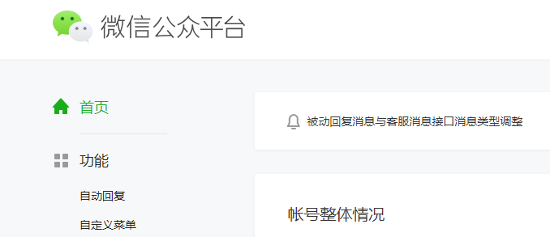
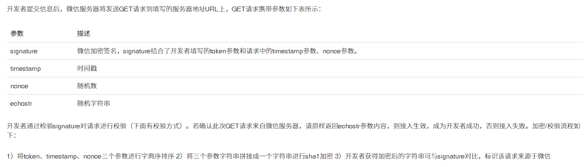

> 本文最初发表于知乎，[原文链接](https://zhuanlan.zhihu.com/p/46720483)。

###  环境准备

参考[这篇文章](https://cloud.tencent.com/developer/article/1517187)解析域名到服务器， HTTPS 自己考虑选配吧。

在服务器上安装 Nginx. 配置目录在`/etc/nginx/conf.d`，于此目录下创建一个配置文件。

```nginx wechat.conf
server {
    listen 80;
    server_name 【你的域名】;

    location / {
        proxy_pass http://127.0.0.1:【转发端口】;
    }
}
```

代码运行环境：Python 3.6.6, Flask 1.0.2.

<!--more-->

### 微信公众号账号注册

前往[微信公众平台](https://mp.weixin.qq.com/)按步骤注册一个账号，完成以后就可以进入这个界面：



#### 验证服务器配置

左边菜单下滑到底，选择基本配置，看到右边有公众号开发信息、服务器配置、已绑定的微信开放平台帐号三个栏目。选择「服务器配置 - 修改配置」。


URL填写刚刚解析到的服务器上公众号服务的域名，Token自己随便取一个，秘钥随机生成就好，然后在这一步暂停。

#### 编写服务端程序

首先看看微信的要求：



1. 将`token`、`timestamp`、`nonce`三个参数进行字典序排序
2. 将三个参数字符串拼接成一个字符串进行 `sha1` 加密
3. 开发者获得加密后的字符串可与 `signature` 对比，标识该请求来源于微信

所以我们按照这样写就好了：

```python
# -*- coding: UTF-8 -*-

import time
import hashlib
from lxml import etree
from flask import request
from flask import Flask, make_response
# 这些是本例中所有用到的库

class Message(object):
    def __init__(self, req):
        self.request = req
        self.token = '【这里填刚刚公众号页面上的项目】'
        self.AppID = '【这里填刚刚公众号页面上的项目】'
        self.AppSecret = '【这里填刚刚公众号页面上的项目】'

class Get(Message):
    def __init__(self, req):
        super(Get, self).__init__(req)
        self.signature = req.args.get('signature')  # 这里分别获取传入的四个参数
        self.timestamp = req.args.get('timestamp')
        self.nonce = req.args.get('nonce')
        self.echostr = req.args.get('echostr')
        self.return_code = 'Invalid'

    def verify(self):
        data = sorted([self.token, self.timestamp, self.nonce])  # 字典排序
        string = ''.join(data).encode('utf-8')                   # 拼接成字符串
        hashcode = hashlib.sha1(string).hexdigest()              # sha1加密
        if self.signature == hashcode:
            self.return_code = self.echostr
```

#### 验证消息

服务端代码如下：

```python
app = Flask(__name__)

@app.route("/【这里填URL路径】/", methods=["GET", "POST"])
def index():
    if request.method == "GET":
        message = Get(request)
        message.verify()
        return message.return_code

    elif request.method == "POST":
        pass  # 留坑给后面

if __name__ == "__main__":
    app.run(port=【这里可以指定服务运行端口，默认5000，与反向代理一致】)
```

服务启动后，再点击微信公众平台的 提交 按钮，验证成功后不要忘了选择 启用服务端配置。


### 消息处理

#### 接收用户消息

这里要参阅微信公众平台技术文档：[微信公众平台](https://mp.weixin.qq.com/wiki?t=resource/res_main)，对各类消息的 XML 有详细说明。  
例如文本消息：

```xml
<xml>
    <ToUserName><![CDATA[toUser]]></ToUserName>
    <FromUserName><![CDATA[fromUser]]></FromUserName>
    <CreateTime>1348831860</CreateTime>
    <MsgType><![CDATA[text]]></MsgType>
    <Content><![CDATA[this is a test]]></Content>
    <MsgId>1234567890123456</MsgId>
</xml>
```

> ps. 这里其实有点坑，文档很不讲究，有的地方的空格会导致错误。。。

这里只是一个初期的示例，写的就随便一些，或许分消息类型读参数好一点，可是我懒呀：

```python
class Post(Message):
    def __init__(self, req):
        super(Post, self).__init__(req)
        self.xml = etree.fromstring(req.stream.read())
        self.MsgType = self.xml.find("MsgType").text
        self.ToUserName = self.xml.find("ToUserName").text
        self.FromUserName = self.xml.find("FromUserName").text
        self.CreateTime = self.xml.find("CreateTime").text
        self.MsgId = self.xml.find("MsgId").text

        hash_table = {
            'text': ['Content'],
            'image': ['PicUrl', 'MediaId'],
            'voice': ['MediaId', 'Format'],
            'video': ['MediaId', 'ThumbMediaId'],
            'shortvideo': ['MediaId', 'ThumbMediaId'],
            'location': ['Location_X', 'Location_Y', 'Scale', 'Label'],
            'link': ['Title', 'Description', 'Url'],
        }

        attributes = hash_table[self.MsgType]
        self.Content = self.xml.find("Content").text if 'Content' in attributes else '抱歉，暂未支持此消息。'
        self.PicUrl = self.xml.find("PicUrl").text if 'PicUrl' in attributes else '抱歉，暂未支持此消息。'
        self.MediaId = self.xml.find("MediaId").text if 'MediaId' in attributes else '抱歉，暂未支持此消息。'
        self.Format = self.xml.find("Format").text if 'Format' in attributes else '抱歉，暂未支持此消息。'
        self.ThumbMediaId = self.xml.find("ThumbMediaId").text if 'ThumbMediaId' in attributes else '抱歉，暂未支持此消息。'
        self.Location_X = self.xml.find("Location_X").text if 'Location_X' in attributes else '抱歉，暂未支持此消息。'
        self.Location_Y = self.xml.find("Location_Y").text if 'Location_Y' in attributes else '抱歉，暂未支持此消息。'
        self.Scale = self.xml.find("Scale").text if 'Scale' in attributes else '抱歉，暂未支持此消息。'
        self.Label = self.xml.find("Label").text if 'Label' in attributes else '抱歉，暂未支持此消息。'
        self.Title = self.xml.find("Title").text if 'Title' in attributes else '抱歉，暂未支持此消息。'
        self.Description = self.xml.find("Description").text if 'Description' in attributes else '抱歉，暂未支持此消息。'
        self.Url = self.xml.find("Url").text if 'Url' in attributes else '抱歉，暂未支持此消息。'
        self.Recognition = self.xml.find("Recognition").text if 'Recognition' in attributes else '抱歉，暂未支持此消息。'
```

#### 回复用户消息

仍然以文本消息示例，返回的还是这样格式的XML：

```xml
<xml>
    <ToUserName><![CDATA[toUser]]></ToUserName>
    <FromUserName><![CDATA[fromUser]]></FromUserName>
    <CreateTime>12345678</CreateTime>
    <MsgType><![CDATA[text]]></MsgType>
    <Content><![CDATA[你好]]></Content>
</xml>
```

那么回复消息可以这样写：

```python
class Reply(Post):
    def __init__(self, req):
        super(Reply, self).__init__(req)
        self.xml = f'<xml><ToUserName><![CDATA[{self.FromUserName}]]></ToUserName>' \
                   f'<FromUserName><![CDATA[{self.ToUserName}]]></FromUserName>' \
                   f'<CreateTime>{str(int(time.time()))}</CreateTime>'

    def text(self, Content):
        self.xml += f'<MsgType><![CDATA[text]]></MsgType>' \
                    f'<Content><![CDATA[{Content}]]></Content></xml>'

    def image(self, MediaId):
        pass

    def voice(self, MediaId):
        pass

    def video(self, MediaId, Title, Description):
        pass

    def music(self, ThumbMediaId, Title='', Description='', MusicURL='', HQMusicUrl=''):
        pass
        
    def reply(self):
        response = make_response(self.xml)
        response.content_type = 'application/xml'
        return response
```

因为篇幅所限，其他几种消息类型就不放出来了，参照文档和文本类型，其实一模一样。

#### 消息测试

填一下前面 Flask 代码里那个坑：

```python
def index():
    if request.method == "GET":
        message = Get(request)
        message.verify()
        return message.return_code

    elif request.method == "POST":
        message = Reply(request)
        message.text(message.Content)
        return message.reply()
```

这就是一个直击本质的复读机了。

### 后记

开了这个头，后面的开发就很(hai)简(zao)单(de)了(hen)，但这只是一个简易的示例，很多地方没有顾及到，可能某些步骤有遗漏，示例代码也是一遍撸好的，有很多地方不好或者不对，那也欢迎指导。
